---
format:
  revealjs:
    theme: [default, custom.scss]
    slide-number: false
    progress: true
    history: false
    transition: fade
    transition-speed: fast
    incremental: false
    fig-align: center
    highlight-style: github
    code-block-bg: true
    center: false
    width: 1600
    height: 800
    logo: "images/logo_df4.png"
    scrollable: false
execute:
  echo: false
  warning: false
---

## {background-image="images/portada_df.png" background-size="cover" background-position="center" data-state="no-logo" }


------------------------------------------------------------------------

## Agenda


::::: columns
::: {.column .incremental width="30%"}
-   

-   No

-   Nope

-   No chance
:::

::: {.column .fragment width="70%"}

:::
:::::

------------------------------------------------------------------------

## 

:::: {style="display: flex; justify-content: center; align-items: center; height: 60vh; flex-direction: column; text-align: center;"}
::: {.callout-note style="font-size: 1.5em;"}
## Storytelling principle #1

Nunca revelar el final antes de tiempo.\
[Siempre eleva la tensión y el drama]{.fragment}
:::
::::

<br>

------------------------------------------------------------------------

## Agenda (v2)

::: incremental
1.  Nunca reveles [el final]{style="background-color:black;"}\
2.  Los detalles son importantes, pero [no **todos** los detalles.]{style="background-color:black;"}\
3.  Explicar menos, [Mostrar más]{style="background-color:black;"}
4.  Tu primera versión será [horrible.]{style="background-color:black;"}\
:::

------------------------------------------------------------------------

## Qué es Storytelling?

::::: columns
::: {.column .fragment width="50%"}
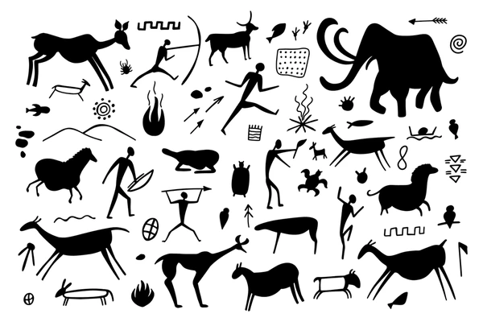{fig-align="center" width="90%"}
:::

::: {.column .fragment width="50%"}
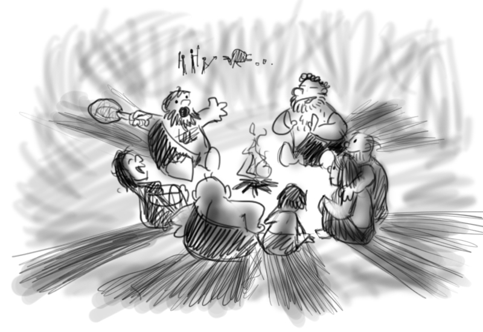{fig-align="center" width="100%"}
:::
:::::

. . .

::: {style="text-align: center; "}
🔥 Las **historias** son la primera tecnología humana.
:::

::: notes
Stories are how humans share knowledge.\
It’s our oldest learning tool — built for memory, connection, and meaning.\
Use it well.
:::

------------------------------------------------------------------------

## Ohh, nuestros cerebros son hackables...

::: r-stack
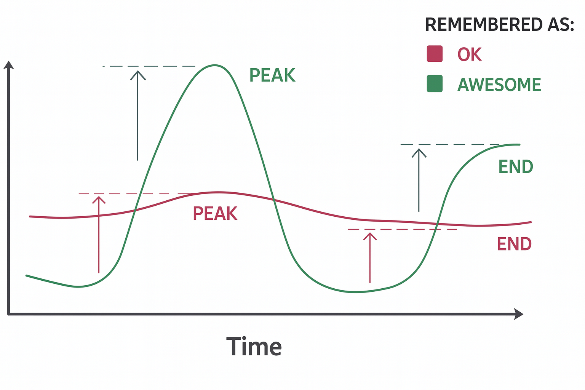{.fragment .fade-in-then-out fig-align="center" width="70%"}

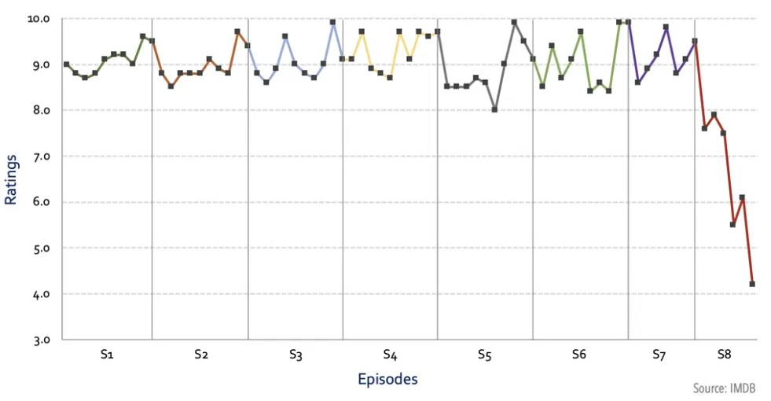{.fragment fig-align="center" width="100%"}
:::

------------------------------------------------------------------------

## Narrativa

::::: columns
::: {.column width="60%"}
<br><br>

Usa **trucos** de Storytelling (narrativa) para crear presentaciones que serán **recordadas** y que causarán **impacto**
:::

::: {.column .fragment width="40%"}
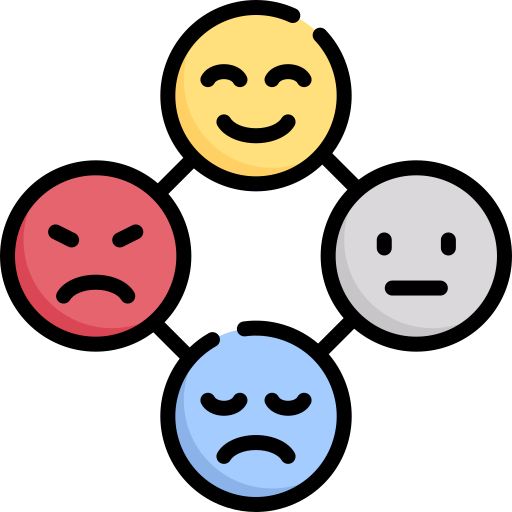{fig-align="center"}
:::
:::::

. . .

::: {style="text-align: center;"}
🎭 Emociones inspiran acción
:::

::: notes
Great ideas need great communication.\
Storytelling is your toolkit to move people.\
Facts inform — emotions inspire action.
:::

------------------------------------------------------------------------

## Más que gráficos bonitos

::::: columns
::: {.column width="50%"}
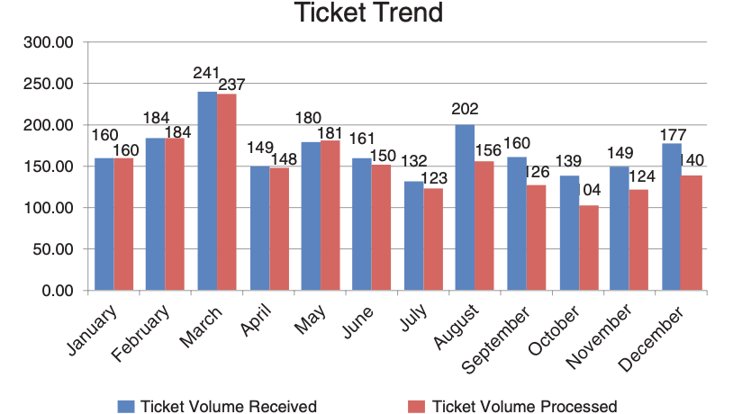{fig-align="center"} *🔢 No compartas números*
:::

::: {.column .fragment width="50%"}
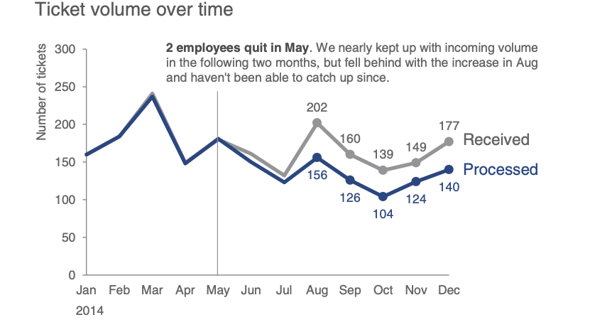{fig-align="center"} *🪶Comparte una historia*
:::
:::::

. . .

<br><br> [(C) Storytelling with Data, por Cole Nussbaumer Knaflic.]{style="font-size: 0.75em; color: gray"}

------------------------------------------------------------------------

## 

:::: {style="display: flex; justify-content: center; align-items: center; height: 60vh; flex-direction: column; text-align: center;"}
::: callout-note
## Storytelling principle #2

Los detalles son importantes, [pero no **todos** los detalles son importantes.]{.fragment}
:::
::::

::: notes
Details guide attention.\
Show less — but better.\
Focus only on what moves the story forward.
:::

------------------------------------------------------------------------

## El arte de una buena visualización

::::: columns
::: {.column .fragment width="60%"}
<br><br>

-   Gráficos claros y comprensibles
-   Elección correcta del gráfico
-   Patrones y anomalías visibles
-   Datos complejos → ideas simples
:::

::: {.column width="40%"}
{fig-align="center" width="80%"}
:::
:::::

. . .

> ⌛ Si no se entiende en 5-7 segundos, simplifica o cambia el título.

------------------------------------------------------------------------

## Ejemplos

<br>

::::: columns
::: {.column width="50%" style="text-align: center;"}
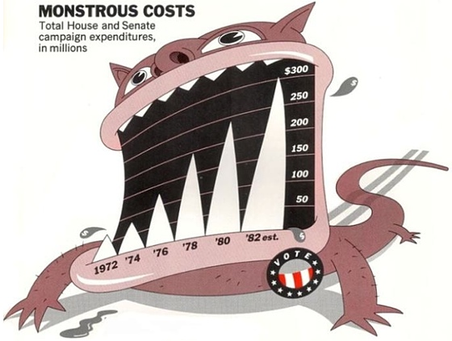{fig-align="center" width="82%"}

<br> *❌ Chartjunk*
:::

::: {.column .fragment width="50%" style="text-align: center;"}
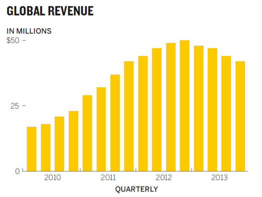{fig-align="center" width="100%"}

*✅ Good Chart*
:::
:::::

------------------------------------------------------------------------

## 

:::: {style="display: flex; justify-content: center; align-items: center; height: 60vh; flex-direction: column; text-align: center;"}
::: callout-note
## Storytelling principle #3

[Explicar Menos]{style="color: red"}, [Mostrar Más]{.fragment style="color: green"}
:::
::::

------------------------------------------------------------------------

## Mejores Gráficos para tus Datos

::: r-stack
<br>

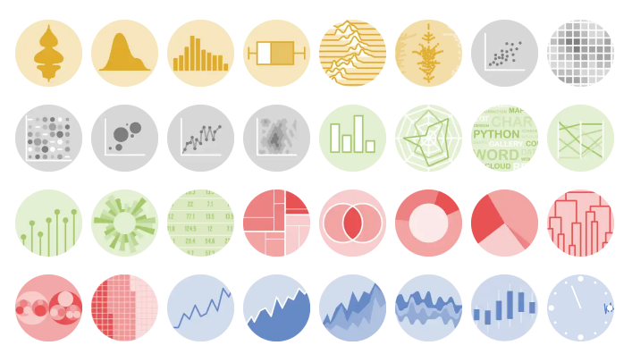{.fragment .fade-in-then-out fig-align="left"}

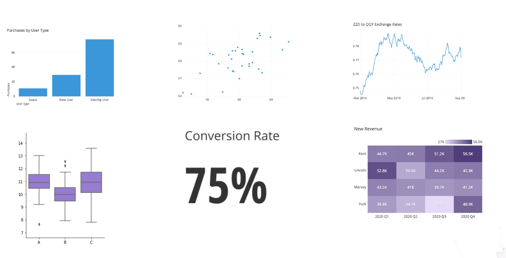{.fragment fig-align="right"}
:::

. . .

[(C) Essential chart types for data visualization, by Atlassian.]{style="font-size: 0.75em; color: gray"}

::: notes
You don’t need fancy charts.\
Bar, scatter, box, heatmap, big text — that's 90% of data storytelling.\
Simple wins.
:::

------------------------------------------------------------------------

## La AI en Data Storytelling

<br><br>

:::::: columns
::: {.column width="35%"}
{.fragment fig-align="center"}
:::

::: {.column width="30%"}
{.fragment fig-align="center" width="100%"}
:::

::: {.column width="35%"}
{.fragment fig-align="center"}
:::
::::::

. . .

::: {style="text-align: center;"}
🥱 1° versión $<$ ... $<$ 😊 última versión
:::

::: notes
First versions are never perfect.\
Draft → feedback → improve.\
In 2026, AI compresses this cycle dramatically.\
What took days now takes hours.
:::

------------------------------------------------------------------------

## 

::::: {style="display: flex; justify-content: center; align-items: center; height: 60vh; flex-direction: column; text-align: center;"}
:::: {.callout-note style="font-size: 1.5em; max-width: 75%; margin: auto;"}
## Storytelling principle #4

Tu primera versión será [**siempre** horrible.]{.fragment}

::: {.fragment style="font-size: 0.65em; color: #666; margin-top: 0.75rem;"}
*...y hoy la IA te ayuda a llegar más rápido a la buena.*
:::
::::
:::::

::: notes
Bad first drafts are normal — always were.\
What changes in 2026 is the speed of iteration.\
The principle stays. The tools change.
:::

## AI tools

::: r-stack
{.fragment .fade-in-then-out fig-align="center" width="100%"}

{.fragment .fade-in-then-out fig-align="center" width="80%"}

{.fragment fig-align="center" width="70%"}
:::

------------------------------------------------------------------------

## Experiencias

:::::: r-stack
::: fragment
{width="900px"}
:::

::: fragment
{fig-align="center" width="850px" height="600px"}
:::

::: fragment
<iframe src="https://sebastiandres.github.io/pyschool_2025/space_station/rooms/sala_00.html" width="1200" height="600" frameborder="0" style="max-width:100%; border:1px solid #CCC; border-radius:10px;" allowfullscreen>

</iframe>
:::
::::::

------------------------------------------------------------------------

## Agenda (v2)

::: incremental
1.  Nunca reveles el [**final**]{.fragment style="color:grey;"}\
2.  Los detalles son importantes, pero [no **todos** los detalles]{.fragment style="color:grey;"}\
3.  Explica menos, [**muestra más**]{.fragment style="color:grey;"}\
4.  Tu primer borrador será [**horrible**]{.fragment style="color:grey;"}\
:::

::: notes
A mysterious agenda — like a good story.

Now you’ve seen how each point connects.

Simple rules to tell better stories with data.
:::

#  {background-image="images/horst_quarto_penguins_thankyou.png" data-state="no-logo"}

::: {style="display: flex; justify-content: center; align-items: flex-start; margin-top: 0vh; padding-top: 0vh; height: 60vh; flex-direction: column; text-align: center;"}
[Hora del Adiós]{style="font-size: 4em; color: #1e6490;"}
:::

::: {style="position: fixed; bottom: -350px; right: -60px; text-align: center;"}
{width="150px" style="border-radius: 8px; box-shadow: 0 4px 15px rgba(0,0,0,0.25);"}
:::

```{=html}
<style>
/* Ajusta el tamaño del título y subtítulo */
.reveal .slides h1 {
  font-size: 2em; /* Tamaño más pequeño para el título */
}

.reveal .slides h2 {
  font-size: 1.5em; /* Tamaño más pequeño para el subtítulo */
}

/* Ajusta el tamaño del texto en los párrafos */
.reveal .slides p {
  font-size: 0.8em; /* Texto más pequeño */
}

/* Ajusta el tamaño de las tablas */
.reveal .slides table {
  font-size: 0.8em; /* Tamaño de fuente más pequeño en las tablas */
  width: 90%; /* Ajusta el ancho de la tabla */
  margin: 0 auto; /* Centra la tabla */
}

/* Ajusta el tamaño de los bullets */
.reveal .slides ul {
  font-size: 1em; /* Tamaño de fuente más pequeño en los bullets */

}

.reveal .slide-logo {
   max-height: 2em !important;

}

</style>
```