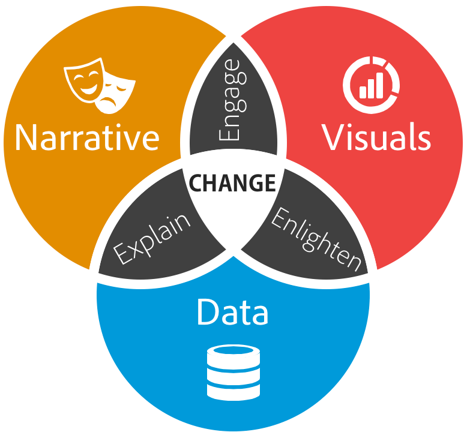
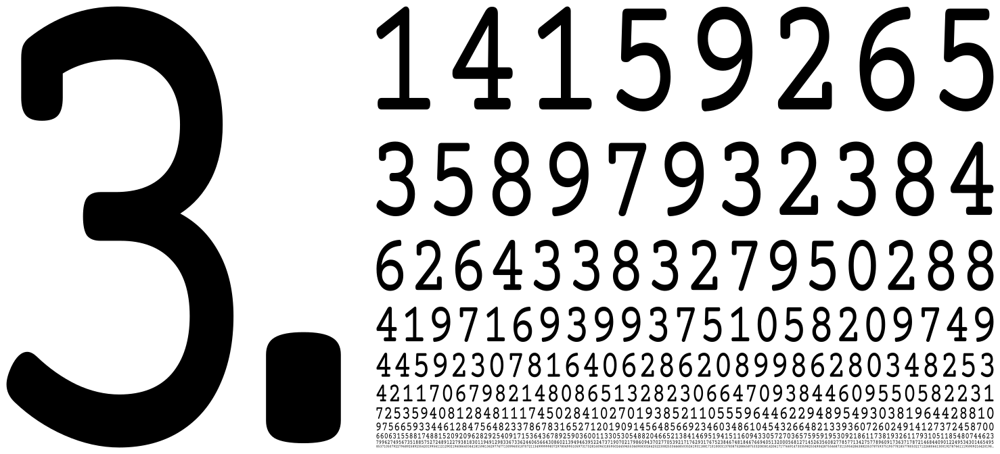
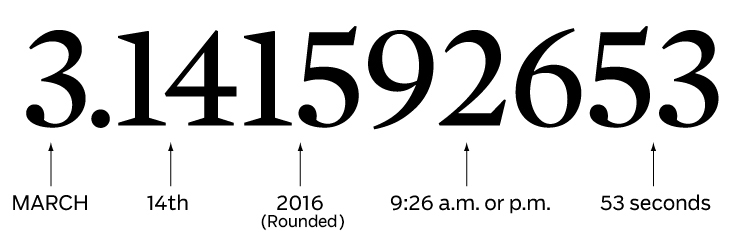
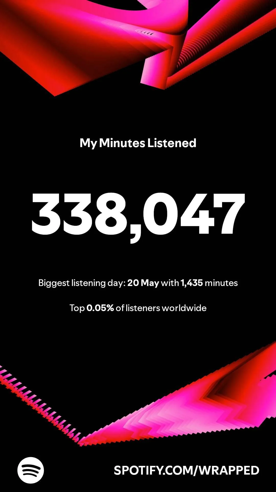
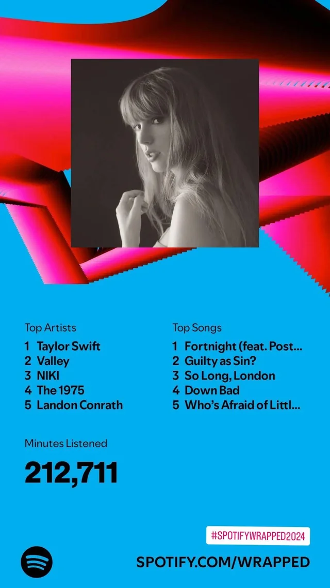
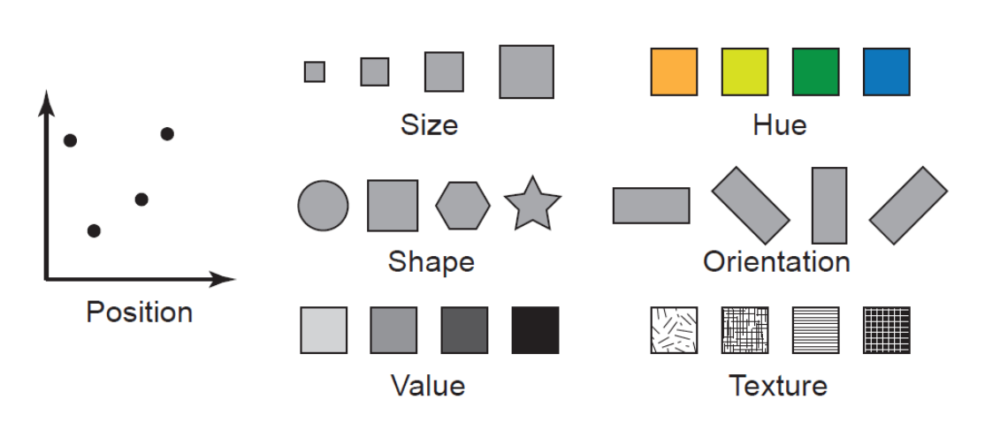
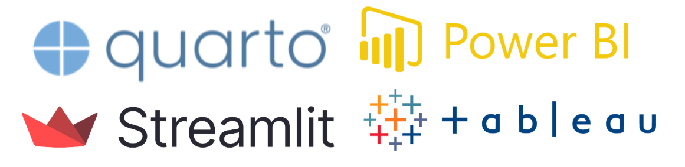

##  {.title-slide background-color="#0F2044"}

::: title-block
**Lo que nadie te dice sobre la IA generativa**

Límites, técnicas y lo que viene
:::

::: subtitle-block
LLMs · Prompt Engineering · RAG · Agentes · Seguridad · Python\
PyCon Chile 2026
:::

::: author-block
Francisco Alfaro Medina\
Dirección de Transformación Digital · UTFSM\
fralfaro.github.io/portfolio
:::

------------------------------------------------------------------------


## Agenda

::::: columns
::: {.column .incremental width="30%"}
-   

-   No

-   Nope

-   No chance
:::

::: {.column .fragment width="70%"}

:::
:::::

------------------------------------------------------------------------

## 

:::: {style="display: flex; justify-content: center; align-items: center; height: 60vh; flex-direction: column; text-align: center;"}
::: {.callout-note style="font-size: 1.5em;"}
## Storytelling principle #1

Nunca revelar el final antes de tiempo.\
[Siempre eleva la tensión y el drama]{.fragment}
:::
::::

<br>

------------------------------------------------------------------------

## Agenda (v2)

::: incremental
1.  Nunca reveles [el final]{style="background-color:black;"}\
2.  Los detalles son importantes, pero [no **todos** los detalles.]{style="background-color:black;"}\
3.  Explicar menos, [Mostrar más]{style="background-color:black;"}
4.  Tu primera versión será [horrible.]{style="background-color:black;"}\
:::

# Storytelling {.title-middle-dark background-image="images/horst_quarto_penguins_share.png" data-state="no-logo"}

------------------------------------------------------------------------

## Qué es Storytelling?

::::: columns
::: {.column width="50%"}
{fig-align="center" width="90%"}
:::

::: {.column .fragment width="50%"}
{fig-align="center" width="100%"}
:::
:::::

. . .

::: {style="text-align: center; "}
🔥 Las **historias** son la primera tecnología humana.
:::

::: notes
Stories are how humans share knowledge.\
It’s our oldest learning tool — built for memory, connection, and meaning.\
Use it well.
:::

------------------------------------------------------------------------

## Qué es Data Storytelling?

<br>

::: r-stack
{.fragment fig-align="center" width="70%"}
:::

. . .

<br>

::: {style="text-align: center; "}
📊 **Data Storytelling** es una forma de comunicar con datos.
:::

------------------------------------------------------------------------

## Ohh, nuestros cerebros son hackables...

::: r-stack
{.fragment .fade-in-then-out fig-align="center" width="70%"}

{.fragment fig-align="center" width="100%"}
:::

------------------------------------------------------------------------

## Atención y memoria

<br>

::: r-stack
{.fragment .fade-in-then-out fig-align="center" width="90%"}

{.fragment fig-align="center" width="100%"}
:::

------------------------------------------------------------------------

## Narrativa

::::: columns
::: {.column width="60%"}
<br><br>

Usa **trucos** de Storytelling (narrativa) para crear presentaciones que serán **recordadas** y que causarán **impacto**
:::

::: {.column .fragment width="40%"}
{fig-align="center"}
:::
:::::

. . .

::: {style="text-align: center;"}
🎭 Emociones inspiran acción
:::

::: notes
Great ideas need great communication.\
Storytelling is your toolkit to move people.\
Facts inform — emotions inspire action.
:::

------------------------------------------------------------------------

## Más que gráficos bonitos

::::: columns
::: {.column width="50%"}
{fig-align="center"} *🔢 No compartas números*
:::

::: {.column .fragment width="50%"}
{fig-align="center"} *🪶Comparte una historia*
:::
:::::

. . .

<br><br> [(C) Storytelling with Data, por Cole Nussbaumer Knaflic.]{style="font-size: 0.75em; color: gray"}

------------------------------------------------------------------------

## 

:::: {style="display: flex; justify-content: center; align-items: center; height: 60vh; flex-direction: column; text-align: center;"}
::: callout-note
## Storytelling principle #2

Los detalles son importantes, [pero no **todos** los detalles son importantes.]{.fragment}
:::
::::

::: notes
Details guide attention.\
Show less — but better.\
Focus only on what moves the story forward.
:::

------------------------------------------------------------------------

## Ejemplo: Spotify Wrapped

:::::: columns
::: {.column .fragment width="30%" fragment-index="1"}
{fig-align="center" width="85%" height="100%"}
:::

::: {.column .center width="40%"}
<br><br><br><br>

Cómo hacer millones de personas <br> compartir estadísticas en redes sociales?
:::

::: {.column .fragment width="30%" fragment-index="1"}
{fig-align="center" width="85%" height="100%"}
:::
::::::

# Visualización {.title-top-ice background-image="images/horst_penguins_telescope.png" data-state="no-logo"}

------------------------------------------------------------------------

## Visualización ...

::::: columns
::: {.column .fragment width="60%"}
<br><br>

-   Gráficos claros y comprensibles
-   Elección correcta del gráfico
-   Patrones y anomalías visibles
-   Datos complejos → ideas simples
:::

::: {.column width="40%"}
{fig-align="center"}
:::
:::::

. . .

> ⌛ Si no se entiende en 5-7 segundos, simplifica o cambia el título.

------------------------------------------------------------------------

## 

<br>

{fig-align="center" width="80%"}

. . .

<br>

::: {style="text-align:center; font-size:25px; font-family:sans-serif;"}
[Más fácil de distinguir]{style="color:green; font-weight:bold;"} [⟵────────────────────────────⟶]{style="margin: 0 15px; font-size:18px; background: linear-gradient(to right, green, orange, red); -webkit-background-clip: text; color: transparent;"} [Más difícil de distinguir]{style="color:red; font-weight:bold;"}
:::

------------------------------------------------------------------------

## Ejemplos {background-image="images/slide-normal.jpg" transition="zoom"}

<br>

::::: columns
::: {.column width="50%" style="text-align: center;"}
{fig-align="center" width="82%"}

<br> *❌ Chartjunk*
:::

::: {.column .fragment width="50%" style="text-align: center;"}
{fig-align="center" width="100%"}

*✅ Good Chart*
:::
:::::

------------------------------------------------------------------------

## 

:::: {style="display: flex; justify-content: center; align-items: center; height: 60vh; flex-direction: column; text-align: center;"}
::: callout-note
## Storytelling principle #3

[Explicar Menos]{style="color: red"}, [Mostrar Más]{.fragment style="color: green"}
:::
::::

------------------------------------------------------------------------

## Mejores Gráficos para tus Datos

::: r-stack
<br>

{.fragment .fade-in-then-out fig-align="left"}

{.fragment fig-align="right"}
:::

. . .

[(C) Essential chart types for data visualization, by Atlassian.]{style="font-size: 0.75em; color: gray"}

::: notes
You don’t need fancy charts.\
Bar, scatter, box, heatmap, big text — that's 90% of data storytelling.\
Simple wins.
:::

## 4 Pilares Visualización - Noah Iliinsky

::::: columns
::: {.column .fragment .incremental width="60%"}
<br>

1.  **Propósito**: Define la meta.
2.  **Contenido**: Datos relevantes.
3.  **Estructura**: Organización clara.
4.  **Formato**: Gráfico adecuado.
:::

::: {.column width="40%"}
{fig-align="center"}
:::
:::::

. . .

[(C) Noah Iliinsky: "Four Pillars of Visualization" - YouTube.]{style="font-size: 0.75em; color: gray"}

## Herramientas

::: r-stack
{.fragment .fade-in-then-out fig-align="center" width="100%"}

{.fragment .fade-in-then-out fig-align="center" width="100%"}

{.fragment .fade-in-then-out fig-align="center" width="60%"}

{.fragment .fade-in-then-out fig-align="center" width="90%"}

{.fragment fig-align="center" width="80%"}
:::

# Inteligencia Artificial {.title-middle-ice background-image="images/horst_quarto_penguins_teach.png" data-state="no-logo"}

------------------------------------------------------------------------

##  {background-image="images/slide-normal.jpg"}

<br><br>

:::::: columns
::: {.column width="35%"}
{.fragment fig-align="center"}
:::

::: {.column width="30%"}
{.fragment fig-align="center" width="100%"}
:::

::: {.column width="35%"}
{.fragment fig-align="center"}
:::
::::::

. . .

::: {style="text-align: center;"}
🥱 1° versión $<$ ... $<$ 😊 última versión
:::

::: notes
First versions are never perfect.\
Draft → feedback → improve.\
In 2026, AI compresses this cycle dramatically.\
What took days now takes hours.
:::

------------------------------------------------------------------------

##  {background-image="images/slide-normal.jpg"}

::::: {style="display: flex; justify-content: center; align-items: center; height: 60vh; flex-direction: column; text-align: center;"}
:::: {.callout-note style="font-size: 1.5em; max-width: 75%; margin: auto;"}
## Storytelling principle #4

Tu primera versión será [**siempre** horrible.]{.fragment}

::: {.fragment style="font-size: 0.65em; color: #666; margin-top: 0.75rem;"}
*...y hoy la IA te ayuda a llegar más rápido a la buena.*
:::
::::
:::::

::: notes
Bad first drafts are normal — always were.\
What changes in 2026 is the speed of iteration.\
The principle stays. The tools change.
:::

------------------------------------------------------------------------

## El nuevo stack de Data Storytelling {background-image="images/slide-normal.jpg"}

::::: columns
::: {.column width="50%"}
### Generar narrativa

-   **ChatGPT o1 / Claude 3.5** → guión, insights, resumen ejecutivo
-   **Gemini 2.0** → análisis multimodal (sube el gráfico, pide la historia)
-   **NotebookLM** → convierte tu dataset en podcast o briefing

### Crear visualizaciones

-   **Napkin AI** → texto → diagrama en segundos
-   **Gamma** → datos → presentación completa
-   **Julius AI** → chat con tu CSV, genera gráficos automáticamente
:::

::: {.column .fragment width="50%"}
### Ejecutar y desplegar

-   **Streamlit + Claude API** → apps de datos con lenguaje natural
-   **Evidence.dev** → reportes en Markdown con SQL en vivo
-   **Observable Framework** → dashboards estáticos de alto rendimiento

### Modelos locales (sin mandar datos a la nube)

-   **Ollama + LLaMA 3 / Mistral** → corre modelos en tu laptop
-   **LM Studio** → interfaz visual para modelos locales
-   **Anything LLM** → RAG local sobre tus propios documentos
:::
:::::

::: notes
The stack has exploded since 2023.\
Key shift: you can now run serious models locally — no data leaves your machine.\
For institutional data (UTFSM, health, finance) this is critical.
:::

------------------------------------------------------------------------

## Agentes de IA para datos {background-image="images/slide-normal.jpg"}

:::::: columns
:::: {.column width="55%"}
<br>

Un **agente** no solo responde — planifica, ejecuta pasos y usa herramientas.

::: fragment
:::
::::

::: {.column .fragment width="45%"}
### Frameworks en 2026

| Herramienta        | Para qué                          |
|--------------------|-----------------------------------|
| **Claude Code**    | Agente de código en terminal      |
| **LangGraph**      | Flujos multi-agente complejos     |
| **CrewAI**         | Equipos de agentes especializados |
| **n8n**            | Automatización sin código         |
| **Copilot Studio** | Agentes empresariales (Microsoft) |
:::
::::::

::: notes
Agents are the big shift in 2026.\
You stop prompting and start delegating.\
For data storytelling: the agent does the EDA, you review the story.
:::

------------------------------------------------------------------------

## IA + Visualización: el estado del arte {background-image="images/slide-normal.jpg"}

::: r-stack
{.fragment .fade-in-then-out fig-align="center" width="85%"}

{.fragment .fade-in-then-out fig-align="center" width="85%"}

{.fragment .fade-in-then-out fig-align="center" width="75%"}

{.fragment fig-align="center" width="80%"}
:::

::: notes
Replace these GIFs with screen recordings if you have them.\
Gamma: https://gamma.app — best for fast deck generation.\
Julius: https://julius.ai — best for CSV chat.\
Napkin: https://napkin.one — best for diagrams from text.\
NotebookLM: https://notebooklm.google.com — best for document Q&A.
:::

------------------------------------------------------------------------

# Conclusiones {.title-top-dark background-image="images/horst_quarto_penguins_thankyou.png" data-state="no-logo"}

------------------------------------------------------------------------

## Agenda (v2)

::: incremental
1.  Nunca reveles el [**final**]{.fragment style="color:grey;"}\
2.  Los detalles son importantes, pero [no **todos** los detalles]{.fragment style="color:grey;"}\
3.  Explica menos, [**muestra más**]{.fragment style="color:grey;"}\
4.  Tu primer borrador será [**horrible**]{.fragment style="color:grey;"}\
:::

::: notes
A mysterious agenda — like a good story.

Now you’ve seen how each point connects.

Simple rules to tell better stories with data.
:::

------------------------------------------------------------------------

## 🎉 ¡Gracias por Participar!

::::: columns
::: {.column width="50%"}
<br>

❓ ¿Preguntas?

👏 Responder [encuesta](https://docs.google.com/forms/d/e/1FAIpQLScrKncFmj2n8vLUOhEd9GrY_zfWBwGFEtLJFKj2lsBQ0ERxSg/viewform?usp=dialog)

🥳 Disfrutar del Evento!
:::

::: {.column width="50%" align="center"}
{width="400"}
:::
:::::

```{=html}
<style>
/* Ajusta el tamaño del título y subtítulo */
.reveal .slides h1 {
  font-size: 2em; /* Tamaño más pequeño para el título */
}

.reveal .slides h2 {
  font-size: 1.5em; /* Tamaño más pequeño para el subtítulo */
}

/* Ajusta el tamaño del texto en los párrafos */
.reveal .slides p {
  font-size: 0.8em; /* Texto más pequeño */
}

/* Ajusta el tamaño de las tablas */
.reveal .slides table {
  font-size: 0.8em; /* Tamaño de fuente más pequeño en las tablas */
  width: 90%; /* Ajusta el ancho de la tabla */
  margin: 0 auto; /* Centra la tabla */
}

/* Ajusta el tamaño de los bullets */
.reveal .slides ul {
  font-size: 1em; /* Tamaño de fuente más pequeño en los bullets */

}

.reveal .slide-logo {
   max-height: 3em !important;

}

</style>
```