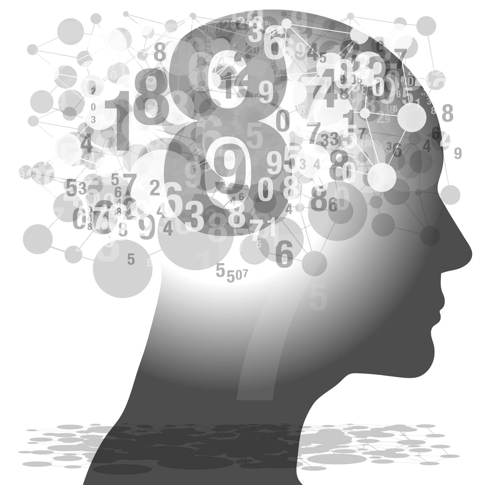

##  {.title-slide background-color="#0F2044"}

::: title-block
**Lo que nadie te dice sobre la IA generativa**

Límites, técnicas y lo que viene
:::

::: subtitle-block
LLMs · Prompt Engineering · RAG · Agentes · Seguridad · Python\
PyCon Chile 2026
:::

::: author-block
Francisco Alfaro Medina\
Dirección de Transformación Digital · UTFSM\
fralfaro.github.io/portfolio
:::

------------------------------------------------------------------------

## Sobre Nosotros {background-color="#f8f9fa"}


<br>

```{=html}
<style>
.team-grid { display: grid; grid-template-columns: repeat(3, 1fr); gap: 16px; padding: 1rem 0; }
.card { background: #0F2044; border-radius: 12px; overflow: hidden; border: 0.5px solid rgba(255,255,255,0.1); }
.card-top { background: #0F2044; padding: 1.5rem 1rem 0; text-align: center; }
.avatar { width: 72px; height: 72px; border-radius: 50%; border: 2.5px solid #C9A84C; display: flex; align-items: center; justify-content: center; font-size: 22px; font-weight: 500; color: #C9A84C; margin: 0 auto 0.75rem; background: #0a1a38; }
.card-name { font-size: 15px; font-weight: 500; color: #ffffff; margin: 0 0 0.25rem; }
.card-role { font-size: 11px; color: #8FA8C8; margin: 0 0 1rem; line-height: 1.4; }
.card-wave { height: 32px; background: #ffffff; border-radius: 50% 50% 0 0 / 100% 100% 0 0; }
.card-bottom { background: #ffffff; padding: 0.75rem 1rem 1rem; }
.card-bio { font-size: 12px; color: #555; line-height: 1.5; margin: 0 0 0.875rem; }
.btn-link { display: inline-flex; align-items: center; gap: 6px; font-size: 12px; color: #185FA5; border: 0.5px solid #378ADD; border-radius: 8px; padding: 5px 12px; text-decoration: none; background: #E6F1FB; }
</style>

<div class="team-grid">
  <div class="card">
    <div class="card-top">
      <div class="avatar">FA</div>
      <p class="card-name">Francisco Alfaro</p>
      <p class="card-role">Líder de Análisis y Modelación Avanzada</p>
    </div>
    <div class="card-wave"></div>
    <div class="card-bottom">
      <p class="card-bio">Especialista en inteligencia artificial, estadística y educación.</p>
      <a class="btn-link" href="https://fralfaro.github.io/portfolio/">🌐 Portfolio</a>
    </div>
  </div>
  <div class="card">
    <div class="card-top">
      <div class="avatar">VC</div>
      <p class="card-name">Valeska Canales</p>
      <p class="card-role">Científica de Datos</p>
    </div>
    <div class="card-wave"></div>
    <div class="card-bottom">
      <p class="card-bio">Especialista en visualización, storytelling y comunicación de datos.</p>
      <a class="btn-link" href="https://vcanalesp.github.io/portafolio/">🌐 Portfolio</a>
    </div>
  </div>
  <div class="card">
    <div class="card-top">
      <div class="avatar">AR</div>
      <p class="card-name">Aníbal Romo</p>
      <p class="card-role">Gestión del Cambio Organizacional</p>
    </div>
    <div class="card-wave"></div>
    <div class="card-bottom">
      <p class="card-bio">Profesional en transformación digital e innovación institucional.</p>
      <a class="btn-link" href="#">💼 LinkedIn</a>
    </div>
  </div>
</div>
```

## 🤖 A.I. en el día a día

::: r-stack
<br>

{.fragment .fade-in-then-out fig-align="left"}

{.fragment .fade-in-then-out fig-align="center"}

{.fragment fig-align="right"}
:::

------------------------------------------------------------------------


------------------------------------------------------------------------

##  {background-image="images/background_slides3.png" background-opacity="0.3"}

::: {style="display: flex; justify-content: center; align-items: center; height: 60vh; flex-direction: column; text-align: center;"}
[Explicación sobre los LLMs]{style="font-size: 1em"}

[¿ Qué son los LLM ?]{style="font-size: 2em"}
:::

------------------------------------------------------------------------

## Large language Model

::: columns
::: {.column .incremental width="60%"}
<br><br>

-   Los LLMs generan lenguaje natural tras entrenarse con grandes volúmenes de texto.
-   Se usan en chatbots, asistentes virtuales y tareas de procesamiento de lenguaje.
:::

::: {.column width="40%"}
::: {style="text-align: center;"}

:::
:::
:::


------------------------------------------------------------------------


## Representación semántica

::: columns
::: {.column .fragment width="60%"}
<br><br>

-   **Semántica** significa **el sentido o significado** de las palabras.
-   Necesitamos guardarla como un **todo** o dividirla en **partes con sentido** (tokens).
:::

::: {.column width="40%"}
<br> {fig-align="center"}
:::
:::

------------------------------------------------------------------------

## 

::: {style="text-align: center;"}
<iframe src="https://agents-course-the-tokenizer-playground.static.hf.space" frameborder="0" width="950" height="650">

</iframe>
:::

------------------------------------------------------------------------

## Diagrama técnico de un LLM

::: r-stack
<br>

{.fragment .fade-in-then-out fig-align="center"}

{.fragment fig-align="center"}
:::

------------------------------------------------------------------------

## 

::: {style="text-align: center;"}
<iframe src="https://agents-course-decoding-visualizer.hf.space" frameborder="0" width="950" height="650">

</iframe>
:::


------------------------------------------------------------------------

##  {background-image="images/background_slides3.png" background-opacity="0.3"}

::: {style="display: flex; justify-content: center; align-items: center; height: 60vh; flex-direction: column; text-align: center;"}
[No es Magia, es Ciencia]{style="font-size: 1em"}

[¿Qué son los Prompts?]{style="font-size: 1.5em"}
:::

------------------------------------------------------------------------

## 📝 Qué son los Prompts?

::: fragment
Los **prompts** son las **instrucciones** que se le dan a un modelo de lenguaje, como **ChatGPT**, para generar una **respuesta** o realizar una **tarea específica**. Pueden ser preguntas, frases o directrices que guían el modelo hacia el resultado deseado.
:::

::: {style="text-align: center;"}

:::

------------------------------------------------------------------------

## 📝 Ejemplos

::: fragment
**Pregunta directa**: "¿Qué es la inteligencia artificial?"

**Instrucción**: "Escribe una historia corta sobre un viaje al espacio."

**Comando**: "Genera un código Python para calcular el promedio de una lista."
:::

::: {style="text-align: center;"}

:::

------------------------------------------------------------------------

## 

::: {style="text-align: center;"}
<iframe src="https://emma2025-prompts.streamlit.app/?embed=true" frameborder="0" width="1500" height="700">

</iframe>
:::

------------------------------------------------------------------------

## 🤖 Asistentes Virtuales Inteligentes

<br>

::: fragment
Los **asistentes virtuales** impulsados por **IA** suelen usar **LLMs** para comprender y generar lenguaje natural, lo que mejora su capacidad de comunicación, automatización y soporte en distintas industrias.
:::

::: {style="text-align: center;"}

:::


------------------------------------------------------------------------

## 🎉 ¡Gracias por Participar! 

::: columns
::: {.column width="50%"}
<br>

❓ ¿Preguntas?

👏 Responder [encuesta](https://docs.google.com/forms/d/e/1FAIpQLScrKncFmj2n8vLUOhEd9GrY_zfWBwGFEtLJFKj2lsBQ0ERxSg/viewform?usp=dialog)

🥳 Disfrutar del Evento!
:::

::: {.column width="50%" align="center"}
{width="400"}
:::
:::

```{=html}
<style>
/* Ajusta el tamaño del título y subtítulo */
.reveal .slides h1 {
  font-size: 2em; /* Tamaño más pequeño para el título */
}

.reveal .slides h2 {
  font-size: 1.5em; /* Tamaño más pequeño para el subtítulo */
}

/* Ajusta el tamaño del texto en los párrafos */
.reveal .slides p {
  font-size: 0.8em; /* Texto más pequeño */
}

/* Ajusta el tamaño de las tablas */
.reveal .slides table {
  font-size: 0.8em; /* Tamaño de fuente más pequeño en las tablas */
  width: 90%; /* Ajusta el ancho de la tabla */
  margin: 0 auto; /* Centra la tabla */
}

/* Ajusta el tamaño de los bullets */
.reveal .slides ul {
  font-size: 1em; /* Tamaño de fuente más pequeño en los bullets */

}

.reveal .slide-logo {
   max-height: 3em !important;

}

</style>
```