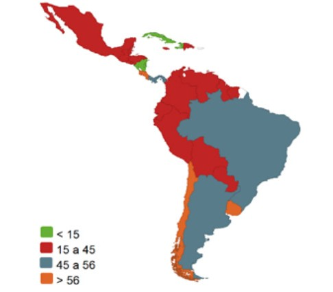
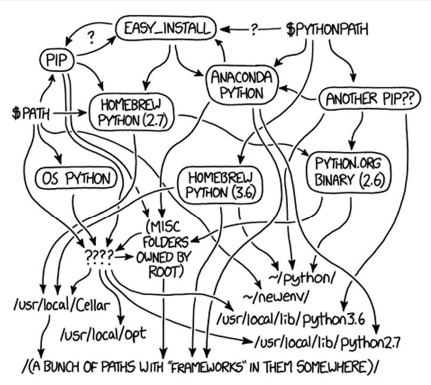
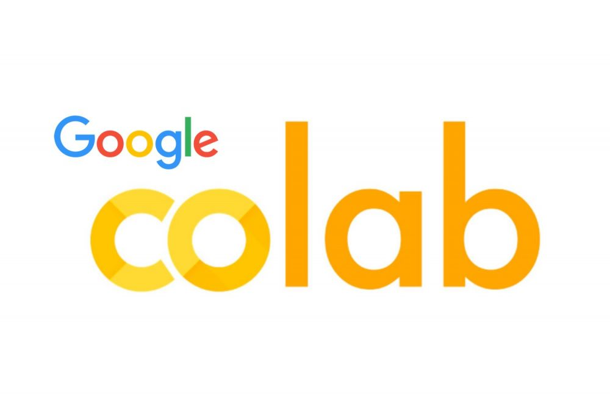
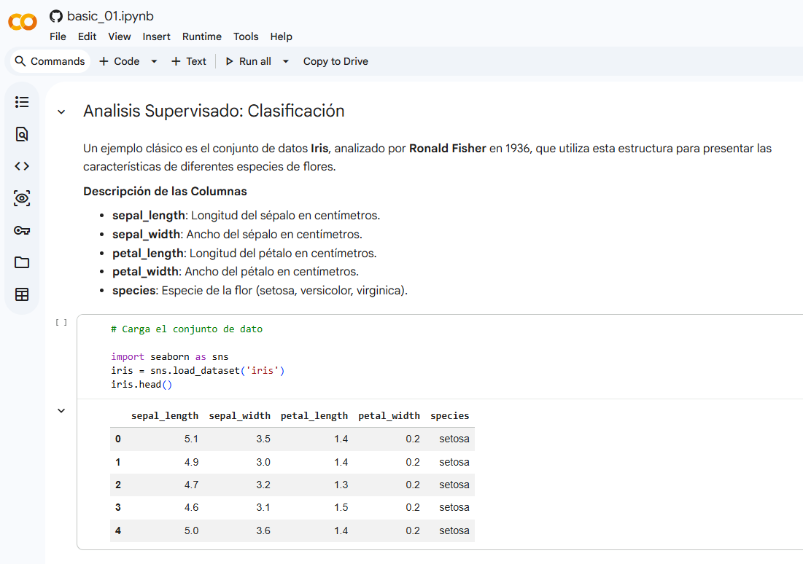
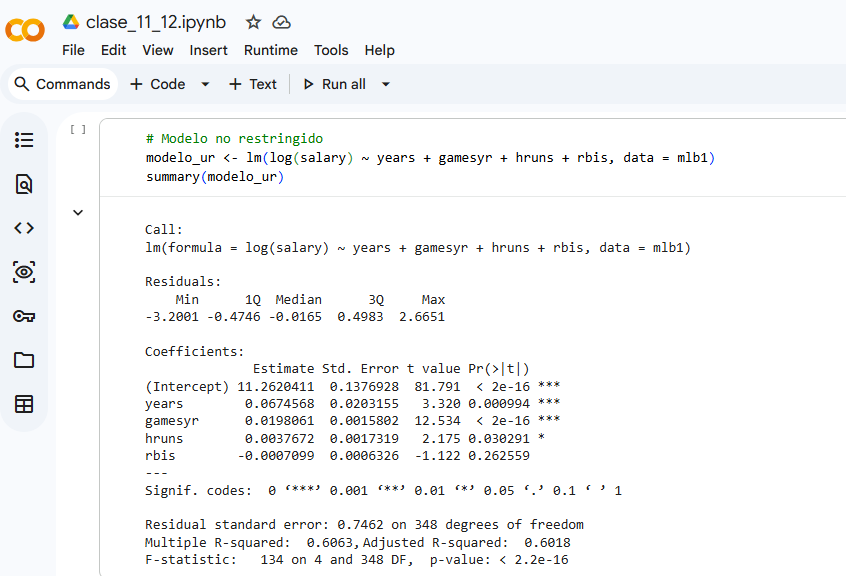
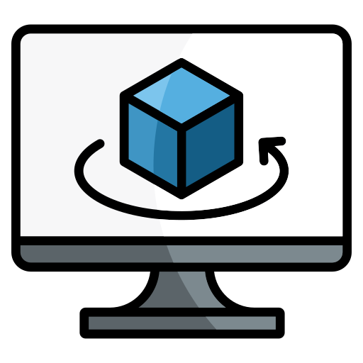
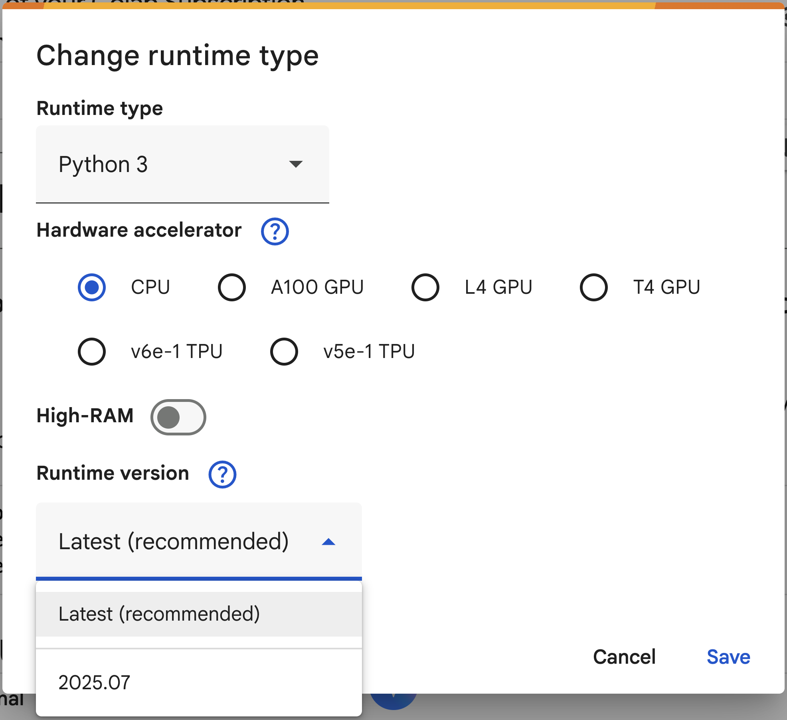

##  {.title-slide background-color="#0F2044"}

::: title-block
**Google Colab**

Ejecuta código desde el navegador
:::

::: subtitle-block
Python · R · Datos · Drive · IA con Gemini\
MOOC propedéutico — Aprende USM 2026
:::

::: author-block
Francisco Alfaro Medina\
Dirección de Transformación Digital · UTFSM\
Unidad de Educación a Distancia · 2026
:::


## ¿Te ha pasado esto?

::: r-stack
<br>


{.fragment .fade-in-then-out fig-align="center" width="100%"}

{.fragment .fade-in-then-out fig-align="center" width="100%"}

{.fragment fig-align="center" width="100%"}
:::

------------------------------------------------------------------------

## Objetivos

::: columns
::: {.column width="40%"}
::: {style="text-align: center;"}

:::
:::

::: {.column .incremental width="60%"}
<br>

-   **Conocer Colab**: Qué es y para qué sirve en docencia e investigación.
-   **Primeros pasos**: Celdas de código, Markdown y ejecución en la nube.
-   **Recursos y datos**: RAM, CPU, librerías, kernels y cómo subir archivos.
-   **Integraciones**: Google Drive, credenciales seguras y Gemini IA.
:::
:::

------------------------------------------------------------------------

##  {background-image="images/background_slides3.png" background-opacity="0.3"}

::: {style="display: flex; justify-content: center; align-items: center; height: 60vh; flex-direction: column; text-align: center;"}
[Google Colab]{style="font-size: 2em"}

[¿Qué es y para qué sirve?]{style="font-size: 2.5em"}
:::

------------------------------------------------------------------------

## ¿Qué es Google Colab?

::: columns
::: {.column width="40%"}
::: {style="text-align: center;"}

:::
:::

::: {.column .incremental width="60%"}
<br>

-   **¿Qué es?**
    -   Entorno de notebooks Jupyter en la nube, gratuito y sin instalación.
-   **¿Para qué sirve?**
    -   Ejecutar código Python (y R) directamente desde el navegador.\
    -   Compartir análisis, tareas y proyectos con un enlace.\
    -   Acceder a GPU/TPU gratuita para proyectos de datos e IA.
:::
:::

. . .

> 🌿 Solo necesitas una cuenta de Google para empezar en [colab.research.google.com](https://colab.research.google.com).

------------------------------------------------------------------------

## Ejemplos 

<br>

::: r-stack
<br>


{.fragment .fade-in-then-out fig-align="center" width="80%"}


{.fragment fig-align="center" width="90%"}
:::

------------------------------------------------------------------------

##  {background-image="images/background_slides3.png" background-opacity="0.3"}

::: {style="display: flex; justify-content: center; align-items: center; height: 60vh; flex-direction: column; text-align: center;"}
[Google Colab]{style="font-size: 2em"}

[Lo que necesitas saber]{style="font-size: 2.5em"}
:::

------------------------------------------------------------------------

## Celdas: el corazón de Colab

::: panel-tabset

## Markdown

::: columns
::: {.column width="50%"}
✏️ **Celda de texto (Markdown):**

```markdown
# Mi Análisis

Este notebook explora los datos de estudiantes
de la UTFSM durante el semestre 2026.

## Objetivos
- Explorar distribuciones
- Visualizar tendencias
- Ajustar un modelo
```
:::

::: {.column width="50%"}
👁️ **Se renderiza así:**

Título visible, secciones organizadas y texto formateado — igual que en GitHub README, pero dentro del notebook.

::: {style="background: #f0f4ff; border-left: 4px solid #0F2044; border-radius: 6px; padding: 0.5em 1em; font-size: 0.85em; margin-top: 1em;"}
💡 Usa celdas de texto para explicar cada paso. Un buen notebook se lee como un informe.
:::
:::
:::

## Python

::: columns
::: {.column width="50%"}
✏️ **Celda de código Python:**

```python
import pandas as pd
import matplotlib.pyplot as plt

# Cargar datos
df = pd.read_csv("datos.csv")

# Visualizar
df["nota"].hist(bins=20, color="#0F2044")
plt.title("Distribución de notas")
plt.xlabel("Nota")
plt.show()
```
:::

::: {.column width="50%"}
👁️ **¿Qué hace?**

- Importa librerías ya instaladas en Colab.
- Carga un archivo CSV.
- Genera un histograma directo en el notebook.

::: {style="background: #f0f4ff; border-left: 4px solid #0F2044; border-radius: 6px; padding: 0.5em 1em; font-size: 0.85em; margin-top: 1em;"}
💡 Python es el lenguaje principal de Colab — y el más usado en ciencia de datos.
:::
:::
:::

## R

::: columns
::: {.column width="50%"}
✏️ **Activar R en Colab:**

En el menú: **Runtime → Change runtime type → R**

```r
# Cargar datos
df <- read.csv("datos.csv")

# Visualizar con ggplot2
library(ggplot2)
ggplot(df, aes(x = nota)) +
  geom_histogram(fill = "#0F2044",
                 bins = 20) +
  labs(title = "Distribución de notas")
```
:::

::: {.column width="50%"}
👁️ **¿Qué hace?**

- Cambia el kernel de Python a R con un clic.
- Permite usar R y sus librerías (`ggplot2`, `dplyr`, `tidyr`) directamente.
- Ideal si tu curso usa R como lenguaje principal.

::: {style="background: #f0f4ff; border-left: 4px solid #0F2044; border-radius: 6px; padding: 0.5em 1em; font-size: 0.85em; margin-top: 1em;"}
💡 No necesitas instalar R en tu computador — Colab lo tiene listo.
:::
:::
:::

:::

------------------------------------------------------------------------

##  {background-image="images/background_slides3.png" background-opacity="0.3"}

::: {style="display: flex; justify-content: center; align-items: center; height: 60vh; flex-direction: column; text-align: center;"}
[Google Colab]{style="font-size: 2em"}

[Recursos, Librerías y Kernels]{style="font-size: 2.5em"}
:::

------------------------------------------------------------------------

## ¿Qué tiene la máquina?

::: columns
::: {.column width="40%"}
::: {style="text-align: center;"}

:::
:::

::: {.column .incremental width="60%"}
<br>

-   **CPU**: ~2 núcleos Intel Xeon — suficiente para análisis de datos típicos.
-   **RAM**: ~12 GB — para datasets medianos sin problema.
-   **Disco**: ~100 GB temporales — se borran al cerrar la sesión.
-   **GPU T4** *(gratis)*: disponible bajo demanda para modelos de ML.

:::
:::

. . .

> ⚠️ **Sesiones temporales**: si la sesión se desconecta, los archivos locales se pierden. Guarda siempre en Drive.

------------------------------------------------------------------------

## Verificar recursos disponibles

```python
# Ver RAM y CPU
import psutil, platform

print(f"Sistema: {platform.system()}")
print(f"CPU: {psutil.cpu_count()} núcleos")
print(f"RAM total:     {psutil.virtual_memory().total / 1e9:.1f} GB")
print(f"RAM disponible:{psutil.virtual_memory().available / 1e9:.1f} GB")
```

```python
# Ver GPU asignada
!nvidia-smi --query-gpu=name,memory.total --format=csv,noheader
```

```python
# Ver disco disponible
!df -h /
```

. . .

> 🌿 Corre estas celdas al inicio de tu sesión para saber con qué recursos cuentas.

------------------------------------------------------------------------

## Librerías: ya instaladas vs. extras

::: columns
::: {.column width="50%"}

**✅ Ya vienen instaladas:**

::: {style="font-size: 0.85em;"}
| Librería | Para qué sirve |
|---|---|
| `pandas` | Datos tabulares |
| `numpy` | Álgebra numérica |
| `matplotlib` | Gráficos básicos |
| `scikit-learn` | Machine Learning |
| `tensorflow` | Deep Learning |
| `seaborn` | Visualización estadística |
:::

:::

::: {.column width="50%"}

**📦 Instalar librerías extra:**

```python
# Con pip (Python)
!pip install polars lightgbm

# Con apt (sistema)
!apt-get install -y libgdal-dev

# Para R (kernel R)
install.packages("tidymodels")
```

::: {style="background: #fff3cd; border-left: 4px solid #e6a817; border-radius: 6px; padding: 0.5em 1em; font-size: 0.85em; margin-top: 0.8em;"}
⚠️ Las librerías instaladas con `!pip` se pierden al reiniciar la sesión.
:::

:::
:::

------------------------------------------------------------------------

## Cambiar el Kernel (Runtime)

::: columns
::: {.column width="40%"}
::: {style="text-align: center;"}

:::
:::

::: {.column .incremental width="60%"}
<br>

**Menú: Runtime → Change runtime type**

-   **CPU**: para análisis de datos y scripts generales.
-   **GPU T4**: para entrenamiento de modelos de ML/DL.
-   **TPU**: para modelos muy grandes con TensorFlow.
-   **R**: para cambiar completamente el lenguaje del entorno.

:::
:::

. . .

> 🌿 Cambiar el runtime **reinicia la sesión** — guarda tu trabajo antes de hacerlo.

------------------------------------------------------------------------

##  {background-image="images/background_slides3.png" background-opacity="0.3"}

::: {style="display: flex; justify-content: center; align-items: center; height: 60vh; flex-direction: column; text-align: center;"}
[Google Colab]{style="font-size: 2em"}

[Datos, Drive y Credenciales]{style="font-size: 2.5em"}
:::

------------------------------------------------------------------------

## Subir datos a Colab

::: panel-tabset

## Subida directa

::: columns
::: {.column width="50%"}
✏️ **Desde el panel lateral:**

```
📁 Ícono de carpeta (izquierda)
  → Subir archivo
  → Selecciona tu CSV o Excel
```

O desde código:

```python
from google.colab import files
uploaded = files.upload()
# → abre un selector de archivos
```
:::

::: {.column width="50%"}
👁️ **¿Cuándo usarlo?**

- Archivos pequeños (< 50 MB).
- Uso puntual en una sola sesión.

::: {style="background: #fff3cd; border-left: 4px solid #e6a817; border-radius: 6px; padding: 0.5em 1em; font-size: 0.85em; margin-top: 1em;"}
⚠️ El archivo desaparece al cerrar la sesión. No es la opción más estable.
:::
:::
:::

## Desde URL

::: columns
::: {.column width="50%"}
✏️ **Descargar desde internet:**

```python
import pandas as pd

# Desde GitHub (raw)
url = "https://raw.githubusercontent.com/"\
      "usuario/repo/main/datos.csv"
df = pd.read_csv(url)

# Desde Google Sheets (publicado como CSV)
sheet_url = "https://docs.google.com/spreadsheets"\
            "/d/ID/export?format=csv"
df = pd.read_csv(sheet_url)

df.head()
```
:::

::: {.column width="50%"}
👁️ **¿Cuándo usarlo?**

- Datos públicos en GitHub o repositorios abiertos.
- Google Sheets compartidos del curso.

::: {style="background: #f0f4ff; border-left: 4px solid #0F2044; border-radius: 6px; padding: 0.5em 1em; font-size: 0.85em; margin-top: 1em;"}
💡 Es la forma más **reproducible** — el notebook funciona para cualquiera que lo abra.
:::
:::
:::

## Google Drive

::: columns
::: {.column width="50%"}
✏️ **Montar tu Drive:**

```python
from google.colab import drive
drive.mount("/content/drive")

# Acceder a tus archivos como carpeta local
import pandas as pd

ruta = "/content/drive/MyDrive/datos/notas.csv"
df = pd.read_csv(ruta)
df.head()
```
:::

::: {.column width="50%"}
👁️ **¿Por qué es lo mejor?**

- Los archivos **persisten** aunque se reinicie la sesión.
- Organiza datos en carpetas de Drive como si fuera tu escritorio.
- Funciona igual que una carpeta local.

::: {style="background: #f0f4ff; border-left: 4px solid #0F2044; border-radius: 6px; padding: 0.5em 1em; font-size: 0.85em; margin-top: 1em;"}
💡 Recomendado para proyectos que se retoman en múltiples sesiones.
:::
:::
:::

## Credenciales Seguras

::: columns
::: {.column width="50%"}

❌ **Nunca hagas esto:**

```python
# Expone tu clave en el notebook
API_KEY = "sk-abc123supersecreta"
PASSWORD = "mi_clave_secreta"
```

✅ **Usa Secrets de Colab:**

```python
from google.colab import userdata

api_key = userdata.get("MI_API_KEY")
```
:::

::: {.column width="50%"}
👁️ **¿Cómo configurar Secrets?**

```
🔑 Ícono de llave (panel izquierdo)
  → "Add new secret"
  → Nombre: MI_API_KEY
  → Valor: tu clave real
  → Activar acceso al notebook
```

::: {style="background: #fde8e8; border-left: 4px solid #c0392b; border-radius: 6px; padding: 0.5em 1em; font-size: 0.85em; margin-top: 1em;"}
🔐 Nunca compartas un notebook con claves escritas directamente en el código.
:::
:::
:::

:::

------------------------------------------------------------------------

##  {background-image="images/background_slides3.png" background-opacity="0.3"}

::: {style="display: flex; justify-content: center; align-items: center; height: 60vh; flex-direction: column; text-align: center;"}
[Google Colab]{style="font-size: 2em"}

[IA con Gemini integrado]{style="font-size: 2.5em"}
:::

------------------------------------------------------------------------

## Gemini en Colab

::: columns
::: {.column width="40%"}
::: {style="text-align: center;"}

:::
:::

::: {.column .incremental width="60%"}
<br>

-   **¿Qué es Gemini en Colab?**
    -   Asistente IA integrado directamente en el entorno de notebooks.
-   **¿Qué puede hacer?**
    -   Generar y explicar celdas de código.\
    -   Corregir errores y sugerir mejoras.\
    -   Responder preguntas sobre librerías y análisis sin salir de Colab.
:::
:::

. . .

> 🌿 Disponible con cuenta Google — el ícono ✨ aparece en cada celda de código.

------------------------------------------------------------------------

## Gemini: ejemplos prácticos

::: panel-tabset

## Generar código

::: columns
::: {.column width="50%"}
✨ **Le pides a Gemini:**

> *"Crea un gráfico de barras con matplotlib que muestre las notas promedio por carrera, usando la paleta 'tab10'."*
:::

::: {.column width="50%"}
✅ **Gemini genera:**

```python
import matplotlib.pyplot as plt
import numpy as np

carreras = ["Ing. Civil", "Informática",
            "Electrónica", "Industrial"]
promedios = [5.2, 5.8, 4.9, 5.5]

fig, ax = plt.subplots(figsize=(8, 5))
colors = plt.cm.tab10(np.linspace(0, 1, len(carreras)))
ax.bar(carreras, promedios, color=colors)
ax.set_title("Promedio de notas por carrera")
ax.set_ylabel("Nota promedio")
ax.set_ylim(1, 7)
plt.tight_layout()
plt.show()
```
:::
:::

## Explicar errores

::: columns
::: {.column width="50%"}
✨ **Tienes este error:**

```python
df.groupby("carrera")["nota"].means()
```

```
AttributeError: 'SeriesGroupBy' object
has no attribute 'means'
```

> *"¿Por qué da este error y cómo lo corrijo?"*
:::

::: {.column width="50%"}
✅ **Gemini explica:**

❌ `means()` no existe — el método correcto es `mean()` (sin 's').

✅ **Versión corregida:**

```python
df.groupby("carrera")["nota"].mean()
```

::: {style="background: #f0f4ff; border-left: 4px solid #0F2044; border-radius: 6px; padding: 0.5em 1em; font-size: 0.85em; margin-top: 0.8em;"}
💡 Gemini también puede sugerir mejoras de eficiencia y estilo en tu código.
:::
:::
:::

## Analizar datos

::: columns
::: {.column width="50%"}
✨ **Le pides a Gemini:**

> *"Tengo un DataFrame con columnas `nota`, `carrera` y `año_ingreso`. Sugiere un análisis exploratorio básico."*
:::

::: {.column width="50%"}
✅ **Gemini propone:**

```python
# Estadísticas descriptivas
print(df.describe())
print(df["carrera"].value_counts())

# Distribución de notas
df["nota"].hist(bins=15, figsize=(8, 4))

# Notas por carrera
df.boxplot(column="nota", by="carrera",
           figsize=(10, 5))

# Evolución por año de ingreso
df.groupby("año_ingreso")["nota"].mean()\
  .plot(marker="o", title="Promedio por año")
```
:::
:::

:::

------------------------------------------------------------------------

##  {background-image="images/background_slides3.png" background-opacity="0.3"}

::: {style="display: flex; justify-content: center; align-items: center; height: 60vh; flex-direction: column; text-align: center;"}
[Google Colab]{style="font-size: 2em"}

[Manos a la Obra]{style="font-size: 2.5em"}
:::

------------------------------------------------------------------------

## Actividad: Tu Primer Notebook

<br>

::: columns
::: {.column width="40%"}
::: {style="text-align: center;"}

:::
:::

::: {.column .incremental width="60%"}
1. **Abre** [colab.research.google.com](https://colab.research.google.com) y crea un nuevo notebook.
2. **Agrega** una celda de texto con título, descripción y objetivos en Markdown.
3. **Carga** un dataset desde URL *(puedes usar datos de [seaborn-data](https://github.com/mwaskom/seaborn-data))*.
4. **Explora** los datos: `.head()`, `.describe()`, `.info()`.
5. **Crea** al menos un gráfico con `matplotlib` o `seaborn`.
6. *(Extra)* Usa **Gemini** para generar o mejorar alguna celda de código.
:::
:::

. . .

> ⏱️ Tiempo de la actividad: 15–20 minutos.

------------------------------------------------------------------------

##  {background-image="images/background_slides3.png" background-opacity="0.3"}

::: {style="display: flex; justify-content: center; align-items: center; height: 60vh; flex-direction: column; text-align: center;"}
[Google Colab]{style="font-size: 1em"}

[Conclusiones]{style="font-size: 1.5em"}
:::

------------------------------------------------------------------------

## Conclusiones

<br>

::: fragment
::: {style="display: flex; flex-direction: column; gap: 0.75em; font-size: 0.95em;"}

::: {style="display: flex; align-items: center; gap: 1em; background: linear-gradient(90deg, #e8f0fe, #f8f9ff); border-left: 4px solid #0F2044; border-radius: 8px; padding: 0.6em 1em;"}
✅ &nbsp; **Google Colab** permite ejecutar código Python y R sin instalar nada.
:::

::: {style="display: flex; align-items: center; gap: 1em; background: linear-gradient(90deg, #e8f0fe, #f8f9ff); border-left: 4px solid #1a3a6b; border-radius: 8px; padding: 0.6em 1em;"}
✅ &nbsp; Los **notebooks** combinan código, texto y visualizaciones en un solo lugar.
:::

::: {style="display: flex; align-items: center; gap: 1em; background: linear-gradient(90deg, #e8f0fe, #f8f9ff); border-left: 4px solid #2a5298; border-radius: 8px; padding: 0.6em 1em;"}
✅ &nbsp; **Google Drive** es la forma más estable de persistir datos entre sesiones.
:::

::: {style="display: flex; align-items: center; gap: 1em; background: linear-gradient(90deg, #e8f0fe, #f8f9ff); border-left: 4px solid #3a6bc4; border-radius: 8px; padding: 0.6em 1em;"}
✅ &nbsp; Las **credenciales** deben guardarse en Secrets, nunca escritas en el código.
:::

::: {style="display: flex; align-items: center; gap: 1em; background: linear-gradient(90deg, #e8f0fe, #f8f9ff); border-left: 4px solid #4a84e0; border-radius: 8px; padding: 0.6em 1em;"}
✅ &nbsp; **Gemini** integrado acelera el aprendizaje y la escritura de código.
:::

:::
:::

------------------------------------------------------------------------

## 🎉 ¡Gracias por Participar!

::: columns
::: {.column width="50%"}
<br>

❓¿Preguntas?

👏 Responder [encuesta](https://forms.gle/WMYcViob6Z6WbPZD7)

🥳 ¡Disfrutar del Curso!
:::

::: {.column width="50%" align="center"}
{width="400"}
:::
:::

> 🔗 Nuestro Sitio Web: [educacionadistancia.usm.cl/](https://educacionadistancia.usm.cl/)

```{=html}
<style>
.reveal .slides h1 {
  font-size: 2em;
}
.reveal .slides h2 {
  font-size: 1.5em;
}
.reveal .slides p {
  font-size: 0.8em;
}
.reveal .slides table {
  font-size: 0.8em;
  width: 90%;
  margin: 0 auto;
}
.reveal .slides ul {
  font-size: 0.8em;
}
.reveal .slide-logo {
   max-height: 2.5em !important;
}
</style>
```
