##  {#hello-quarto-title data-menu-title="Hola Quarto" background-image="images/horst_penguins_telescope.png" data-state="no-logo"}

[Innovación en la enseñanza <br>de la matemática escolar]{.custom-title}

[<br>con Python y herramientas opensource]{.custom-subtitle}

[Francisco Alfaro Medina <br> Valeska Canales Pozo <br> Dorian Villegas Rojas]{.custom-author}

[<https://sethnut.com/talks>]{.custom-url}

##  { background-opacity="0.25" transition="zoom"}

<br>

::: r-stack
{.fragment .fade-in-then-out fig-align="center"}

{.fragment .fade-in-then-out fig-align="center"}

{.fragment fig-align="center"}
:::


------------------------------------------------------------------------

## Objetivos del Estudio { background-opacity="0.25"}

<br>

::: columns
::: {.column width="35%"}
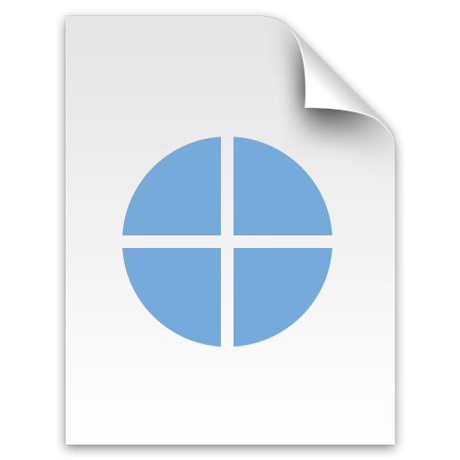
:::

::: {.column width="65%" .incremental}

<br>

- Incorporar **contextos sociales reales** en actividades de modelación matemática.
- Explorar el uso de **narrativas digitales con Python** en talleres interactivos.
- Evaluar **satisfacción y motivación estudiantil** en jóvenes de 13–17 años.


:::
:::


# <br> Comencemos! {.title-top-light background-image="images/horst_quarto_penguins_teach.png" data-state="no-logo"}

## Pregunta de Investigación {background-opacity="0.25" transition="fade" }

<br><br>


<div class="fragment fade-in" style="
  background: rgba(255,255,255,0.75);
  padding: 2rem;
  border-radius: 18px;
  border-left: 10px solid #2E86C1;
  box-shadow: 0 4px 20px rgba(0,0,0,0.15);
  font-size: 2rem;
  text-align: center;
  line-height: 1.4;
">
¿Cómo el uso de herramientas digitales abiertas —<b>Python, Quarto y Streamlit</b>—<br>
favorece la <b>modelación matemática</b> y el <b>pensamiento computacional</b><br>
en estudiantes escolares de 13 a 17 años?
</div>


## Marco Teórico {background-opacity="0.25" transition="fade"}

<br><br>

::: columns
::: {.column width="33%"}
::: {style="text-align:center;"}
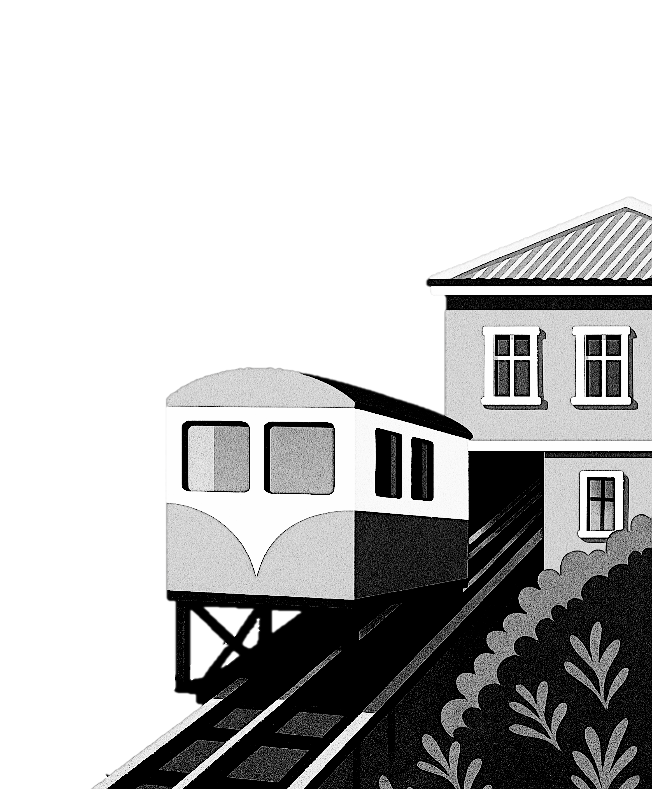<br>
**Modelación y sociedad**\
La matemática para comprender contextos reales.
:::
:::

::: {.column .fragment width="34%"}
::: {style="text-align:center;"}
<br>
**Tecnologías digitales**\
LaTeX, IA y Quarto como herramientas educativas.
:::
:::

::: {.column .fragment width="33%"}
::: {style="text-align:center;"}
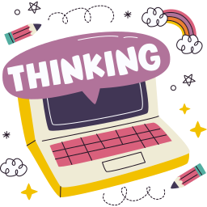<br>
**Pensamiento lógico**\
Integración de matemática y computación.
:::
:::
:::


## Contexto y Participantes {background-opacity="0.25" transition="fade"}

<br><br><br>

<div class="fragment fade-in" style="
  background: rgba(255,255,255,0.80);
  padding: 2.2rem;
  border-radius: 18px;
  border-left: 10px solid #2E86C1;
  box-shadow: 0 4px 20px rgba(0,0,0,0.15);
  font-size: 1.8rem;
  text-align: left;
  line-height: 1.55;
  max-width: 85%;
  margin: 0 auto;
">

<b>Público:</b> estudiantes de 13–17 años.<br>
<b>Contextos:</b> Olimpiadas de Matemática USM y talleres colaborativos USM–UChile.<br>
<b>Duración:</b> sesiones de 60–90 minutos por taller.<br>
<b>Enfoque pedagógico:</b> aprendizaje activo con modelación y visualización.<br>
<b>Herramientas:</b> Python, Quarto, Streamlit y Google Colab.

</div>


##  { background-opacity="0.25" transition="zoom"}

<br>

::: {style="text-align: center;"}
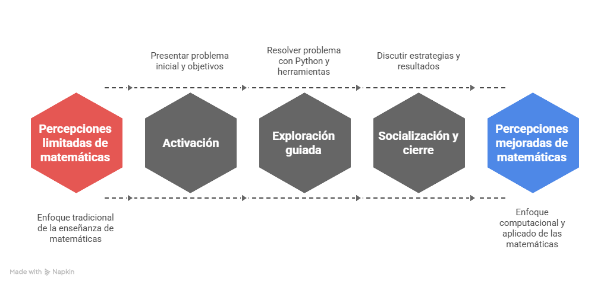
:::

##  { background-opacity="0.25" transition="zoom"}

<br><br>

::: {style="text-align: center;"}
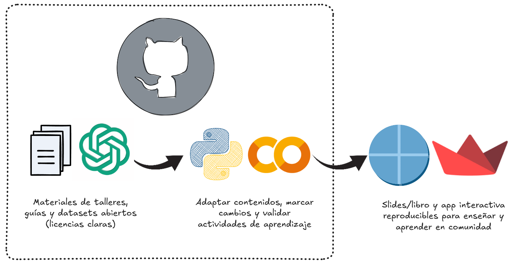
:::


------------------------------------------------------------------------

##  { background-opacity="0.25" transition="zoom"}


<br>

::: r-stack
::: {.fragment .fade-in-then-out}
<iframe src="https://falfaro.xyz/DMAT-SJ-Olimpiadas/" width="1200" height="600" frameborder="0" scrolling="si" style="max-width:100%; border:1px solid #CCC; border-radius:10px;" allowfullscreen>

</iframe>
:::

::: fragment
<iframe src="https://sethnut.com/ws-usm_uchile-2025/" width="1200" height="600" frameborder="0" scrolling="si" style="max-width:100%; border:1px solid #CCC; border-radius:10px;" allowfullscreen>

</iframe>
:::
:::


## Resultados {background-opacity="0.25" transition="fade-in slide-out"}

::: r-stack
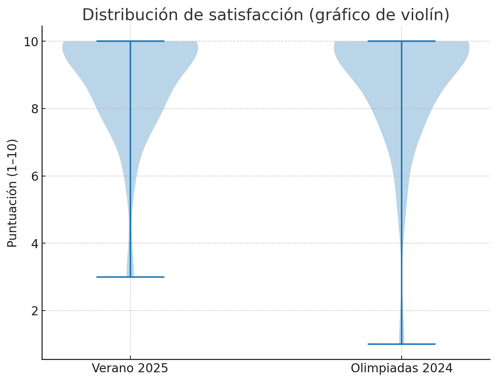{.fragment .fade-in-then-out fig-align="center" width="70%"}

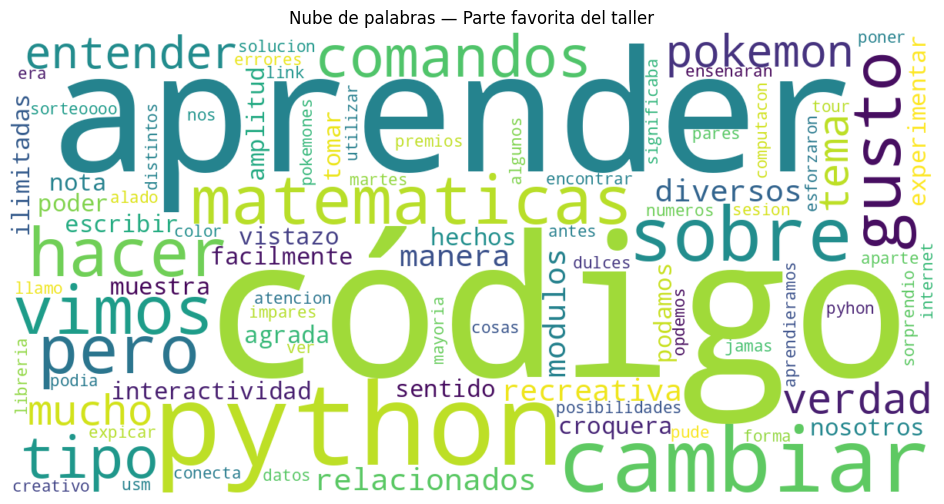{.fragment fig-align="center" width="90%"}
:::


## Opiniones { background-opacity="0.25" size="50%"}

<br><br>

::: columns
::: {.column .fragment width="50%"}
::: {.callout-important title="Negativos"}
- Poco tiempo para dudas
- Faltaron ejemplos
- Ritmo rápido
- Poca práctica guiada
:::
:::

::: {.column .fragment width="50%"}
::: {.callout-note title="Positivos"}
- Profesor claro y motivador
- Actividades útiles
- Buen uso de herramientas
- Taller dinámico y entretenido
:::
:::
:::

##  Experiencias Similares{background-opacity="0.25" transition="fade-in slide-out"}


::: {style="text-align: center;" .fragment}

:::


------------------------------------------------------------------------

##  { background-opacity="0.25" transition="zoom"}


<br>

::: r-stack
::: {.fragment .fade-in-then-out}
<iframe src="https://falfaro.xyz/pyschool_content/" width="1200" height="600" frameborder="0" scrolling="si" style="max-width:100%; border:1px solid #CCC; border-radius:10px;" allowfullscreen>

</iframe>
:::

::: fragment
<iframe src="https://sebastiandres.github.io/pyschool_2025/space_station/rooms/sala_00.html" width="1200" height="600" frameborder="0" scrolling="si" style="max-width:100%; border:1px solid #CCC; border-radius:10px;" allowfullscreen>

</iframe>
:::
:::


## Discusión {background-opacity="0.25" transition="fade"}

<br><br><br>

<div class="fragment fade-in" style="
  background: rgba(255,255,255,0.80);
  padding: 2rem;
  border-radius: 18px;
  border-left: 10px solid #2E86C1;
  box-shadow: 0 4px 20px rgba(0,0,0,0.15);
  font-size: 1.7rem;
  text-align: center;
  line-height: 1.5;
  max-width: 85%;
  margin: 0 auto;
">
<b>La integración de herramientas digitales abiertas</b> permitió que la matemática<br>
dejara de percibirse como un conjunto de procedimientos aislados,<br>
transformándose en un <b>lenguaje para interpretar y comunicar fenómenos reales</b>.<br><br>
La programación y la visualización favorecieron la participación activa<br>
y la construcción de narrativas matemáticas con sentido social.
</div>


# Hora del "adiós" {.title-top-dark background-image="images/horst_quarto_penguins_thankyou.png" data-state="no-logo"}

------------------------------------------------------------------------


## Conclusiones

::: columns
::: {.column width="5%"}
:::

::: {.column width="40%"}
::: bulletbox
::: {.fragment .fade-in-then-semi-out}
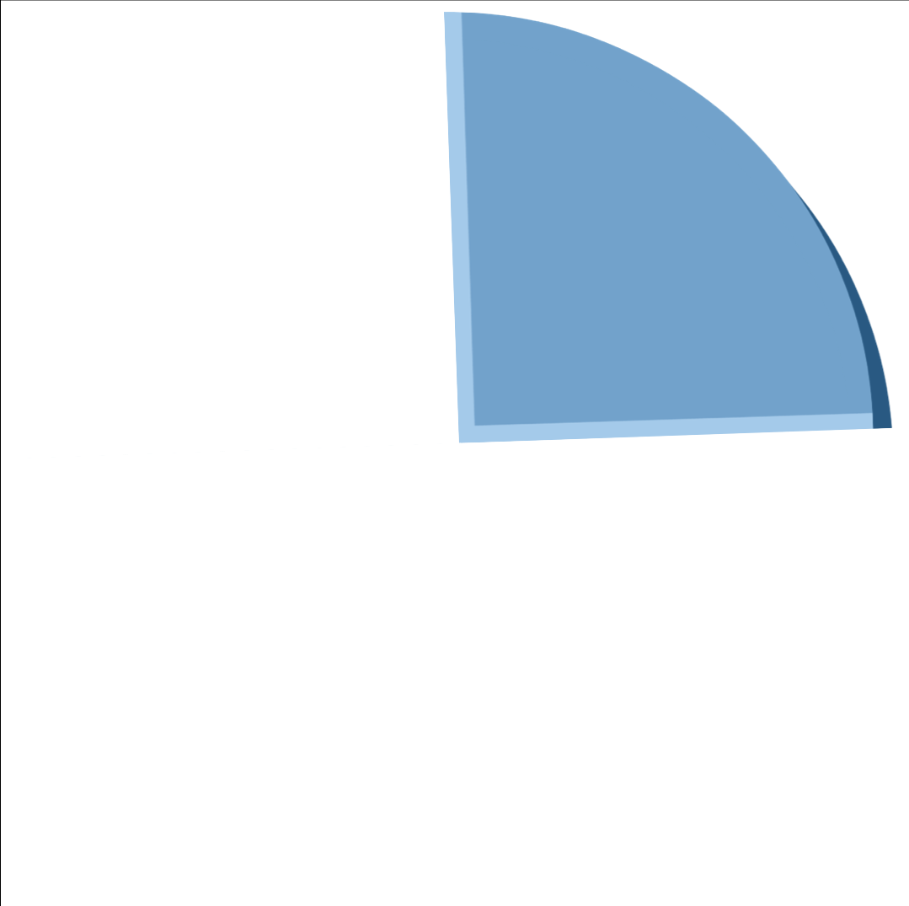{width="50px"}\
**Motivación**: Los talleres aumentaron el interés por aprender.
:::
:::
:::

::: {.column width="5%"}
:::

::: {.column width="40%"}
::: bulletbox
::: {.fragment .fade-in-then-semi-out}
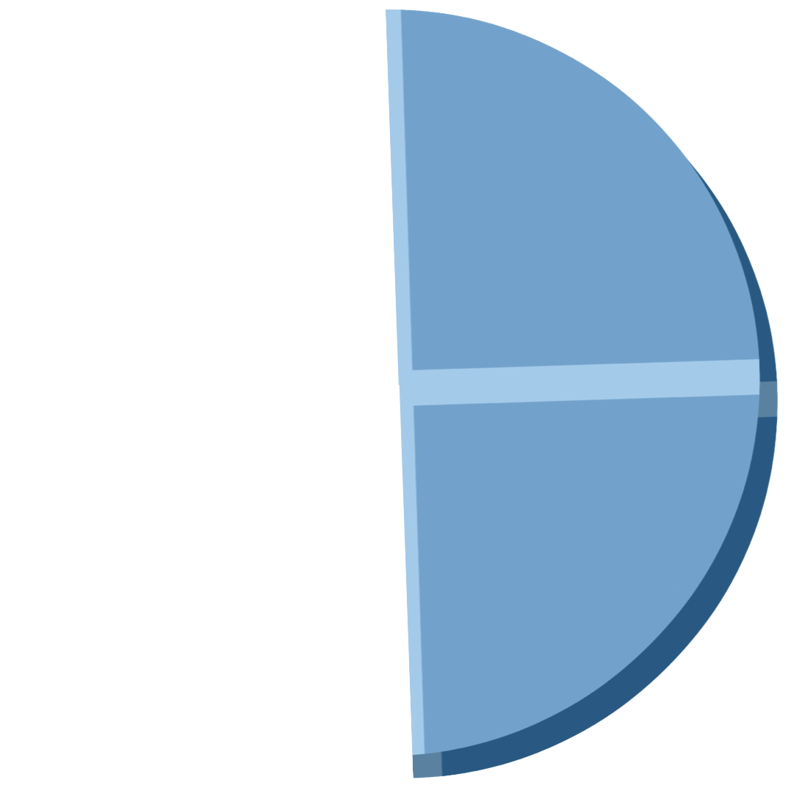{width="50px"}\
**Claridad**: La docencia fueron aspectos altamente valorados.
:::
:::
:::

::: {.column width="5%"}
:::
:::

::: columns
::: {.column width="5%"}
:::

::: {.column width="40%"}
::: bulletbox
::: {.fragment .fade-in-then-semi-out}
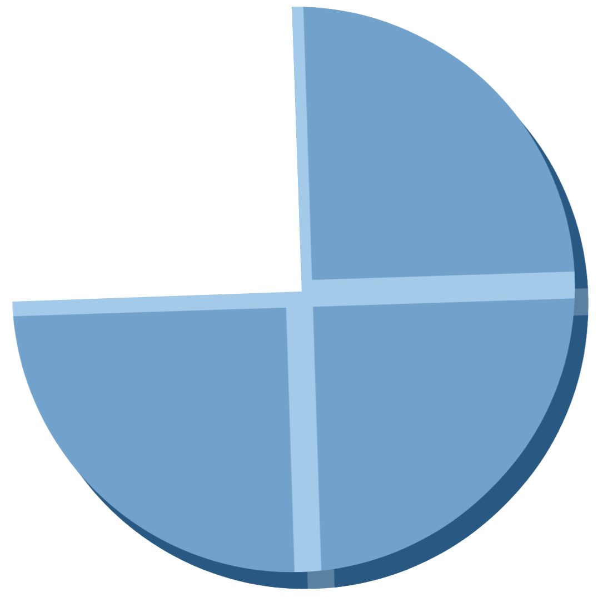{width="50px"}\
**Interactividad**: Las actividades prácticas facilitaron el aprendizaje.
:::
:::
:::

::: {.column width="5%"}
:::

::: {.column width="40%"}
::: bulletbox
::: {.fragment .fade-in-then-semi-out}
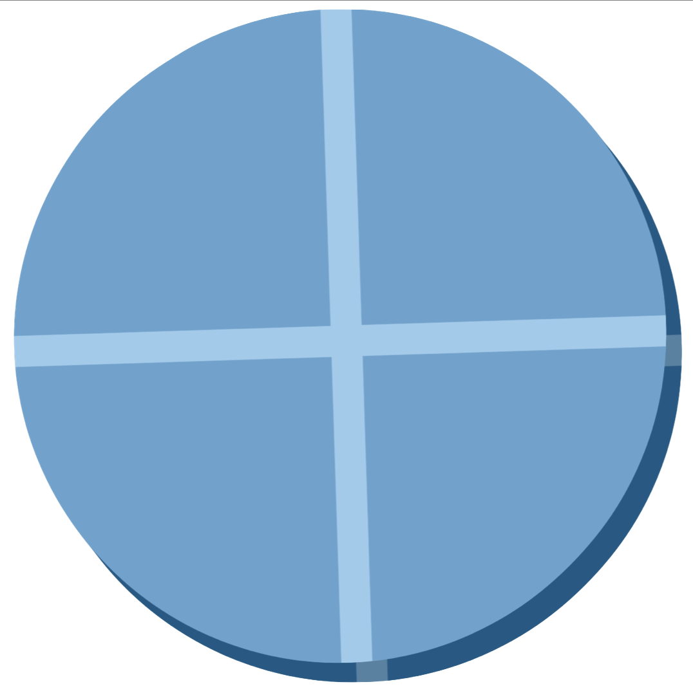{width="50px"}\
**Mejoras**: Se requiere más tiempo para dudas y ejemplos.
:::
:::
:::

::: {.column width="5%"}
:::
:::


------------------------------------------------------------------------

## 🎉 Agradecimientos {background-opacity="0.25" transition="fade"}


::: r-stack
{.fragment .fade-in-then-out fig-align="center" width="850px" height="600px"}

{.fragment .fade-in-then-out fig-align="center" width="850px" height="600px"}

{.fragment .fade-in-then-out fig-align="center" width="850px" height="600px"}

{.fragment fig-align="center" width="850px" height="600px"}
:::


------------------------------------------------------------------------


## 🎉 ¡Gracias por Participar! { background-opacity="0.25"}

::: columns
::: {.column width="50%"}
<br>

❓ ¿Preguntas?

👏 Responder [encuesta](https://forms.gle/SHNh4LEJpfWSvZRk7)

🥳 Disfrutar del Evento!
:::

::: {.column width="50%" align="center"}
{width="400"}
:::
:::

> 🔗 Nuestro Sitio Web: [sethnut.com/talks](https://sethnut.com/talks/)


```{=html}
<style>
/* Ajusta el tamaño del título y subtítulo */
.reveal .slides h1 {
  font-size: 2em; /* Tamaño más pequeño para el título */
}

.reveal .slides h2 {
  font-size: 1.5em; /* Tamaño más pequeño para el subtítulo */
}

/* Ajusta el tamaño del texto en los párrafos */
.reveal .slides p {
  font-size: 0.8em; /* Texto más pequeño */
}

/* Ajusta el tamaño de las tablas */
.reveal .slides table {
  font-size: 0.8em; /* Tamaño de fuente más pequeño en las tablas */
  width: 90%; /* Ajusta el ancho de la tabla */
  margin: 0 auto; /* Centra la tabla */
}

/* Ajusta el tamaño de los bullets */
.reveal .slides ul {
  font-size: 0.8em; /* Tamaño de fuente más pequeño en los bullets */

}

.reveal .slide-logo {
   max-height: 2.5em !important;

}

</style>
```