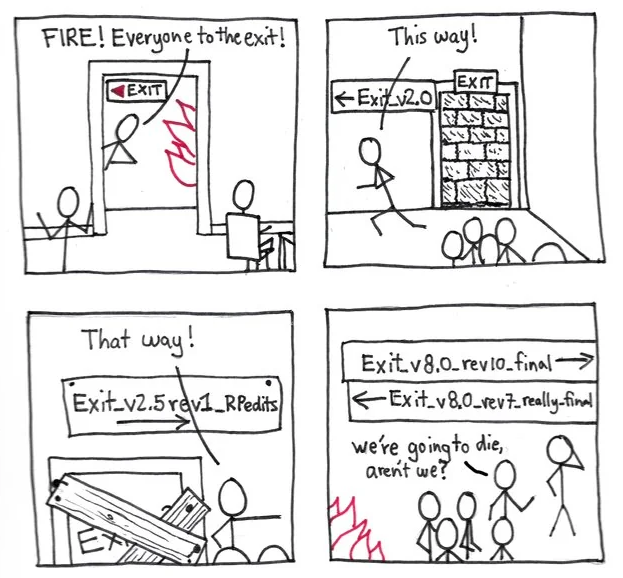
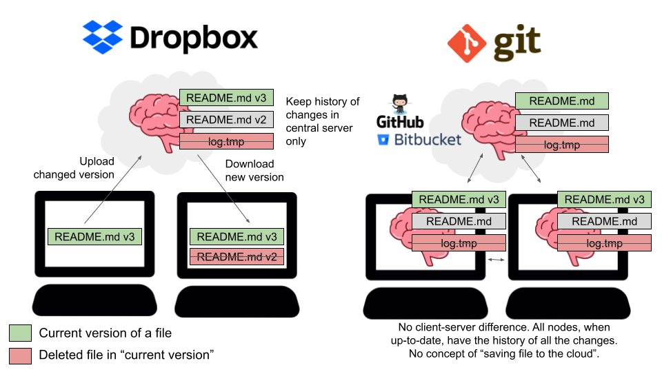
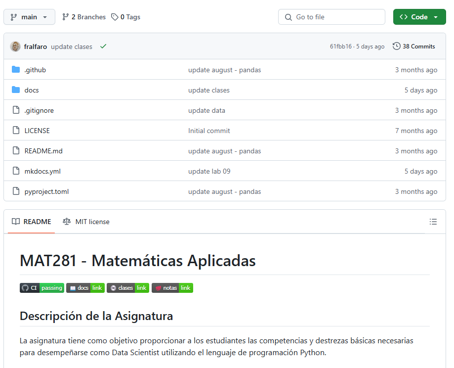
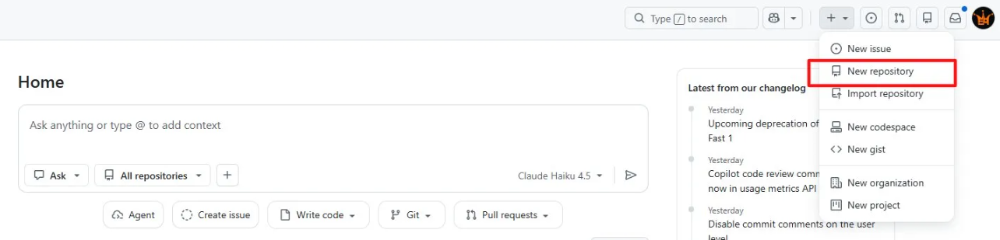
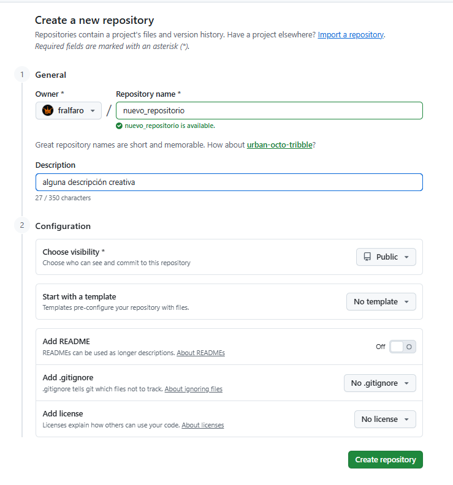
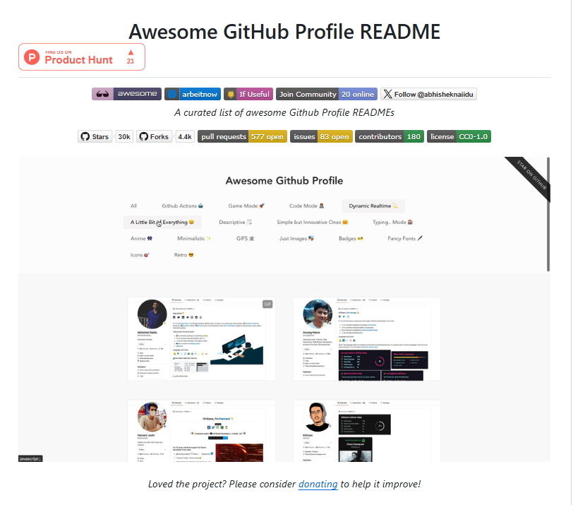

##  {.title-slide background-color="#0F2044"}

::: title-block
**GitHub**

Organiza, comparte y colabora 
:::

::: subtitle-block
Repositorios · README · Portafolio · Perfil Profesional\
MOOC propedéutico — Aprende USM 2026
:::

::: author-block
Francisco Alfaro Medina\
Dirección de Transformación Digital · UTFSM\
Unidad de Educación a Distancia · 2026
:::

## ¿Te ha pasado esto?

::: r-stack
<br>

{.fragment .fade-in-then-out fig-align="center" width="100%"}

{.fragment fig-align="center" width="100%"}
:::

------------------------------------------------------------------------

## Objetivos

::: columns
::: {.column width="40%"}
::: {style="text-align: center;"}

:::
:::

::: {.column .incremental width="60%"}
<br>

-   **Conocer GitHub**: Qué es y por qué usarlo en contexto académico.
-   **Repositorios**: Crear, organizar y compartir proyectos desde la web.
-   **README y Markdown**: Documentar tu trabajo de forma clara y profesional.
-   **Perfil GitHub**: Construir un portafolio visible para el mundo.
:::
:::

------------------------------------------------------------------------

##  {background-image="images/background_slides3.png" background-opacity="0.3"}

::: {style="display: flex; justify-content: center; align-items: center; height: 60vh; flex-direction: column; text-align: center;"}
[GitHub]{style="font-size: 2em"}

[¿Qué es y por qué usarlo?]{style="font-size: 2.5em"}
:::

------------------------------------------------------------------------

## ¿Qué es GitHub?

::: columns
::: {.column width="40%"}
::: {style="text-align: center;"}

:::
:::

::: {.column .incremental width="60%"}
<br>

-   **¿Qué es GitHub?**
    -   Plataforma web para alojar, versionar y compartir proyectos de forma colaborativa.
-   **¿Por qué usarlo en eduación?**
    -   Organiza apuntes, tareas y proyectos en un solo lugar.\
    -   Permite compartir materiales con estudiantes y colegas.\
    -   Deja registro de cada cambio y versión de tu trabajo.
:::
:::

------------------------------------------------------------------------

## Ejemplos

::: columns
::: {.column width="50%"}
{fig-align="center" width="93%"}\
[Repositorio del Curso](https://github.com/fralfaro/MAT281_2024)
:::

::: {.column .fragment width="50%"}
{fig-align="center" width="80%"}\
[Portafolio Estudiantes](https://github.com/fralfaro/MAT281-Portfolio)
:::
:::

------------------------------------------------------------------------

## Crear una cuenta

::: columns
::: {.column width="40%"}
::: {style="text-align: center;"}

:::
:::

::: {.column .incremental width="60%"}
<br>

-   **Paso a paso:**
    1.  Ve a [github.com](https://github.com) y haz clic en **Sign up**.
    2.  Ingresa tu correo, crea una contraseña y elige un nombre de usuario.
    3.  Verifica tu cuenta y completa el perfil básico.
-   **Consejos:**
    -   Usa un nombre de usuario profesional *(ej: `francisco-alfaro`)*.
    -   Agrega foto de perfil y una bio breve.
:::
:::

. . .

> 🌿 Con una cuenta gratuita tienes acceso a repositorios públicos y privados ilimitados.

------------------------------------------------------------------------

## Paso a paso

::: r-stack
{.fragment .fade-in-then-out width="100%"}

{.fragment .fade-in-then-out width="100%"}

{.fragment .fade-in-then-out width="60%"}

{.fragment .fade-in-then-out width="100%"}

{.fragment width="60%"}
:::


------------------------------------------------------------------------

##  {background-image="images/background_slides3.png" background-opacity="0.3"}

::: {style="display: flex; justify-content: center; align-items: center; height: 60vh; flex-direction: column; text-align: center;"}
[GitHub]{style="font-size: 2em"}

[Repositorios: tu espacio de trabajo]{style="font-size: 2.5em"}
:::

------------------------------------------------------------------------

## ¿Qué es un repositorio?

::: columns
::: {.column width="40%"}
::: {style="text-align: center;"}

:::
:::

::: {.column .incremental width="60%"}
<br>

-   **¿Qué es?**
    -   Una carpeta en la nube donde viven todos los archivos de un proyecto.
-   **¿Para qué sirve en docencia?**
    -   Guardar apuntes, notebooks, datos y entregables.\
    -   Compartir materiales con un simple enlace.\
    -   Mantener un historial de cambios de tu trabajo.
:::
:::

------------------------------------------------------------------------

## Crear un repositorio

::: columns
::: {.column width="40%"}
::: {style="text-align: center;"}

:::
:::

::: {.column .incremental width="60%"}
<br>

1.  En tu perfil, haz clic en **New repository**.
2.  Pon un nombre descriptivo *(ej: `mat281-apuntes`)*.
3.  Elige **Public** o **Private** según el caso.
4.  Marca ✅ **Add a README file**.
5.  Haz clic en **Create repository**.
:::
:::

. . .

> 🌿 Desde la web puedes subir archivos, editar texto y organizar carpetas sin instalar nada.

------------------------------------------------------------------------

## Paso a paso

::: r-stack
{.fragment .fade-in-then-out fig-align="center" width="100%"}

{.fragment fig-align="center" width="80%"}
:::

------------------------------------------------------------------------

##  {background-image="images/background_slides3.png" background-opacity="0.3"}

::: {style="display: flex; justify-content: center; align-items: center; height: 60vh; flex-direction: column; text-align: center;"}
[GitHub]{style="font-size: 2em"}

[README y Markdown]{style="font-size: 2.5em"}
:::

------------------------------------------------------------------------

## ¿Qué es el README?

::: columns
::: {.column width="40%"}
::: {style="text-align: center;"}

:::
:::

::: {.column .incremental width="60%"}
<br>

-   **¿Qué es?**
    -   El archivo `README.md` es la "portada" de tu repositorio.
-   **¿Para qué sirve?**
    -   Explica de qué trata el proyecto.\
    -   Guía a quien visita el repositorio.\
    -   En docencia: describe el curso, los contenidos y cómo navegar los materiales.
:::
:::

. . .

> 🌿 Se escribe en **Markdown**, un lenguaje simple y legible.

------------------------------------------------------------------------

## Ejemplos de Readme

::: r-stack
{.fragment .fade-in-then-out width="100%"}

{.fragment width="95%"}
:::

. . .

> 🔗 Para más ejemplos de README, visita [**awesome-readme**](https://github.com/matiassingers/awesome-readme).

------------------------------------------------------------------------

##  {background-image="images/background_slides3.png" background-opacity="0.3"}

::: {style="display: flex; justify-content: center; align-items: center; height: 60vh; flex-direction: column; text-align: center;"}
[GitHub]{style="font-size: 2em"}

[Tu Perfil Profesional]{style="font-size: 2.5em"}
:::

------------------------------------------------------------------------

## GitHub Profile

::: columns
::: {.column width="40%"}
::: {style="text-align: center;"}

:::
:::

::: {.column .incremental width="60%"}
<br>

-   **¿Qué es?**
    -   Tu página pública en GitHub: muestra quién eres y qué has hecho.
-   **¿Por qué importa?**
    -   Funciona como un **portafolio académico y profesional**.\
    -   Es lo primero que ven empleadores, colegas y estudiantes.\
    -   Refleja tu actividad, proyectos y áreas de interés.
:::
:::

. . .

> 🌿 Crear un perfil atractivo es más fácil de lo que parece — y marca la diferencia.

------------------------------------------------------------------------

## Cómo crear tu perfil especial

::: columns
::: {.column width="40%"}
::: {style="text-align: center;"}

:::
:::

::: {.column .incremental width="60%"}
<br>

1.  Crea un repositorio con **el mismo nombre que tu usuario** *(ej: `fralfaro/fralfaro`)*.
2.  GitHub lo reconoce automáticamente como tu **perfil README**.
3.  Edita el `README.md` con tu presentación personal.
4.  ¡Se muestra en la portada de tu perfil para todo el mundo!
:::
:::

. . .

> 🌿 Es un repositorio especial — cuando el nombre coincide con tu usuario, GitHub lo usa como tu página de perfil.

------------------------------------------------------------------------

## Ejemplos de Profile 

::: r-stack
{.fragment .fade-in-then-out width="80%"}

{.fragment width="85%"}
:::

. . .

> 🔗 Para más ejemplos de PROFILE, visita [**awesome-profile**](https://github.com/abhisheknaiidu/awesome-github-profile-readme).

------------------------------------------------------------------------

##  {background-image="images/background_slides3.png" background-opacity="0.3"}

::: {style="display: flex; justify-content: center; align-items: center; height: 60vh; flex-direction: column; text-align: center;"}
[GitHub]{style="font-size: 2em"}

[Manos a la Obra]{style="font-size: 2.5em"}
:::

------------------------------------------------------------------------

## Actividad: Tu Repositorio en GitHub

<br>

::: columns
::: {.column width="40%"}
::: {style="text-align: center;"}

:::
:::

::: {.column .incremental width="60%"}
1.  **Crea** tu cuenta en [github.com](https://github.com) *(si aún no tienes)*.
2.  **Crea** un repositorio llamado `mi-curso-herramientas`.
3.  **Agrega** un `README.md` usando la estructura de syllabus vista en clase.
4.  **Incluye**: título, descripción, tabla de contenidos y al menos un link.
5.  *(Extra)* Crea tu **repositorio de perfil** con tu nombre de usuario.
:::
:::

. . .

> ⏱️ Tiempo de la actividad: 15–20 minutos.

------------------------------------------------------------------------

##  {background-image="images/background_slides3.png" background-opacity="0.3"}

::: {style="display: flex; justify-content: center; align-items: center; height: 60vh; flex-direction: column; text-align: center;"}
[GitHub]{style="font-size: 1em"}

[Conclusiones]{style="font-size: 1.5em"}
:::

------------------------------------------------------------------------

## Conclusiones

<br>

::: fragment
::: {style="display: flex; flex-direction: column; gap: 0.75em; font-size: 0.95em;"}
::: {style="display: flex; align-items: center; gap: 1em; background: linear-gradient(90deg, #e8f0fe, #f8f9ff); border-left: 4px solid #0F2044; border-radius: 8px; padding: 0.6em 1em;"}
✅   **GitHub** es una plataforma esencial para organizar y compartir trabajo académico.
:::

::: {style="display: flex; align-items: center; gap: 1em; background: linear-gradient(90deg, #e8f0fe, #f8f9ff); border-left: 4px solid #1a3a6b; border-radius: 8px; padding: 0.6em 1em;"}
✅   Los **repositorios** permiten versionar y compartir proyectos con un solo enlace.
:::

::: {style="display: flex; align-items: center; gap: 1em; background: linear-gradient(90deg, #e8f0fe, #f8f9ff); border-left: 4px solid #2a5298; border-radius: 8px; padding: 0.6em 1em;"}
✅   **Markdown y README** son herramientas simples para documentar con claridad.
:::

::: {style="display: flex; align-items: center; gap: 1em; background: linear-gradient(90deg, #e8f0fe, #f8f9ff); border-left: 4px solid #3a6bc4; border-radius: 8px; padding: 0.6em 1em;"}
✅   El **perfil de GitHub** funciona como portafolio profesional y académico.
:::

::: {style="display: flex; align-items: center; gap: 1em; background: linear-gradient(90deg, #e8f0fe, #f8f9ff); border-left: 4px solid #4a84e0; border-radius: 8px; padding: 0.6em 1em;"}
✅   Todo se puede hacer **desde el navegador**, sin instalar nada.
:::
:::
:::

------------------------------------------------------------------------

## 🎉 ¡Gracias por Participar!

::: columns
::: {.column width="50%"}
<br>

❓¿Preguntas?

👏 Responder [encuesta](https://forms.gle/WMYcViob6Z6WbPZD7)

🥳 ¡Disfrutar del Curso!
:::

::: {.column width="50%" align="center"}
{width="400"}
:::
:::

> 🔗 Nuestro Sitio Web: [educacionadistancia.usm.cl/](https://educacionadistancia.usm.cl/)

```{=html}
<style>
.reveal .slides h1 {
  font-size: 2em;
}
.reveal .slides h2 {
  font-size: 1.5em;
}
.reveal .slides p {
  font-size: 0.8em;
}
.reveal .slides table {
  font-size: 0.8em;
  width: 90%;
  margin: 0 auto;
}
.reveal .slides ul {
  font-size: 0.8em;
}
.reveal .slide-logo {
   max-height: 2.5em !important;
}
</style>
```