##  {#title data-menu-title="Git & GitHub" background-image="images/github/repos3.png" background-opacity="0.6" data-state="no-logo"}

[Git & GitHub desde Cero]{.custom-title}

[cuenta · perfil · repositorios · git en la práctica]{.custom-subtitle}

[Francisco Alfaro Medina]{.custom-author}

[<https://educacionadistancia.usm.cl>]{.custom-url}

# Motivación {background-image="images/github/gh.png" background-opacity="0.15" transition="zoom"}

## ¿Por qué importa GitHub? {transition="zoom"}

::: r-stack
{.fragment .fade-in-then-out fig-align="center" width="75%"}

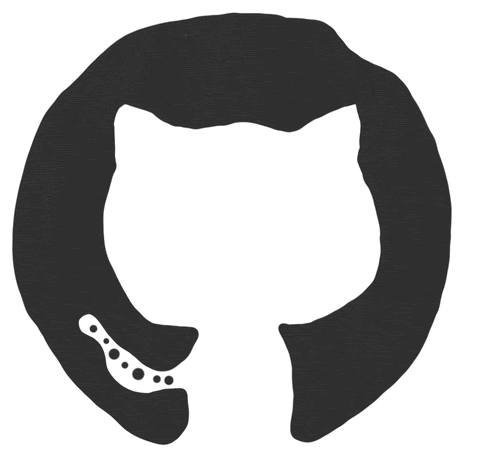{.fragment .fade-in-then-out fig-align="center" width="80%"}

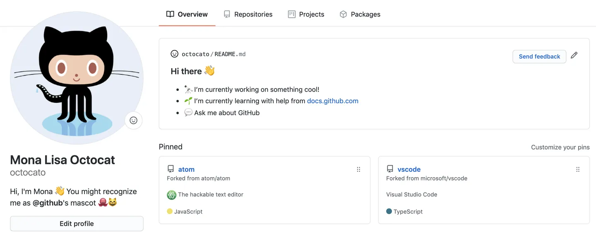{.fragment fig-align="center" width="70%"}
:::

## Hoja de ruta {.takeaway .center}

<br>

::: {style="font-size: 1.4em; line-height: 2.2em; text-align: center;"}
::: fragment
**① Crear una cuenta** → acceder a GitHub.com
:::

::: fragment
**② Personalizar el perfil** → primera impresión digital
:::

::: fragment
**③ Repositorios & README** → mostrar tu trabajo
:::

::: fragment
**④ Git en la práctica** → el flujo real de trabajo
:::
:::

# Crear tu Cuenta {.title-top-light background-image="images/github/octo.png" background-opacity="0.12" data-state="no-logo"}

## ¿Qué es GitHub? {transition="zoom"}

<br>

::: columns
::: {.column width="5%"}
:::

::: {.column width="50%"}
::: bulletbox
::: {.fragment .fade-in-then-semi-out}
**Plataforma de control de versiones** basada en Git, con más de 100 millones de desarrolladores en todo el mundo.
:::
:::

::: bulletbox
::: {.fragment .fade-in-then-semi-out}
**Gratuita** para proyectos públicos y privados — no necesitas pagar para empezar.
:::
:::

::: bulletbox
::: {.fragment .fade-in-then-semi-out}
**Red profesional** que empleadores, reclutadores y colaboradores revisan como primera impresión.
:::
:::
:::

::: {.column width="5%"}
:::

::: {.column width="35%"}
::: {.fragment}
{fig-align="center" width="100%"}
:::
:::

::: {.column width="5%"}
:::
:::

## Registro — Paso a Paso (1/2) {transition="fade"}

<br>

::: r-stack
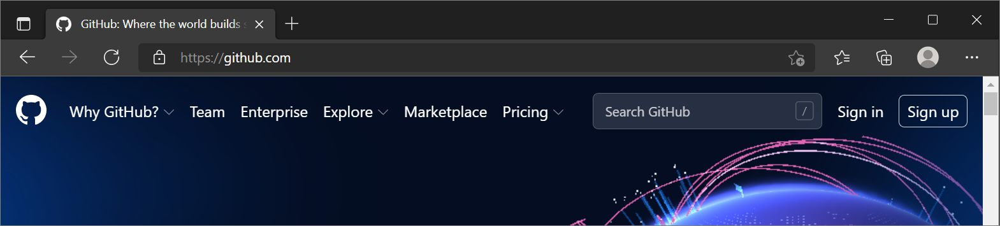{.fragment .fade-in-then-out fig-align="center" width="80%"}

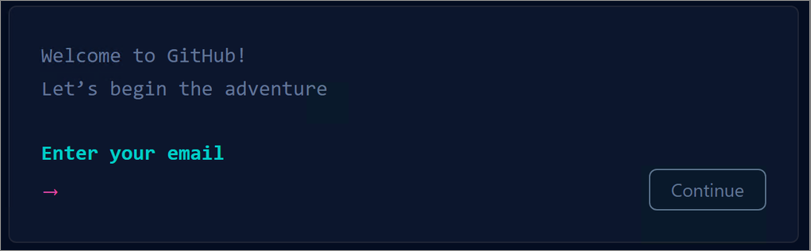{.fragment .fade-in-then-out fig-align="center" width="80%"}

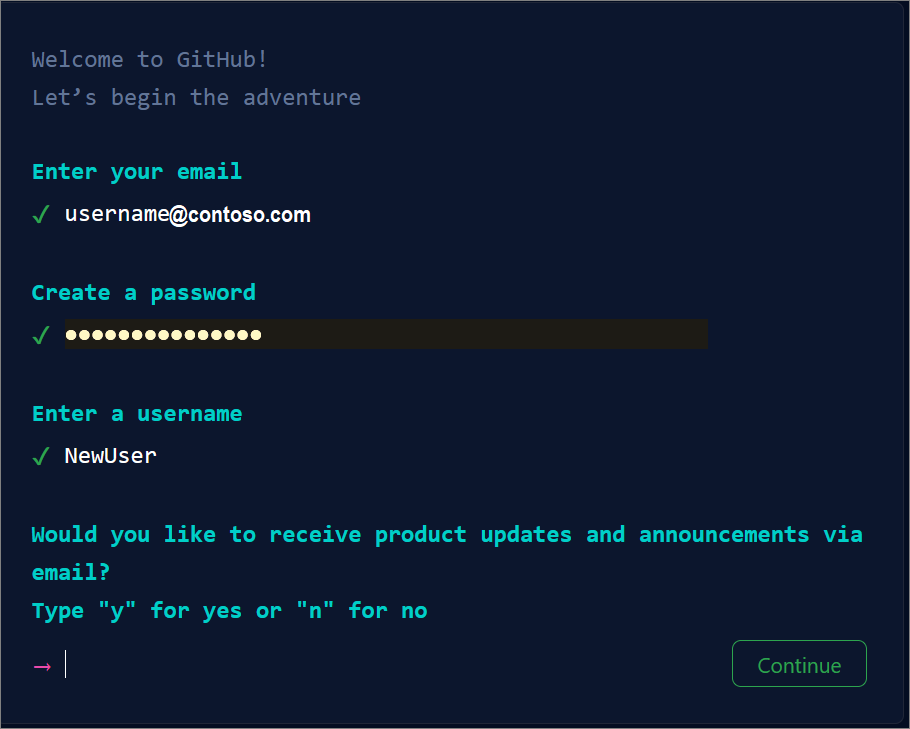{.fragment fig-align="center" width="80%"}
:::

## Registro — Paso a Paso (2/2) {transition="fade"}

<br>

::: r-stack
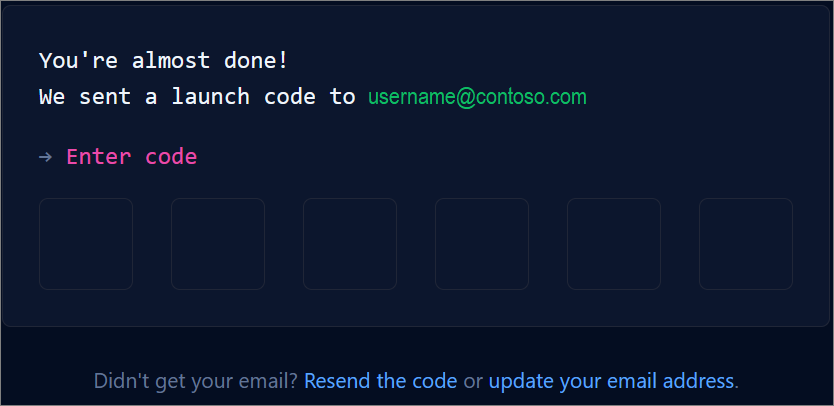{.fragment .fade-in-then-out fig-align="center" width="80%"}

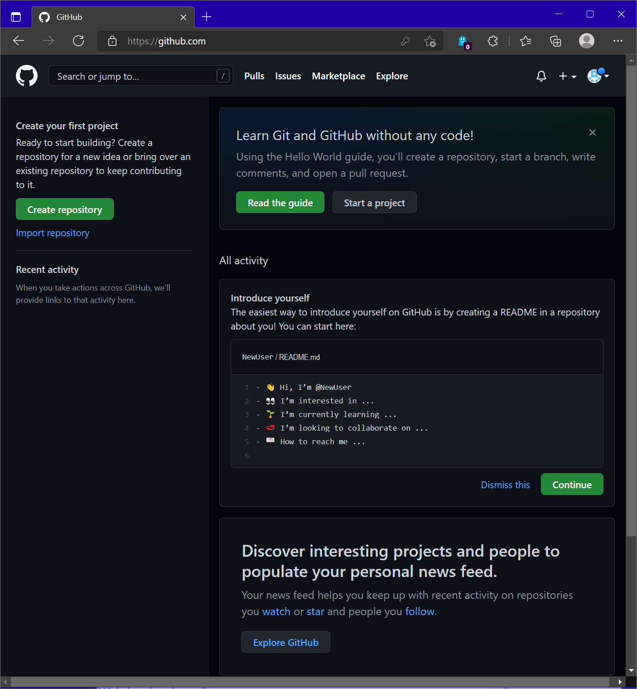{.fragment fig-align="center" width="80%"}
:::

::: {.fragment}
> **Tip:** La cuenta gratuita es más que suficiente para empezar — elige "Free" y omite la personalización inicial.
:::

# Tu Perfil de GitHub {.title-top-ice background-image="images/github/profile2.png" background-opacity="0.15" data-state="no-logo"}

## El perfil como tarjeta digital {transition="zoom"}

{fig-align="center" width="68%"}

## El repositorio especial del perfil {transition="fade"}

::: columns
::: {.column width="55%"}
<br>

::: {.fragment .fade-in-then-semi-out}
El truco está en crear un repositorio cuyo **nombre sea igual a tu nombre de usuario**.
:::

<br>

::: {.fragment .fade-in-then-semi-out}
Debe ser **público** e incluir un `README.md` inicializado — GitHub lo muestra automáticamente en tu perfil.
:::

<br>

::: fragment
Desde ese momento, tu `README.md` **es** tu perfil.
:::
:::

::: {.column width="5%"}
:::

::: {.column width="40%"}
::: r-stack
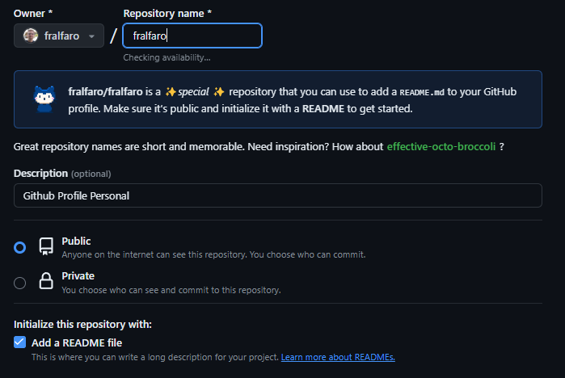{.fragment .fade-in-then-out fig-align="center" width="100%"}

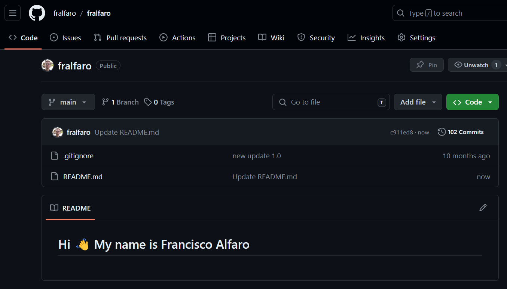{.fragment fig-align="center" width="100%"}
:::
:::
:::

## Editando tu README de perfil {transition="fade"}

<br>

::: r-stack
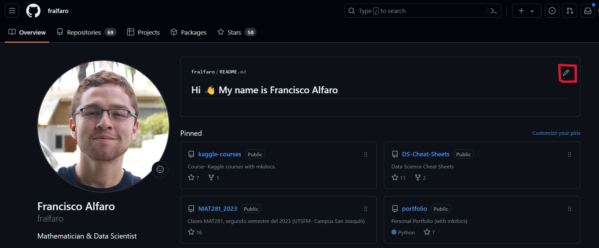{.fragment .fade-in-then-out fig-align="center" width="80%"}

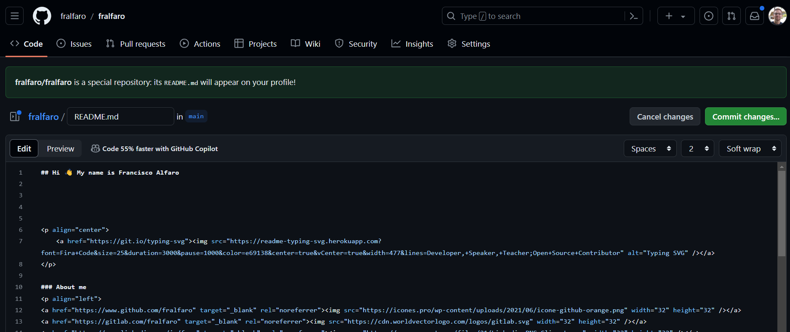{.fragment .fade-in-then-out fig-align="center" width="80%"}

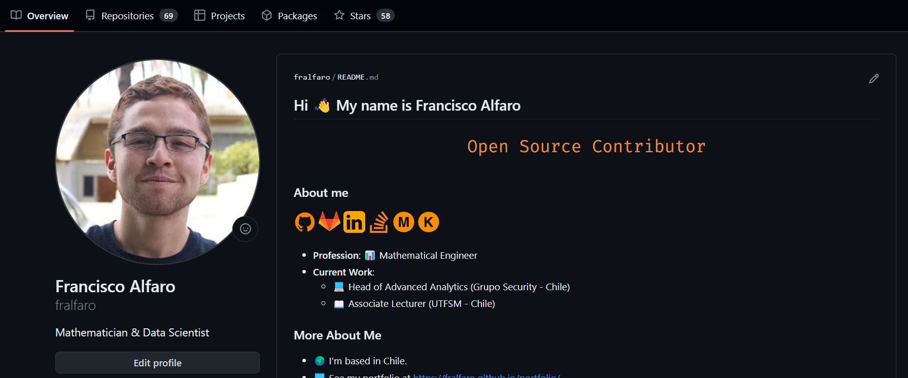{.fragment fig-align="center" width="80%"}
:::

## Herramientas pro para tu perfil {transition="fade"}

::: panel-tabset
### Generador de perfil

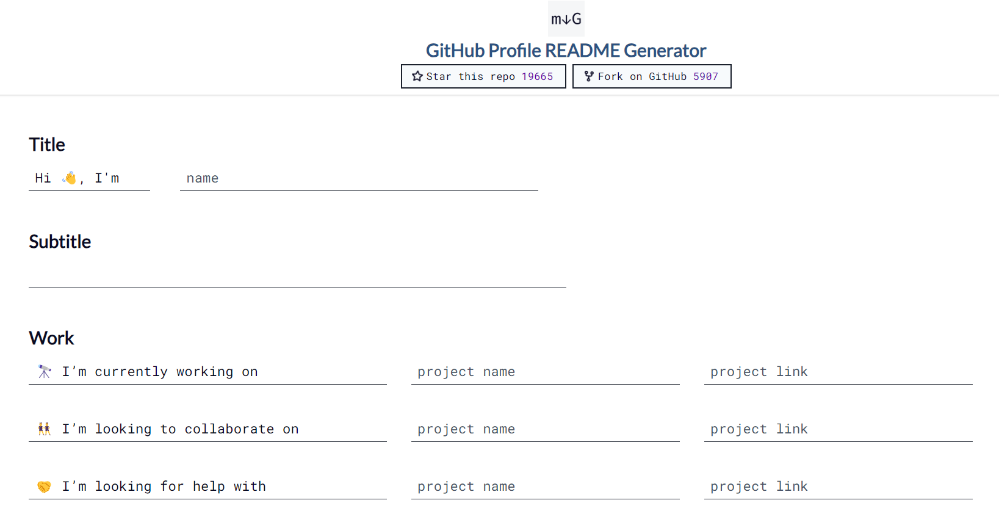{fig-align="center" width="88%"}

### Opciones avanzadas

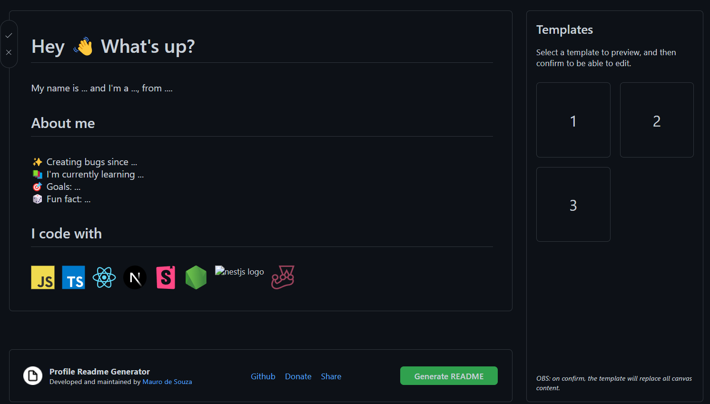{fig-align="center" width="88%"}

### Awesome GitHub Profiles

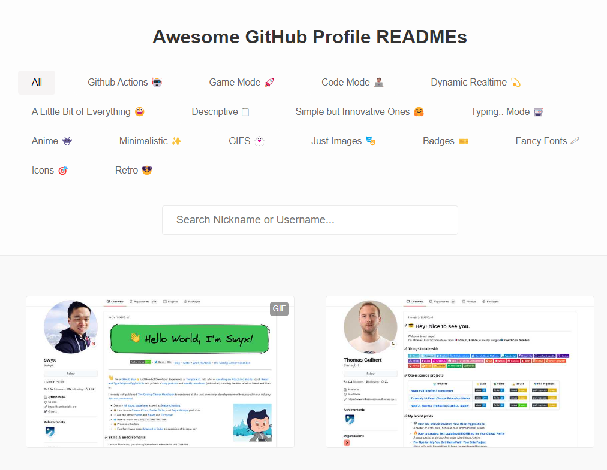{fig-align="center" width="88%"}
:::

# Repositorios & README {.title-middle-dark background-image="images/github/repos3.png" background-opacity="0.2" data-state="no-logo"}

## ¿Qué es un repositorio? {transition="zoom"}

<br>

::: columns
::: {.column width="5%"}
:::

::: {.column width="45%"}
<br>

::: {.fragment .fade-in-then-semi-out}
**Carpeta versionada** en la nube con todo el historial de cambios del proyecto.
:::

<br>

::: {.fragment .fade-in-then-semi-out}
Incluye: issues, pull requests, code review, CI/CD y páginas web — todo en un solo lugar.
:::

<br>

::: {.fragment}
Puede ser **público** (visible para todos) o **privado** (solo para ti y colaboradores).
:::
:::

::: {.column width="5%"}
:::

::: {.column width="40%"}
::: fragment
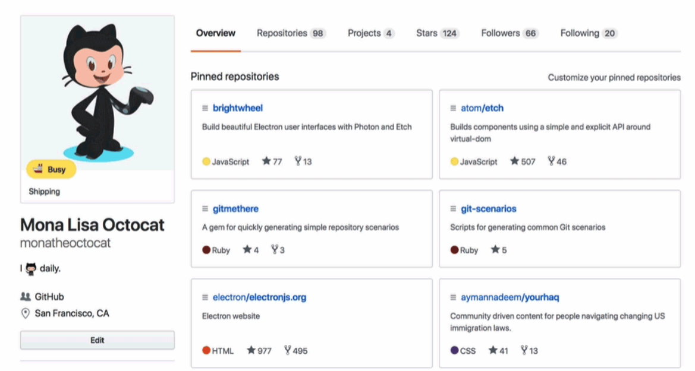{fig-align="center" width="100%"}
:::
:::

::: {.column width="5%"}
:::
:::

## El poder del README.md {transition="fade"}

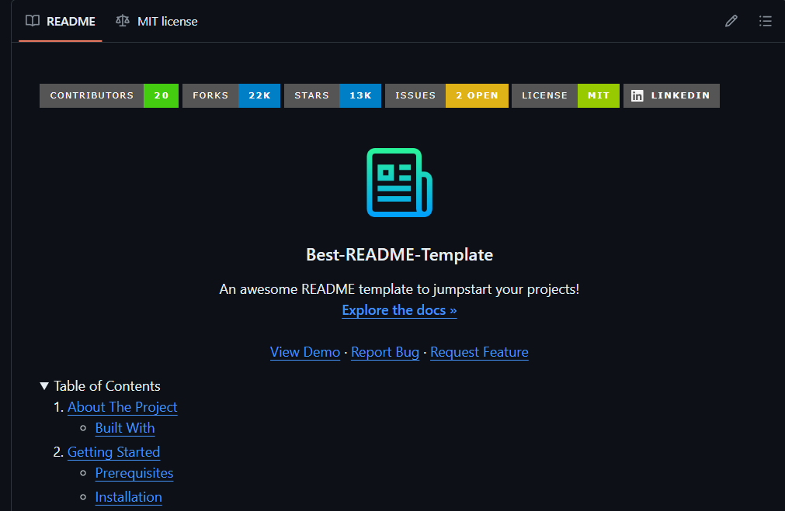{fig-align="center" width="70%"}

## README para Proyectos {transition="fade"}

<br>

::: r-stack
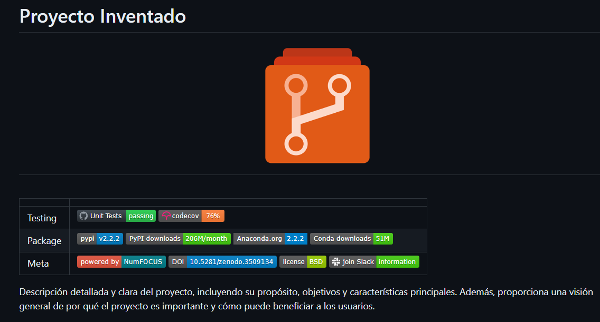{.fragment .fade-in-then-out fig-align="center" width="78%"}

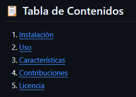{.fragment .fade-in-then-out fig-align="center" width="78%"}

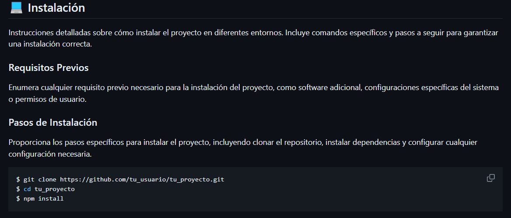{.fragment .fade-in-then-out fig-align="center" width="78%"}

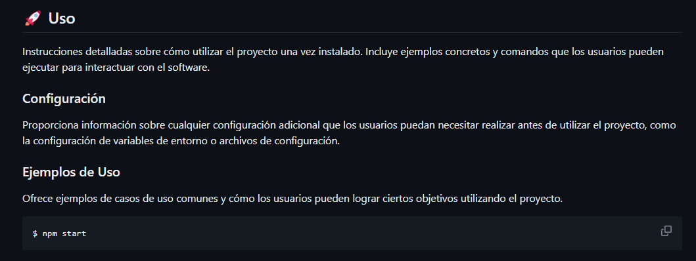{.fragment fig-align="center" width="78%"}
:::

## README para Portafolio {transition="fade"}

<br>

::: r-stack
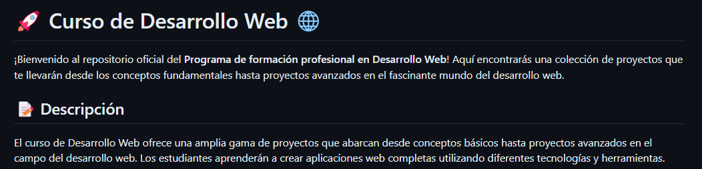{.fragment .fade-in-then-out fig-align="center" width="78%"}

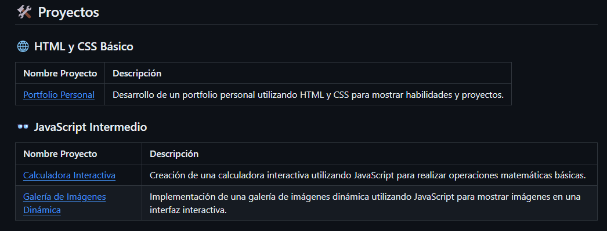{.fragment .fade-in-then-out fig-align="center" width="78%"}

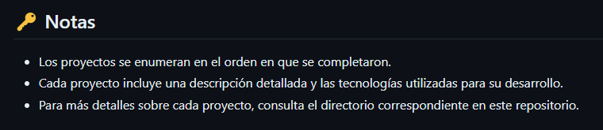{.fragment fig-align="center" width="78%"}
:::

## Inspiración: Awesome README {transition="fade"}

<br>

::: columns
::: {.column width="55%"}
<br>

::: {.fragment .fade-in-then-semi-out}
El repositorio [**awesome-readme**](https://github.com/matiassingers/awesome-readme) reúne los mejores READMEs de GitHub.
:::

<br>

::: {.fragment}
Plantillas, ejemplos reales y guías de estilo — **un README bien hecho puede ser decisivo** para la adopción de tu proyecto.
:::
:::

::: {.column width="5%"}
:::

::: {.column width="40%"}
::: fragment
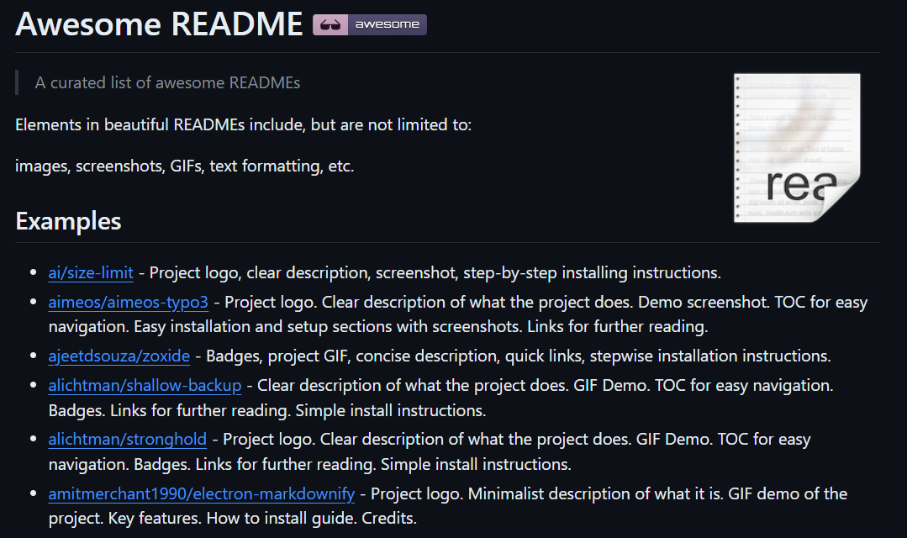{fig-align="center" width="100%"}
:::
:::
:::

# Git en la Práctica {.title-top-dark background-image="images/github/octo.png" background-opacity="0.12" data-state="no-logo"}

## Git vs GitHub {transition="zoom"}

<br>

::: columns
::: {.column width="5%"}
:::

::: {.column width="40%"}
::: bulletbox
::: {.fragment .fade-in-then-semi-out}
**Git** es el sistema de control de versiones que corre en tu máquina local — registra cada cambio en el código.
:::
:::
:::

::: {.column width="5%"}
:::

::: {.column width="40%"}
::: bulletbox
::: {.fragment .fade-in-then-semi-out}
**GitHub** es la plataforma remota que aloja repositorios Git y los hace colaborativos y visibles.
:::
:::
:::

::: {.column width="5%"}
:::
:::

<br>

::: {.fragment .fade-up}
```{mermaid}
flowchart LR
  A[Tu máquina\nGit local] -->|git push| B[GitHub\nRepositorio remoto]
  B -->|git pull| A
```
:::

## Comandos Esenciales {.takeaway .center transition="fade"}

<br>

| Comando | ¿Qué hace? |
|---|---|
| `git init` | Inicializa un repositorio local |
| `git clone <url>` | Copia un repositorio remoto |
| `git status` | Muestra el estado de los archivos |
| `git add .` | Agrega todos los cambios al staging |
| `git commit -m "msg"` | Guarda una versión con mensaje |
| `git push` | Sube cambios al repositorio remoto |
| `git pull` | Baja cambios del repositorio remoto |
| `git log` | Muestra el historial de commits |

## El Flujo Completo {transition="fade"}

<br>

::: columns
::: {.column width="50%"}
::: {.fragment .fade-up}
```bash
# 1. Clonar el repositorio
git clone https://github.com/usuario/repo.git

# 2. Ver el estado actual
git status

# 3. Agregar los cambios
git add .

# 4. Confirmar con mensaje
git commit -m "mi primer commit"

# 5. Subir al repositorio remoto
git push origin main
```
:::
:::

::: {.column width="5%"}
:::

::: {.column width="40%"}
::: {.fragment .fade-up}
```{mermaid}
flowchart TD
  A[Crear repo en GitHub] --> B[git clone]
  B --> C[Editar archivos]
  C --> D[git add + git commit]
  D --> E[git push]
  E --> F[Ver cambios en GitHub ✓]
```
:::
:::
:::

# ¡Gracias! {.title-top-dark background-image="images/github/octo.png" background-opacity="0.3" data-state="no-logo"}

## Resumen del viaje {transition="zoom"}

<br>

::: columns
::: {.column width="5%"}
:::

::: {.column width="40%"}
::: bulletbox
::: {.fragment .fade-in-then-semi-out}
**✅ Cuenta creada**\
Acceso a la red de desarrollo más grande del mundo.
:::
:::

::: bulletbox
::: {.fragment .fade-in-then-semi-out}
**✅ Perfil personalizado**\
Tu tarjeta de presentación digital, lista para reclutadores y colaboradores.
:::
:::
:::

::: {.column width="5%"}
:::

::: {.column width="40%"}
::: bulletbox
::: {.fragment .fade-in-then-semi-out}
**✅ Repositorios con README**\
Proyectos presentados profesionalmente con documentación clara.
:::
:::

::: bulletbox
::: {.fragment .fade-in-then-semi-out}
**✅ Git en la práctica**\
Flujo real de trabajo: local → remoto → GitHub.
:::
:::
:::

::: {.column width="5%"}
:::
:::

## Recursos y Próximos Pasos {transition="zoom"}

<br>

::: columns
::: {.column width="5%"}
:::

::: {.column width="40%"}
::: bulletbox
::: {.fragment .fade-in-then-semi-out}
**Documentación oficial de GitHub**\
🔗 [docs.github.com](https://docs.github.com)\
Guías completas para cada funcionalidad.
:::
:::

::: bulletbox
::: {.fragment .fade-in-then-semi-out}
**GitHub Profile README Generator**\
🔗 [rahuldkjain.github.io/gh-profile-readme-generator](https://rahuldkjain.github.io/gh-profile-readme-generator/)\
Genera tu README de perfil visualmente.
:::
:::
:::

::: {.column width="5%"}
:::

::: {.column width="40%"}
::: bulletbox
::: {.fragment .fade-in-then-semi-out}
**Awesome README**\
🔗 [github.com/matiassingers/awesome-readme](https://github.com/matiassingers/awesome-readme)\
Los mejores READMEs como referencia.
:::
:::

::: bulletbox
::: {.fragment .fade-in-then-semi-out}
**Awesome GitHub Profiles**\
🔗 [zzetao.github.io/awesome-github-profile](https://zzetao.github.io/awesome-github-profile/)\
Galería de perfiles para inspirarte.
:::
:::
:::

::: {.column width="5%"}
:::
:::

## ¡Gracias por Participar!

::: columns
::: {.column width="50%"}
<br>

❓ ¿Preguntas?

🚀 ¡A crear tu primer repositorio!

💡 Tip final: empieza hoy — un perfil vacío no atrae colaboradores
:::

::: {.column width="50%" align="center"}
{width="380"}
:::
:::

> 🔗 Sitio Web: [educacionadistancia.usm.cl](https://educacionadistancia.usm.cl/)

```{=html}
<style>
.reveal .slide-logo {
   max-height: 2em !important;
}
</style>
```
