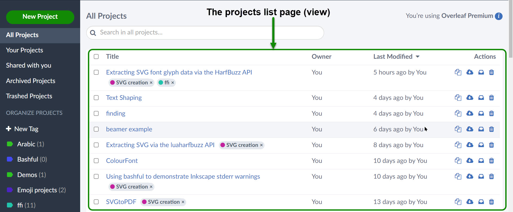
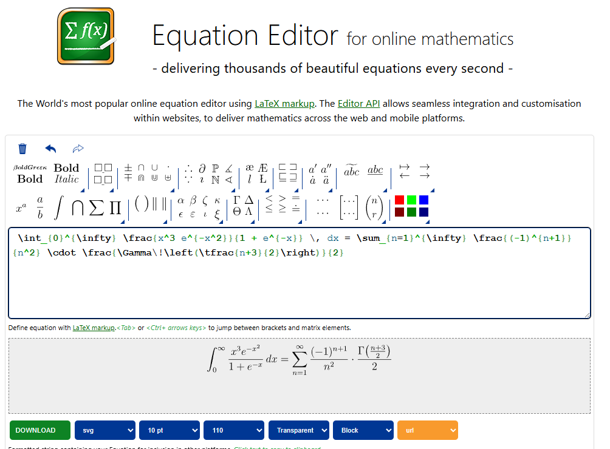
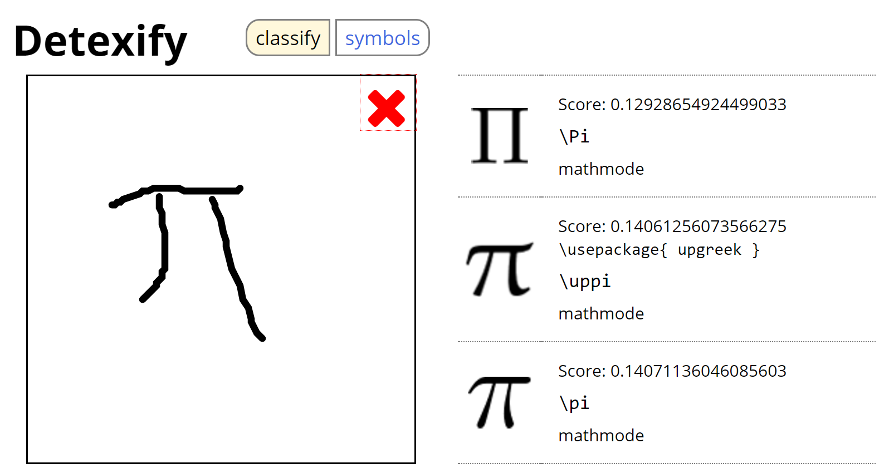

##  {.title-slide background-color="#0F2044"}

::: title-block
**LaTeX y Overleaf para la Docencia**

Escribe documentos académicos profesionales
:::

::: subtitle-block
Informes · Artículos · Presentaciones · Tesis\
MOOC propedéutico — Aprende USM 2026
:::

::: author-block
Francisco Alfaro Medina\
Dirección de Transformación Digital · UTFSM\
Unidad de Educación a Distancia · 2026
:::

## ¿Te ha pasado esto?

::: r-stack
<br>

{.fragment .fade-in-then-out fig-align="center" width="100%"}

{.fragment fig-align="center" width="70%"}
:::

------------------------------------------------------------------------

## Objetivos

::: columns
::: {.column width="40%"}
::: {style="text-align: center;"}

:::
:::

::: {.column .incremental width="60%"}
<br>

-   **Conocer LaTeX**: Qué es y por qué usarlo frente a otros editores.\
-   **Primeros pasos**: Crear, compilar y estructurar un documento básico.\
-   **Elementos clave**: Texto, secciones, listas, imágenes y fórmulas.\
-   **Buenas prácticas**: Organización, plantillas y recursos recomendados.
:::
:::

------------------------------------------------------------------------

##  {background-image="images/background_slides3.png" background-opacity="0.3"}

::: {style="display: flex; justify-content: center; align-items: center; height: 60vh; flex-direction: column; text-align: center;"}
[LaTeX]{style="font-size: 2em"}

[¿Qué es y por qué usarlo?]{style="font-size: 2.5em"}
:::

------------------------------------------------------------------------

## ¿Qué es LaTeX?

::: columns
::: {.column width="40%"}
::: {style="text-align: center;"}

:::
:::

::: {.column .incremental width="60%"}
<br>

-   **¿Qué es LaTeX?**
    -   Sistema para crear documentos académicos y científicos con formato profesional.
-   **Ventajas**:
    -   Automatiza referencias, citas y ecuaciones.\
    -   Control total sobre formato y estructura.\
    -   Ideal para documentos extensos y complejos.
:::
:::

------------------------------------------------------------------------

## Ejemplos de LaTeX

<br>

::: r-stack
::: {.fragment .fade-in-then-out}
<iframe src="https://www.slideshare.net/slideshow/embed_code/key/6iH5QPCL3w1qwm?startSlide=1" width="960" height="600" frameborder="0" scrolling="no" style="max-width:100%; border:1px solid #CCC; border-radius:10px;" allowfullscreen>

</iframe>
:::

::: {.fragment .fade-in-then-out}
<iframe src="https://www.slideshare.net/slideshow/embed_code/key/eUNDWTAdYMfD7M?hostedIn=slideshare&amp;page=upload" width="960" height="600" frameborder="0" scrolling="no" style="max-width:100%; border:1px solid #CCC; border-radius:10px;" allowfullscreen>

</iframe>
:::

::: fragment
<iframe src="https://www.slideshare.net/slideshow/embed_code/key/tkQohqCfNlexT1?startSlide=1" width="960" height="600" frameborder="0" scrolling="no" style="max-width:100%; border:1px solid #CCC; border-radius:10px;" allowfullscreen>

</iframe>
:::
:::

------------------------------------------------------------------------

## ¿Cómo empezar?

::: columns
::: {.column width="40%"}
::: {style="text-align: center;"}

:::
:::

::: {.column .incremental width="60%"}
<br>

-   **Editor recomendado:**
    -   [Overleaf](https://www.overleaf.com/) *(en línea, sin instalación)*
-   **Instalaciones locales:**
    -   [TeX Live](https://www.tug.org/texlive/), [MiKTeX](https://miktex.org/), [MacTeX](https://tug.org/mactex/)
-   **Editores útiles:**
    -   [TeXstudio](https://www.texstudio.org/), [VSCode + LaTeX Workshop](https://marketplace.visualstudio.com/items?itemName=James-Yu.latex-workshop)\
:::
:::

. . .

> 🌿 En este taller nos centraremos en [Overleaf](https://www.overleaf.com/), fácil y en línea.

------------------------------------------------------------------------

## Overleaf: LaTeX Online

::: columns
::: {.column width="40%"}
::: {style="text-align: center;"}

:::
:::

::: {.column .incremental width="60%"}
<br>

-   **¿Qué es?**
    -   Plataforma en línea para escribir y compilar documentos en LaTeX sin instalación.
-   **¿Por qué usarlo?**
    -   Edición colaborativa en tiempo real.\
    -   Integración con GitHub y la nube.\
    -   Compilación y previsualización instantánea.\
:::
:::

. . .

> 🌿 Para este taller, crea tu cuenta gratuita en [Overleaf](https://www.overleaf.com/).

------------------------------------------------------------------------

## Ejemplos en Overleaf

::: r-stack
{.fragment .fade-in-then-out fig-align="center" width="75%"}

{.fragment fig-align="center" width="70%"}
:::

------------------------------------------------------------------------

##  {background-image="images/background_slides3.png" background-opacity="0.3"}

::: {style="display: flex; justify-content: center; align-items: center; height: 60vh; flex-direction: column; text-align: center;"}
[LaTeX]{style="font-size: 2em"}

[Explora y aprende con plantillas]{style="font-size: 2.5em"}
:::

------------------------------------------------------------------------

## Overleaf Gallery

::: columns
::: {.column width="40%"}
::: {style="text-align: center;"}

:::
:::

::: {.column .incremental width="60%"}
<br>

-   **Plantillas listas para usar**:
    -   Artículos, tesis, pósters y presentaciones.
-   **Aprende explorando**:
    -   Abre una plantilla y estudia su código.
-   **Personaliza y reutiliza**:
    -   Cambia texto, imágenes y estilo.
:::
:::

. . .

> 🌿 Veamos algunos ejemplos en [Overleaf Gallery](https://www.overleaf.com/gallery).

------------------------------------------------------------------------

## Ejemplos de plantillas

::: r-stack
{.fragment .fade-in-then-out fig-align="center" width="100%"}

{.fragment fig-align="center" width="75%"}
:::

------------------------------------------------------------------------

##  {background-image="images/background_slides3.png" background-opacity="0.3"}

::: {style="display: flex; justify-content: center; align-items: center; height: 60vh; flex-direction: column; text-align: center;"}
[LaTeX]{style="font-size: 2em"}

[Más Herramientas]{style="font-size: 2.5em"}
:::

------------------------------------------------------------------------

## Herramientas Útiles

::: columns
::: {.column width="45%"}
::: {style="text-align: center;"}

:::
:::

::: {.column .incremental width="55%"}
<br>

-   📊 [**Tables Generator**](https://www.tablesgenerator.com/)\
    Crea y exporta fácilmente tablas en formato LaTeX.

-   🔢 [**LaTeX Equation Editor**](https://editor.codecogs.com/)\
    Genera ecuaciones LaTeX en tiempo real.

-   🧾 [**BibTeX Editor**](https://truben.no/latex/bibtex/)\
    Crea referencias bibliográficas en formato BibTeX.

-   🧠 [**Detexify**](http://detexify.kirelabs.org/classify.html)\
    Dibuja un símbolo y encuentra su comando LaTeX.
:::
:::

------------------------------------------------------------------------

## Ejemplos de herramientas útiles

::: r-stack
{.fragment .fade-in-then-out fig-align="center" width="75%"}

{.fragment .fade-in-then-out fig-align="center" width="80%"}

{.fragment .fade-in-then-out fig-align="center" width="75%"}

{.fragment fig-align="center" width="75%"}
:::

------------------------------------------------------------------------

## LaTeX + Inteligencia Artificial

::: columns
::: {.column width="40%"}
::: {style="text-align: center;"}

:::
:::

::: {.column .incremental width="60%"}
<br><br>

-   [**ChatGPT**](https://chat.openai.com/), [**Gemini**](https://gemini.google.com/), [**Claude**](https://claude.ai/):

    -   Generan y corrigen código LaTeX.
    -   Crean ecuaciones, tablas y bibliografía.
    -   Explican comandos y paquetes.
    -   Mejoran el formato y detectan errores.
:::
:::

. . .

> [🤖 **Consejo**: usa prompts claros, incluye tu código y pide explicaciones paso a paso.]{style="font-size:0.85em;"}

------------------------------------------------------------------------

## Ejemplos de Prompts

::: panel-tabset
## Fórmulas

::: columns
::: {.column width="50%"}
✨ **Prompt:**

> "Escríbeme en LaTeX la fórmula de la distribución normal estándar, con una breve explicación de cada parámetro."
:::

::: {.column width="50%"}
✅ **Resultado:**

``` latex
f(x) = \frac{1}{\sigma\sqrt{2\pi}}
       \exp\left(-\frac{(x-\mu)^2}{2\sigma^2}\right)
```

Donde $\mu$ es la media, $\sigma$ la desviación estándar y $x$ el valor observado.
:::
:::

## Tablas

::: columns
::: {.column width="50%"}
✨ **Prompt:**

> "Crea una tabla en LaTeX con booktabs que compare tres lenguajes de programación: Python, R y Julia, según velocidad, facilidad de uso y comunidad."
:::

::: {.column width="50%"}
✅ **Resultado:**

``` latex
\begin{table}[h]
\centering
\begin{tabular}{lccc}
\toprule
\textbf{Criterio} & \textbf{Python} & \textbf{R} & \textbf{Julia} \\
\midrule
Velocidad    & Media  & Baja  & Alta \\
Facilidad    & Alta   & Media & Media \\
Comunidad    & Grande & Grande & Pequeña \\
\bottomrule
\end{tabular}
\caption{Comparación de lenguajes}
\end{table}
```
:::
:::

## Corrección

::: columns
::: {.column width="50%"}
✨ **Prompt:**

> "Este código LaTeX no compila, ¿qué está mal?"

``` latex
\begin{equation}
f(x) = \int_0^\infty e^-x^2 dx
\end{equation}
```
:::

::: {.column width="50%"}
✅ **Resultado:**

Se detectan **2 errores**:

❌ `e^-x^2` — el exponente debe ir entre llaves: `e^{-x^2}`

❌ `dx` sin espacio — mejor tipografía con `\,dx`

✅ **Versión corregida:**

``` latex
\begin{equation}
f(x) = \int_0^\infty e^{-x^2}\,dx
\end{equation}
```
:::
:::

## Bibliografía

::: columns
::: {.column width="50%"}
✨ **Prompt:**

> "Genera la entrada BibTeX para el libro *The Elements of Statistical Learning* de Hastie, Tibshirani y Friedman (2009, Springer)."
:::

::: {.column width="50%"}
✅ **Resultado:**

``` bibtex
@book{hastie2009elements,
  title     = {The Elements of Statistical Learning},
  author    = {Hastie, Trevor and Tibshirani, Robert
               and Friedman, Jerome},
  year      = {2009},
  publisher = {Springer},
  edition   = {2nd},
  url       = {https://hastie.su.domains/ElemStatLearn/}
}
```
:::
:::
:::

------------------------------------------------------------------------

##  {background-image="images/background_slides3.png" background-opacity="0.3"}

::: {style="display: flex; justify-content: center; align-items: center; height: 60vh; flex-direction: column; text-align: center;"}
[LaTeX]{style="font-size: 2em"}

[Manos a la Obra]{style="font-size: 2.5em"}
:::

------------------------------------------------------------------------

## Actividad: Paper con IA en Overleaf

<br>

::: columns
::: {.column width="40%"}
::: {style="text-align: center;"}

:::
:::

::: {.column .incremental width="60%"}
1.  **Elige** una plantilla en [Overleaf Academic Journal Templates](https://www.overleaf.com/latex/templates/tagged/academic-journal).
2.  **Escoge** un tema libre *(IA, redes sociales, clima, deporte, etc.)*.
3.  **Abre** un asistente IA *(ChatGPT, Gemini, Claude, Copilot…)* y pide:
    -   Estructura del paper con título, abstract y secciones.
    -   Una ecuación relevante al tema.
    -   Una tabla comparativa con `booktabs`.
    -   Dos referencias en BibTeX con `\cite{}`.
4.  **Copia** cada respuesta en Overleaf y **compila**.
5.  *(Extra)* Pídele al asistente que corrija algún error de compilación.
:::
:::

. . .

> ⏱️ Tiempo de la actividad: 15–20 minutos.

------------------------------------------------------------------------

##  {background-image="images/background_slides3.png" background-opacity="0.3"}

::: {style="display: flex; justify-content: center; align-items: center; height: 60vh; flex-direction: column; text-align: center;"}
[LaTeX]{style="font-size: 1em"}

[Conclusiones]{style="font-size: 1.5em"}
:::

------------------------------------------------------------------------

## Conclusiones

<br>

::: fragment
::: {style="display: flex; flex-direction: column; gap: 0.75em; font-size: 0.95em;"}
::: {style="display: flex; align-items: center; gap: 1em; background: linear-gradient(90deg, #e8f0fe, #f8f9ff); border-left: 4px solid #0F2044; border-radius: 8px; padding: 0.6em 1em;"}
✅   **LaTeX** permite redactar documentos con calidad profesional.
:::

::: {style="display: flex; align-items: center; gap: 1em; background: linear-gradient(90deg, #e8f0fe, #f8f9ff); border-left: 4px solid #1a3a6b; border-radius: 8px; padding: 0.6em 1em;"}
✅   Ofrece **control total** sobre el diseño y la estructura del documento.
:::

::: {style="display: flex; align-items: center; gap: 1em; background: linear-gradient(90deg, #e8f0fe, #f8f9ff); border-left: 4px solid #2a5298; border-radius: 8px; padding: 0.6em 1em;"}
✅   Existen **herramientas y plantillas** que simplifican su uso desde el primer día.
:::

::: {style="display: flex; align-items: center; gap: 1em; background: linear-gradient(90deg, #e8f0fe, #f8f9ff); border-left: 4px solid #3a6bc4; border-radius: 8px; padding: 0.6em 1em;"}
✅   Con **asistentes IA**, escribir en LaTeX es más rápido y eficiente.
:::

::: {style="display: flex; align-items: center; gap: 1em; background: linear-gradient(90deg, #e8f0fe, #f8f9ff); border-left: 4px solid #4a84e0; border-radius: 8px; padding: 0.6em 1em;"}
✅   **Overleaf** permite comenzar sin instalar nada, desde cualquier navegador.
:::
:::
:::

------------------------------------------------------------------------

## 🎉 ¡Gracias por Participar!

::: columns
::: {.column width="50%"}
<br>

❓¿Preguntas?

👏 Responder [encuesta](https://forms.gle/WMYcViob6Z6WbPZD7)

🥳 Disfrutar del Curso!
:::

::: {.column width="50%" align="center"}
{width="400"}
:::
:::

> 🔗 Nuestro Sitio Web: [educacionadistancia.usm.cl/](https://educacionadistancia.usm.cl/)

```{=html}
<style>
/* Ajusta el tamaño del título y subtítulo */
.reveal .slides h1 {
  font-size: 2em; /* Tamaño más pequeño para el título */
}

.reveal .slides h2 {
  font-size: 1.5em; /* Tamaño más pequeño para el subtítulo */
}

/* Ajusta el tamaño del texto en los párrafos */
.reveal .slides p {
  font-size: 0.8em; /* Texto más pequeño */
}

/* Ajusta el tamaño de las tablas */
.reveal .slides table {
  font-size: 0.8em; /* Tamaño de fuente más pequeño en las tablas */
  width: 90%; /* Ajusta el ancho de la tabla */
  margin: 0 auto; /* Centra la tabla */
}

/* Ajusta el tamaño de los bullets */
.reveal .slides ul {
  font-size: 0.8em; /* Tamaño de fuente más pequeño en los bullets */

}

.reveal .slide-logo {
   max-height: 2.5em !important;
}


</style>
```