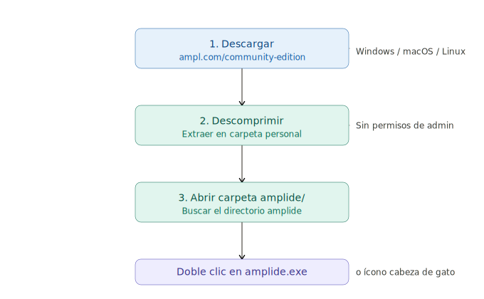

##  {.title-slide background-color="#0F2044"}

::: title-block
**Gestión de Operaciones**

AMPL + Python · Flujo de trabajo moderno
:::

::: subtitle-block
Optimización · Inventarios · Logística · Redes de distribución\
Departamento de Industrias · UTFSM · 2026
:::

::: author-block
Francisco Alfaro - Matias Bahamondes\
Universidad Técnica Federico Santa María\
Departamento de Industrias · 2026
:::

------------------------------------------------------------------------

## ¿Qué veremos hoy? {background-color="#f8f9fa"}

<br>

```{=html}
<style>
.agenda-grid { display: grid; grid-template-columns: repeat(4, 1fr); gap: 1.2rem; font-size: 0.78em; }
.agenda-card { background: #0F2044; border-radius: 10px; padding: 1.3rem 1rem; color: white; text-align: center; border-top: 4px solid #4A9FD4; }
.agenda-num { font-size: 2rem; margin-bottom: 0.4rem; }
.agenda-title { color: #C9A84C; font-weight: 700; font-size: 0.95em; margin-bottom: 0.4rem; }
.agenda-desc { color: #8FA8C8; font-size: 0.85em; line-height: 1.5; }
</style>

<div class="agenda-grid">
  <div class="agenda-card">
    <div class="agenda-num">🏭</div>
    <div class="agenda-title">Los ramos</div>
    <div class="agenda-desc">ICN-343 y ICN-344: objetivos, contenidos y metodología</div>
  </div>
  <div class="agenda-card">
    <div class="agenda-num">⚙️</div>
    <div class="agenda-title">AMPL</div>
    <div class="agenda-desc">¿Qué es? ¿Para qué sirve? Sintaxis básica y flujo de modelación</div>
  </div>
  <div class="agenda-card">
    <div class="agenda-num">☁️</div>
    <div class="agenda-title">Google Colab</div>
    <div class="agenda-desc">AMPL + Python sin instalación local: todo en la nube</div>
  </div>
  <div class="agenda-card">
    <div class="agenda-num">🐙</div>
    <div class="agenda-title">GitHub</div>
    <div class="agenda-desc">Entregar tareas de forma profesional: control de versiones aplicado</div>
  </div>
</div>
```

<br>

::: {style="text-align: center; background: rgba(74,159,212,0.1); border-left: 4px solid #4A9FD4; padding: 0.75rem 1.5rem; border-radius: 4px; font-size: 0.9rem;"}
El objetivo no es cambiar herramientas por cambiar — es **trabajar mejor**: menos fricción, más foco en los modelos.
:::

------------------------------------------------------------------------

##  {background-color="#0F2044"}

::: {style="display: flex; justify-content: center; align-items: center; height: 60vh; flex-direction: column; text-align: center;"}
[Parte 1]{style="font-size: 1em; color: #4A9FD4;"}

[Los ramos: ICN-343 e ICN-344]{style="font-size: 2em; font-weight: bold;"}

[¿Qué se aprende y cómo se evalúa?]{style="font-size: 1em; color: #6B7A8D; font-style: italic;"}
:::

------------------------------------------------------------------------

## ICN-343 · Gestión de Operaciones

:::::: columns
:::: {.column width="55%"}
<br>

El estudiante aplica **modelos matemáticos** para tomar decisiones tácticas y operativas en:

-   📈 Proyección de demanda
-   📦 Administración de inventarios
-   🏗️ Planificación de producción
-   🔩 Plan de requerimiento de materiales (MRP)
-   🗓️ Programación de la producción

::: callout-note
## Eje formativo

Ingeniería Aplicada · Prerrequisito: ILN-250\
4 créditos UTFSM — 183 horas cronológicas
:::
::::

::: {.column width="45%"}
**Evaluación**

| Instrumento | N°  | \%  |
|-------------|-----|-----|
| Certamen 1  | 1   | 35% |
| Certamen 2  | 1   | 35% |
| Controles   | 3–4 | 15% |
| Tareas      | 3   | 15% |

<br>

$$\text{NF} = 0{,}35 \cdot C_1 + 0{,}35 \cdot C_2 + 0{,}30 \cdot \overline{Q+T}$$
:::
::::::

------------------------------------------------------------------------

## ICN-344 · Gestión de Operaciones II

::::::: columns
:::: {.column width="55%"}
<br>

El estudiante aplica modelos y metodologías para decisiones sobre **logística y operaciones estratégicas**:

-   🌐 Logística y cadenas de abastecimiento
-   📏 Capacidad de largo plazo
-   📍 Localización de instalaciones
-   🚚 Modelos de transporte
-   🏢 Distribución física de plantas (Layout)

::: callout-note
## Eje formativo

Ingeniería Aplicada · Prerrequisito: ICN-343\
4 créditos UTFSM — 143 horas cronológicas
:::
::::

:::: {.column width="45%"}
**Evaluación**

| Instrumento            | N°  | \%  |
|------------------------|-----|-----|
| Certamen 1             | 1   | 35% |
| Certamen 2             | 1   | 35% |
| Tareas Computacionales | 2   | 30% |

<br>

$$\text{NF} = 0{,}35 \cdot C_1 + 0{,}35 \cdot C_2 + 0{,}30 \cdot TC$$

::: callout-tip
Las **Tareas Computacionales** son el corazón del ramo — requieren código, análisis e interpretación.
:::
::::
:::::::

------------------------------------------------------------------------

##  {background-color="#0F2044"}

::: {style="display: flex; justify-content: center; align-items: center; height: 60vh; flex-direction: column; text-align: center;"}
[Parte 2]{style="font-size: 1em; color: #4A9FD4;"}

[AMPL: el lenguaje de optimización]{style="font-size: 2em; font-weight: bold;"}

[Modelar problemas reales con sintaxis clara]{style="font-size: 1em; color: #6B7A8D; font-style: italic;"}
:::

------------------------------------------------------------------------

## ¿Qué es AMPL?

:::::: columns
:::: {.column width="50%"}
<br>

**AMPL** (*A Mathematical Programming Language*) es un lenguaje algebraico de modelación para problemas de optimización:

-   Separación limpia entre **modelo** y **datos**
-   Compatible con solvers industriales: CPLEX, Gurobi, HiGHS, Cbc
-   Ampliamente usado en investigación de operaciones, logística, supply chain
-   Sintaxis cercana a la notación matemática

::: callout-important
## ¿Por qué AMPL y no Excel Solver?

Excel Solver escala mal. AMPL maneja modelos con miles de variables y restricciones, y produce código **reproducible y auditable**.
:::
::::

::: {.column width="50%"}
**Estructura de un modelo AMPL**

<br>

```
# 1. Conjuntos
set PRODUCTOS;

# 2. Parámetros
param demanda {PRODUCTOS};
param costo   {PRODUCTOS};
param capacidad;

# 3. Variables
var x {PRODUCTOS} >= 0;

# 4. Objetivo
minimize CostoTotal:
  sum {p in PRODUCTOS} costo[p] * x[p];

# 5. Restricciones
subject to CapacidadMax:
  sum {p in PRODUCTOS} x[p] <= capacidad;

subject to SatisfacerDemanda {p in PRODUCTOS}:
  x[p] >= demanda[p];
```
:::
::::::

---------------------------

## Instalación: pasos

<br>

:::: {.columns}

::: {.column width="45%"}

:::

::: {.column width="55%"}

<br>

**1. Descargar**  
Ingresa a [ampl.com/community-edition](https://ampl.com/community-edition/)  
y descarga el archivo para tu sistema operativo.

**2. Descomprimir**  
Extrae el contenido en una carpeta personal  
(sin permisos de administrador).

**3. Abrir `amplide/`**  
Busca el directorio `amplide` dentro de la carpeta extraída.

**4. Ejecutar**  
Doble clic en `amplide.exe` (Windows)  
o en el ícono de cabeza de gato (macOS/Linux).
:::

::::

::: {.callout-warning}
**Atención:** Lo más complejo de este proceso es que AMPL debe instalarse localmente. Dependiendo del sistema operativo, puede surgir problemas de rutas, permisos o compatibilidad con el solver.
:::

------------------------------------------------------------------------


##  {background-color="#0F2044"}

::: {style="display: flex; justify-content: center; align-items: center; height: 60vh; flex-direction: column; text-align: center;"}
[Parte 3]{style="font-size: 1em; color: #4A9FD4;"}

[Google Colab: todo en la nube]{style="font-size: 2em; font-weight: bold;"}

[AMPL + Python sin instalar nada en tu computador]{style="font-size: 1em; color: #6B7A8D; font-style: italic;"}
:::

------------------------------------------------------------------------

## El problema del flujo de trabajo tradicional

::::: columns
::: {.column width="50%"}
**¿Cómo se trabaja habitualmente?**

```{=html}
<div style="font-size:0.82em; margin-top:0.5rem;">
  <div style="display:flex; align-items:center; gap:0.7rem; background:#FEF9E7; border-left:4px solid #E67E22; border-radius:6px; padding:0.6rem 1rem; margin-bottom:0.6rem;">
    <span><strong>Instalar AMPL</strong> en el computador personal (licencias, versiones, SO)</span>
  </div>
  <div style="display:flex; align-items:center; gap:0.7rem; background:#FEF9E7; border-left:4px solid #E67E22; border-radius:6px; padding:0.6rem 1rem; margin-bottom:0.6rem;">
    <span><strong>Archivos .mod y .dat</strong> dispersos en distintas carpetas del equipo</span>
  </div>
  <div style="display:flex; align-items:center; gap:0.7rem; background:#FEF9E7; border-left:4px solid #E67E22; border-radius:6px; padding:0.6rem 1rem; margin-bottom:0.6rem;">
    <span><strong>Envío por correo</strong> de archivos sueltos sin historial de cambios</span>
  </div>
  <div style="display:flex; align-items:center; gap:0.7rem; background:#FEF9E7; border-left:4px solid #E67E22; border-radius:6px; padding:0.6rem 1rem;">
    <span><strong>"En mi PC funciona"</strong> — resultados no reproducibles entre equipos</span>
  </div>
</div>
```
:::

::: {.column width="50%"}
**Lo que proponemos**

```{=html}
<div style="font-size:0.82em; margin-top:0.5rem;">
  <div style="display:flex; align-items:center; gap:0.7rem; background:#EAFAF1; border-left:4px solid #27AE60; border-radius:6px; padding:0.6rem 1rem; margin-bottom:0.6rem;">
    <span><strong>Google Colab</strong>: AMPL y Python corriendo en la nube sin instalar nada</span>
  </div>
  <div style="display:flex; align-items:center; gap:0.7rem; background:#EAFAF1; border-left:4px solid #27AE60; border-radius:6px; padding:0.6rem 1rem; margin-bottom:0.6rem;">
    <span><strong>Notebooks</strong>: modelo, datos, resultados y graficos en un solo lugar</span>
  </div>
  <div style="display:flex; align-items:center; gap:0.7rem; background:#EAFAF1; border-left:4px solid #27AE60; border-radius:6px; padding:0.6rem 1rem; margin-bottom:0.6rem;">
    <span><strong>GitHub</strong>: repositorio por tarea con historial completo de versiones</span>
  </div>
  <div style="display:flex; align-items:center; gap:0.7rem; background:#EAFAF1; border-left:4px solid #27AE60; border-radius:6px; padding:0.6rem 1rem;">
    <span><strong>100% reproducible</strong>: cualquiera abre el notebook y obtiene el resultado</span>
  </div>
</div>
```
:::
:::::

------------------------------------------------------------------------

## AMPL en Google Colab: instalación en 3 líneas

:::::: columns
:::: {.column width="50%"}
<br>

**¿Cómo se instala AMPL en Colab?**

```{=html}
<div style="font-size:0.72em; overflow:hidden;">
```

```python
# Celda 1: instalar el cliente Python de AMPL
!pip install amplpy -q

# Celda 2: descargar módulos y solvers
from amplpy import AMPL, tools
tools.ampl_notebook(
    modules=["highs", "cplex"],
    license_uuid="default"
)
```

```{=html}
</div>
```

::: callout-tip
## Licencia académica
AMPL ofrece una **licencia gratuita** para uso educativo a través de `amplpy`. No requiere tarjeta de crédito.
:::
::::

::: {.column width="50%"}
**Resolver un problema completo en Colab**

```{=html}
<div style="font-size:0.72em; overflow:hidden;">
```

```python
from amplpy import AMPL

ampl = AMPL()

# Modelo inline (también puede ser un archivo .mod)
ampl.eval("""
  var x >= 0;
  var y >= 0;
  maximize obj: 5*x + 4*y;
  s.t. c1: 6*x + 4*y <= 24;
  s.t. c2:   x + 2*y <=  6;
""")

ampl.option["solver"] = "highs"
ampl.solve()

print("x =", ampl.var["x"].value())
print("y =", ampl.var["y"].value())
print("obj =", ampl.obj["obj"].value())
```

```{=html}
</div>
```
:::
::::::

------------------------------------------------------------------------

## Python para análisis y visualización

:::::: columns
:::: {.column width="50%"}
<br>

Junto con AMPL, usamos Python para:

-   **Preparar los datos** de entrada (pandas)
-   **Extraer resultados** del modelo y transformarlos
-   **Visualizar** sensibilidades, inventarios, rutas (matplotlib, plotly)
-   **Interpretar** la solución en contexto del negocio

::: callout-note
## División clara de roles

-   **AMPL** → formula y resuelve el modelo de optimización
-   **Python** → prepara datos, procesa resultados, genera gráficos
:::
::::

::: {.column width="50%"}
```python
import pandas as pd
import matplotlib.pyplot as plt

# Extraer solución de AMPL a DataFrame
resultados = ampl.var["x"].to_pandas()

# Visualizar producción óptima por período
fig, ax = plt.subplots(figsize=(8, 4))
ax.bar(
    resultados.index,
    resultados["x.val"],
    color="#4A9FD4"
)
ax.set_title("Plan de producción óptimo", fontsize=13)
ax.set_xlabel("Período")
ax.set_ylabel("Unidades producidas")
ax.axhline(
    y=demanda_promedio,
    color="#C9A84C",
    linestyle="--",
    label="Demanda promedio"
)
ax.legend()
plt.tight_layout()
plt.show()
```
:::
::::::

------------------------------------------------------------------------

##  {background-color="#0F2044"}

::: {style="display: flex; justify-content: center; align-items: center; height: 60vh; flex-direction: column; text-align: center;"}
[Parte 4]{style="font-size: 1em; color: #4A9FD4;"}

[GitHub: entregar tareas como ingenieros]{style="font-size: 2em; font-weight: bold;"}

[Control de versiones aplicado al trabajo académico]{style="font-size: 1em; color: #6B7A8D; font-style: italic;"}
:::

------------------------------------------------------------------------

## ¿Por qué GitHub y no solo el correo?

<br>

```{=html}
<div style="display:grid; grid-template-columns:1fr 1fr; gap:1.5rem; font-size:0.80em;">

  <div style="background:#0F2044; border-radius:10px; padding:1.4rem;">
    <div style="color:#E74C3C; font-weight:700; font-size:1em; margin-bottom:1rem;">📧 Entrega por correo (forma tradicional)</div>
    <div style="color:#d0dce8; line-height:1.9;">
      ❌ &nbsp;"tarea_v3_FINAL_corregida.zip"<br>
      ❌ &nbsp;Sin historial de qué cambió y cuándo<br>
      ❌ &nbsp;Difícil de retroalimentar con precisión<br>
      ❌ &nbsp;No se puede ver el proceso, solo el resultado<br>
      ❌ &nbsp;Archivos perdidos o versiones equivocadas
    </div>
  </div>

  <div style="background:#0F2044; border-radius:10px; padding:1.4rem; border:2px solid #27AE60;">
    <div style="color:#27AE60; font-weight:700; font-size:1em; margin-bottom:1rem;">🐙 Entrega por GitHub (forma moderna)</div>
    <div style="color:#d0dce8; line-height:1.9;">
      ✅ &nbsp;Repositorio con estructura clara por tarea<br>
      ✅ &nbsp;Historial completo de commits con mensajes<br>
      ✅ &nbsp;Feedback directo en el código mediante Issues<br>
      ✅ &nbsp;El notebook se puede abrir y ejecutar en Colab<br>
      ✅ &nbsp;Portafolio profesional para después de la U
    </div>
  </div>

</div>
```

<br>

::: {style="text-align: center; background: rgba(201,168,76,0.1); border-left: 4px solid #C9A84C; padding: 0.75rem 1.5rem; border-radius: 4px; font-size: 1.5rem;"}
Git y GitHub son **habilidades requeridas** en la industria. Practicarlas desde el ramo es una ventaja directa.
:::

------------------------------------------------------------------------

## Estructura de un repositorio de tarea

<br>

::::: columns
::: {.column width="50%"}
**Estructura recomendada**

```{=html}
<div style="font-size:0.75em; background:#1e2433; border-radius:8px; padding:1rem 1.2rem; font-family:monospace; color:#cdd6f4; line-height:1.8;">
<table style="border:none; border-collapse:collapse; width:100%;">
<tr><td style="padding:0; white-space:nowrap; color:#cdd6f4;">tarea_01_inventarios/</td><td></td></tr>
<tr><td style="padding:0; white-space:nowrap; color:#cdd6f4;">├── README.md</td>        <td style="padding:0 0 0 1.5rem; color:#6c7a96;">← descripción del problema y resultados</td></tr>
<tr><td style="padding:0; white-space:nowrap; color:#cdd6f4;">├── notebook.ipynb</td>   <td style="padding:0 0 0 1.5rem; color:#6c7a96;">← código AMPL + Python (abre en Colab)</td></tr>
<tr><td style="padding:0; white-space:nowrap; color:#cdd6f4;">├── data/</td>            <td></td></tr>
<tr><td style="padding:0; white-space:nowrap; color:#cdd6f4;">&nbsp;&nbsp;&nbsp;└── datos_demanda.csv</td><td style="padding:0 0 0 1.5rem; color:#6c7a96;">← datos de entrada</td></tr>
<tr><td style="padding:0; white-space:nowrap; color:#cdd6f4;">├── model/</td>           <td></td></tr>
<tr><td style="padding:0; white-space:nowrap; color:#cdd6f4;">&nbsp;&nbsp;&nbsp;└── inventario.mod</td>   <td style="padding:0 0 0 1.5rem; color:#6c7a96;">← modelo AMPL (opcional)</td></tr>
<tr><td style="padding:0; white-space:nowrap; color:#cdd6f4;">└── results/</td>         <td></td></tr>
<tr><td style="padding:0; white-space:nowrap; color:#cdd6f4;">&nbsp;&nbsp;&nbsp;└── plan_optimo.png</td>  <td style="padding:0 0 0 1.5rem; color:#6c7a96;">← gráfico de la solución</td></tr>
</table>
</div>
```
:::

::: {.column width="50%"}
**Flujo de trabajo**

```{=html}
<div style="font-size:0.82em; margin-top:0.5rem;">
  <div style="display:flex; align-items:center; gap:0.8rem; background:#0F2044; border-radius:8px; padding:0.6rem 1rem; margin-bottom:0.5rem;">
    <span style="background:#4A9FD4; color:white; border-radius:50%; width:28px; height:28px; display:flex; align-items:center; justify-content:center; font-weight:700; flex-shrink:0;">1</span>
    <span style="color:#d0dce8;">Crear repositorio en GitHub con el nombre de la tarea</span>
  </div>
  <div style="display:flex; align-items:center; gap:0.8rem; background:#0F2044; border-radius:8px; padding:0.6rem 1rem; margin-bottom:0.5rem;">
    <span style="background:#4A9FD4; color:white; border-radius:50%; width:28px; height:28px; display:flex; align-items:center; justify-content:center; font-weight:700; flex-shrink:0;">2</span>
    <span style="color:#d0dce8;">Abrir el notebook en Google Colab (botón "Open in Colab")</span>
  </div>
  <div style="display:flex; align-items:center; gap:0.8rem; background:#0F2044; border-radius:8px; padding:0.6rem 1rem; margin-bottom:0.5rem;">
    <span style="background:#4A9FD4; color:white; border-radius:50%; width:28px; height:28px; display:flex; align-items:center; justify-content:center; font-weight:700; flex-shrink:0;">3</span>
    <span style="color:#d0dce8;">Trabajar: modelar, resolver, analizar, visualizar</span>
  </div>
  <div style="display:flex; align-items:center; gap:0.8rem; background:#0F2044; border-radius:8px; padding:0.6rem 1rem; margin-bottom:0.5rem;">
    <span style="background:#4A9FD4; color:white; border-radius:50%; width:28px; height:28px; display:flex; align-items:center; justify-content:center; font-weight:700; flex-shrink:0;">4</span>
    <span style="color:#d0dce8;">Hacer commit con mensajes descriptivos de los avances</span>
  </div>
  <div style="display:flex; align-items:center; gap:0.8rem; background:#0F2044; border-radius:8px; padding:0.6rem 1rem;">
    <span style="background:#C9A84C; color:#0F2044; border-radius:50%; width:28px; height:28px; display:flex; align-items:center; justify-content:center; font-weight:700; flex-shrink:0;">5</span>
    <span style="color:#d0dce8;"><strong style="color:#C9A84C;">Entregar</strong>: compartir el link del repositorio (no enviar archivos)</span>
  </div>
</div>
```
:::
:::::

------------------------------------------------------------------------

## Flujo de trabajo integrado

<br>

```{=html}
<div style="display:flex; align-items:center; justify-content:center; gap:0; margin-top:0.5rem; font-size:0.78em;">

  <div style="background:#0F2044; border-radius:10px; padding:1.3rem 1.5rem; color:white; text-align:center; min-width:160px;">
    <div style="font-size:1.8rem; margin-bottom:0.5rem;">📋</div>
    <div style="color:#C9A84C; font-weight:700; margin-bottom:0.4rem;">Enunciado</div>
    <div style="color:#8FA8C8; font-size:0.9em;">Problema de operaciones publicado en el curso</div>
  </div>

  <div style="color:#4A9FD4; font-size:1.8rem; padding:0 0.6rem;">→</div>

  <div style="background:#0F2044; border-radius:10px; padding:1.3rem 1.5rem; color:white; text-align:center; min-width:160px;">
    <div style="font-size:1.8rem; margin-bottom:0.5rem;">🐙</div>
    <div style="color:#C9A84C; font-weight:700; margin-bottom:0.4rem;">GitHub</div>
    <div style="color:#8FA8C8; font-size:0.9em;">Crear repo, clonar template del curso</div>
  </div>

  <div style="color:#4A9FD4; font-size:1.8rem; padding:0 0.6rem;">→</div>

  <div style="background:#0F2044; border-radius:10px; padding:1.3rem 1.5rem; color:white; text-align:center; min-width:160px;">
    <div style="font-size:1.8rem; margin-bottom:0.5rem;">☁️</div>
    <div style="color:#C9A84C; font-weight:700; margin-bottom:0.4rem;">Google Colab</div>
    <div style="color:#8FA8C8; font-size:0.9em;">Modelar en AMPL, analizar con Python</div>
  </div>

  <div style="color:#4A9FD4; font-size:1.8rem; padding:0 0.6rem;">→</div>

  <div style="background:#0F2044; border-radius:10px; padding:1.3rem 1.5rem; color:white; text-align:center; min-width:160px;">
    <div style="font-size:1.8rem; margin-bottom:0.5rem;">💾</div>
    <div style="color:#C9A84C; font-weight:700; margin-bottom:0.4rem;">Commit</div>
    <div style="color:#8FA8C8; font-size:0.9em;">Guardar avances con mensajes claros</div>
  </div>

  <div style="color:#4A9FD4; font-size:1.8rem; padding:0 0.6rem;">→</div>

  <div style="background:#0F2044; border-radius:10px; padding:1.3rem 1.5rem; color:white; text-align:center; min-width:160px; border:2px solid #C9A84C;">
    <div style="font-size:1.8rem; margin-bottom:0.5rem;">✅</div>
    <div style="color:#C9A84C; font-weight:700; margin-bottom:0.4rem;">Entrega</div>
    <div style="color:#8FA8C8; font-size:0.9em;">Link al repositorio público → el docente evalúa directamente</div>
  </div>

</div>

<div style="text-align:center; margin-top:1.2rem; font-size:0.8em; color:#6B7A8D; font-style:italic;">
  Todo en un solo ecosistema — sin envíos de archivos, sin "¿cuál es la versión final?", sin problemas de instalación.
</div>
```

------------------------------------------------------------------------

## Resumen: ¿qué cambia y qué no?

<br>

```{=html}
<div style="display:grid; grid-template-columns:1fr 1fr; gap:1.5rem; font-size:0.80em;">

  <div style="background:#0F2044; border-radius:10px; padding:1.5rem;">
    <div style="color:#4A9FD4; font-weight:700; font-size:1em; margin-bottom:1rem; border-bottom:1px solid #1A3A6B; padding-bottom:0.5rem;">🔄 Lo que cambia (la forma)</div>
    <div style="color:#d0dce8; line-height:1.9;">
      • AMPL corre en <strong style="color:#C9A84C;">Google Colab</strong>, no en el PC local<br>
      • Las tareas se entregan como <strong style="color:#C9A84C;">repositorios GitHub</strong><br>
      • Modelo + datos + resultados en un <strong style="color:#C9A84C;">notebook</strong><br>
      • Feedback del docente directo en el <strong style="color:#C9A84C;">repositorio</strong>
    </div>
  </div>

  <div style="background:#0F2044; border-radius:10px; padding:1.5rem;">
    <div style="color:#27AE60; font-weight:700; font-size:1em; margin-bottom:1rem; border-bottom:1px solid #1A3A6B; padding-bottom:0.5rem;">✅ Lo que no cambia (el fondo)</div>
    <div style="color:#d0dce8; line-height:1.9;">
      • La <strong style="color:#C9A84C;">formulación matemática</strong> de cada modelo<br>
      • Los <strong style="color:#C9A84C;">contenidos temáticos</strong> de ambos ramos<br>
      • La <strong style="color:#C9A84C;">exigencia académica</strong> y los criterios de evaluación<br>
      • El énfasis en <strong style="color:#C9A84C;">interpretación</strong> y toma de decisiones
    </div>
  </div>

</div>
```

<br>

::: callout-tip
## Lo importante

La herramienta cambia para que puedan **enfocarse en lo que importa**: formular bien el problema, entender la solución y tomar decisiones fundamentadas.
:::

------------------------------------------------------------------------

## Próximos pasos

::::::: columns
:::: {.column width="50%"}
**Esta semana:**

1.  Crear una cuenta en [github.com](https://github.com) si no tienen
2.  Abrir el repositorio template del curso y clonarlo
3.  Ejecutar el notebook de introducción a AMPL en Google Colab
4.  Resolver el ejercicio de calentamiento (EOQ básico)

::: callout-note
## Recursos disponibles

-   🔗 Repositorio del curso: `github.com/[curso]/icn343`
-   📓 Notebook de introducción: `intro_ampl.ipynb`
-   📖 Guía rápida de Git para el ramo: `README.md`
:::
::::

:::: {.column width="50%"}
**Calendario de tareas**

| Tarea | Tema                     | Entrega   |
|-------|--------------------------|-----------|
| T1    | Inventarios (EOQ/MRP)    | Semana 5  |
| T2    | Planificación producción | Semana 9  |
| T3    | Transporte/Localización  | Semana 13 |

<br>

::: callout-important
## Recomendación

No esperen a la última semana para hacer commit. El historial de commits cuenta — muestra que trabajaron el problema y no solo copiaron una solución.
:::
::::
:::::::

------------------------------------------------------------------------

## 🎉 ¡Manos a la obra!

:::::: columns
:::: {.column width="55%"}
<br>

**El flujo completo en una línea:**

> Enunciado → GitHub → Colab (AMPL + Python) → Commit → Link de entrega

<br>

❓ ¿Preguntas sobre la metodología?

📧 Contacto del curso: `[correo@usm.cl]`

🔗 Repositorio: `github.com/[curso]/icn343`

<br>

::: {style="font-size:0.8em; color:#6B7A8D;"}
Los materiales de esta presentación estarán disponibles en el repositorio del curso.
:::
::::

::: {.column width="45%"}
```{=html}
<div style="background:#0F2044; border-radius:12px; padding:2rem; color:white; text-align:center; margin-top:1rem;">
  <div style="font-size:2.5rem; margin-bottom:0.8rem;">🚀</div>
  <div style="color:#C9A84C; font-weight:700; font-size:1.1em; margin-bottom:1rem;">Stack tecnológico del ramo</div>
  <div style="display:grid; grid-template-columns:1fr 1fr; gap:0.8rem; font-size:0.82em;">
    <div style="background:#1A3A6B; border-radius:8px; padding:0.7rem;">
      <div style="font-size:1.3rem;">⚙️</div>
      <div style="color:#4A9FD4; font-weight:600;">AMPL</div>
      <div style="color:#8FA8C8; font-size:0.85em;">Optimización</div>
    </div>
    <div style="background:#1A3A6B; border-radius:8px; padding:0.7rem;">
      <div style="font-size:1.3rem;">🐍</div>
      <div style="color:#4A9FD4; font-weight:600;">Python</div>
      <div style="color:#8FA8C8; font-size:0.85em;">Análisis y gráficos</div>
    </div>
    <div style="background:#1A3A6B; border-radius:8px; padding:0.7rem;">
      <div style="font-size:1.3rem;">☁️</div>
      <div style="color:#4A9FD4; font-weight:600;">Google Colab</div>
      <div style="color:#8FA8C8; font-size:0.85em;">Entorno en la nube</div>
    </div>
    <div style="background:#1A3A6B; border-radius:8px; padding:0.7rem;">
      <div style="font-size:1.3rem;">🐙</div>
      <div style="color:#4A9FD4; font-weight:600;">GitHub</div>
      <div style="color:#8FA8C8; font-size:0.85em;">Entrega y versiones</div>
    </div>
  </div>
</div>
```
:::
::::::

```{=html}
<style>
.reveal .slides h1 {
  font-size: 2em;
}
.reveal .slides h2 {
  font-size: 1.5em;
}
.reveal .slides p {
  font-size: 0.8em;
}
.reveal .slides table {
  font-size: 0.8em;
  width: 90%;
  margin: 0 auto;
}
.reveal .slides ul {
  font-size: 1em;
}
.reveal .slide-logo {
   max-height: 3em !important;
}
</style>
```