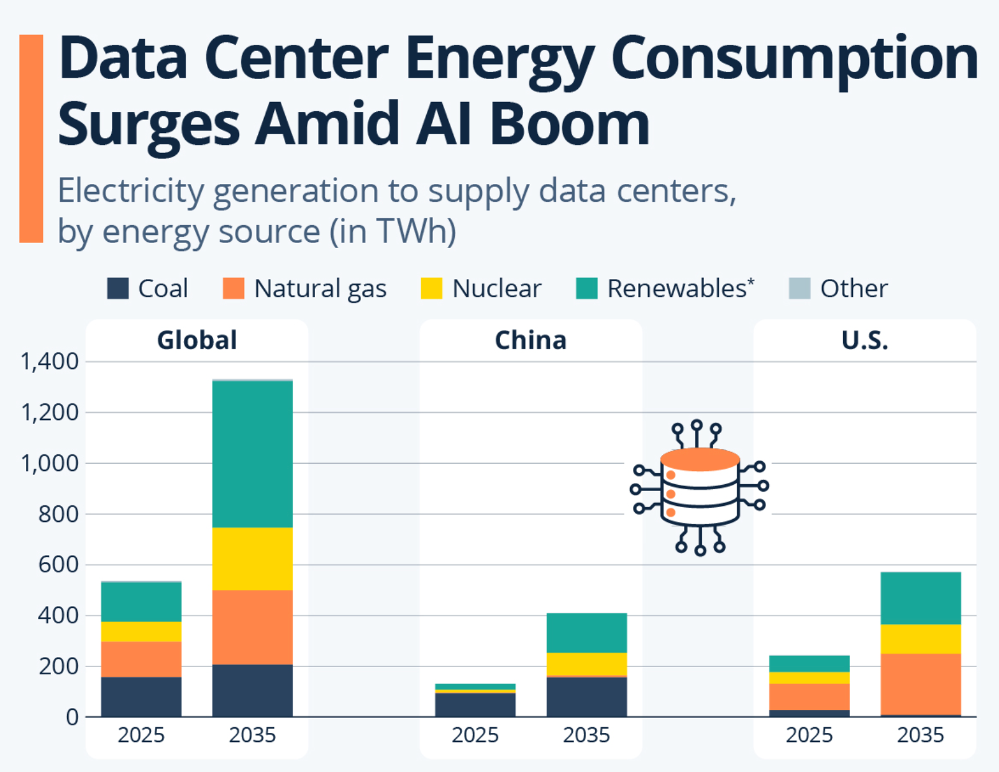
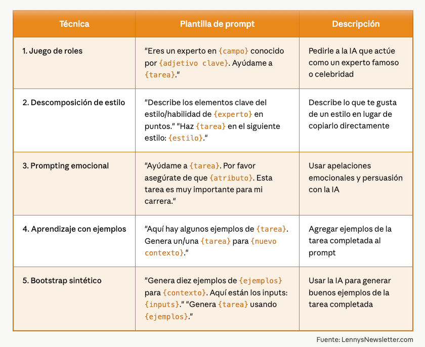
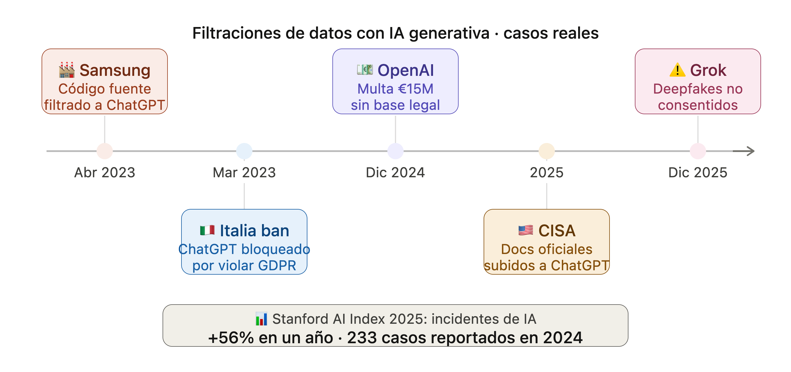

##  {.title-slide background-color="#0F2044"}

::: title-block
**Toma de Decisiones Basadas en Datos e IA**

Módulo 3 · Clase 3: Inteligencia Artificial Generativa
:::

::: subtitle-block
LLMs · Prompts · Asistentes Virtuales · Ética · Uso Responsable\
Diplomado Transformación Digital · DGEC UTFSM · 2026
:::

::: author-block
Francisco Alfaro Medina\
Universidad Técnica Federico Santa María\
Dirección de Transformación Digital · 2026
:::

------------------------------------------------------------------------

## Resumen del módulo y hoja de ruta de hoy

```{=html}
<div style="display:grid; grid-template-columns:1fr 1fr 1fr; gap:1rem; font-size:0.78em; margin-top:0.5rem;">

  <div style="background:#0F2044; border-radius:10px; padding:1.2rem; color:white; border-left:4px solid #6B7A8D; opacity:0.8;">
    <div style="color:#8FA8C8; font-size:0.8em; font-weight:700; text-transform:uppercase; letter-spacing:0.08em; margin-bottom:0.6rem;">✅ Clase 1</div>
    <div style="color:#d0dce8; line-height:1.7; font-size:0.95em;">
      Ecosistema de datos · Tipos de datos · EDA · Visualización · 4 tipos de analítica
    </div>
  </div>

  <div style="background:#0F2044; border-radius:10px; padding:1.2rem; color:white; border-left:4px solid #6B7A8D; opacity:0.8;">
    <div style="color:#8FA8C8; font-size:0.8em; font-weight:700; text-transform:uppercase; letter-spacing:0.08em; margin-bottom:0.6rem;">✅ Clase 2</div>
    <div style="color:#d0dce8; line-height:1.7; font-size:0.95em;">
      Tipos de aprendizaje · Regresión y clasificación · Overfitting · CRISP-DM · Scikit-learn
    </div>
  </div>

  <div style="background:#0F2044; border-radius:10px; padding:1.2rem; color:white; border-left:4px solid #C9A84C;">
    <div style="color:#C9A84C; font-size:0.8em; font-weight:700; text-transform:uppercase; letter-spacing:0.08em; margin-bottom:0.6rem;">🎯 Clase 3 — Hoy</div>
    <div style="color:#d0dce8; line-height:1.7; font-size:0.95em;">
      ¿Qué son los LLMs? · Tokens · Asistentes virtuales · Prompt engineering · Límites · Ética · Actividad final
    </div>
  </div>

</div>
```

<br>

::: {style="text-align: center; background: rgba(201,168,76,0.1); border-left: 4px solid #C9A84C; padding: 0.75rem 1.5rem; border-radius: 4px; font-size: 1.2rem;"}
Esta clase cierra el módulo con la pieza más visible de la IA actual: los modelos de lenguaje y cómo usarlos con criterio.
:::

------------------------------------------------------------------------

## IA en los medios …

:::: {style="display: flex; justify-content: center; align-items: center; height: 70vh; flex-direction: column; text-align: center;"}
::: r-stack
{.fragment .fade-in-then-out fig-align="center" width="70%"}

{.fragment .fade-in-then-out fig-align="center" width="50%"}
:::
::::

## La realidad ...
 
<br>

:::: {style="display: flex; justify-content: center; align-items: center; height: 70vh; flex-direction: column; text-align: center;"}
::: r-stack
{.fragment .fade-in-then-out fig-align="center" width="45%"}

{.fragment .fade-in-then-out fig-align="center" width="65%"}

{.fragment fig-align="center" width="75%"}
:::
::::

## La triste realidad ...

<br>

:::: {style="display: flex; justify-content: center; align-items: center; height: 70vh; flex-direction: column; text-align: center;"}
::: r-stack
{.fragment .fade-in-then-out fig-align="center" width="55%"}

{.fragment fig-align="center" width="55%"}
:::
::::

------------------------------------------------------------------------

##  {background-image="images/background_slides3.png" background-opacity="0.3"}

::: {style="display: flex; justify-content: center; align-items: center; height: 60vh; flex-direction: column; text-align: center;"}
[Parte 1]{style="font-size: 1em; color: #4A9FD4;"}

[¿Qué son los LLMs?]{style="font-size: 2em; font-weight: bold;"}

[Spoiler: no razonan, predicen]{style="font-size: 1em; color: #6B7A8D; font-style: italic;"}
:::

------------------------------------------------------------------------

## Large Language Models

::::: columns
::: {.column width="58%"}
<br>

-   Un LLM es una red neuronal entrenada con **cantidades masivas de texto**.
-   Aprende distribuciones de probabilidad sobre secuencias de **tokens**.
-   Su tarea fundamental: **predecir el siguiente token más probable**.
-   No tiene un modelo del mundo. No tiene intenciones. No "entiende".
-   Todo lo que parece razonamiento es **interpolación estadística muy sofisticada**.
:::

::: {.column width="42%"}
<br><br>

```{=html}
<div style="background:#0F2044; border-radius:10px; padding:1.4rem; color:white; font-size:0.75em; text-align:center;">
  <div style="color:#C9A84C; font-size:1.1em; margin-bottom:1rem;">🧠 ¿Qué hace un LLM?</div>
  <div style="background:#1A3A6B; padding:0.5rem; border-radius:6px; margin-bottom:0.4rem;">
    Input: "El cielo es de color"
  </div>
  <div style="color:#4A9FD4;">↓ tokeniza</div>
  <div style="background:#1A3A6B; padding:0.5rem; border-radius:6px; margin:0.4rem 0;">
    [231, 4892, 12, 8743, ...]
  </div>
  <div style="color:#4A9FD4;">↓ atiende + predice</div>
  <div style="background:#27AE60; padding:0.5rem; border-radius:6px; margin-top:0.4rem;">
    P("azul") = 0.71 · P("gris") = 0.12 · ...
  </div>
  <div style="color:#6B7A8D; font-size:0.85em; margin-top:0.8rem;">No hay comprensión. Solo probabilidad.</div>
</div>
```
:::
:::::

<br>

::: callout-important
## La frase más importante de esta charla

**Un LLM no razona, predice.** Todo lo demás se deriva de entender esto bien. Incluido su costo.
:::

------------------------------------------------------------------------

## Historia de los LLM

<br>

::: r-stack
{.fragment fig-align="center" width="800px" height="600px"}

{.fragment fig-align="center" width="1200px" height="600px"}
:::

------------------------------------------------------------------------

## De texto a tokens — la unidad económica de la IA

::::: columns
::: {.column width="55%"}
<br>

-   Los modelos no procesan palabras, procesan **tokens** (fragmentos de texto).
-   Un token ≈ 0.75 palabras en inglés. **En español: menos eficiente** (\~0.6).
-   La tokenización afecta directamente el **costo, la velocidad y la precisión**.
-   Palabras técnicas, nombres propios o en otro idioma usan **varios tokens**.
-   **Cada token que envías y recibes se cobra.** Sin excepciones.
:::

::: {.column width="45%"}
<br><br>

```{=html}
<div style="background:#0F2044; border-radius:10px; padding:1.2rem; color:white; font-size:0.72em; margin-top:1rem;">
  <div style="color:#4A9FD4; margin-bottom:0.8rem;">📏 ¿Cuántos tokens usa tu contenido?</div>
  <div style="display:flex; flex-direction:column; gap:0.4rem;">
    <div style="background:#1A3A6B; padding:0.4rem 0.7rem; border-radius:5px;">📄 1 página A4 ≈ 500 tokens</div>
    <div style="background:#1A3A6B; padding:0.4rem 0.7rem; border-radius:5px;">📚 1 libro estándar ≈ 100K tokens</div>
    <div style="background:#1A3A6B; padding:0.4rem 0.7rem; border-radius:5px;">💻 100 líneas de código ≈ 800 tokens</div>
    <div style="background:#1A3A6B; padding:0.4rem 0.7rem; border-radius:5px;">🖼️ 1 imagen (vision) ≈ 765–2K tokens</div>
    <div style="background:#1A3A6B; padding:0.4rem 0.7rem; border-radius:5px;">📊 CSV 1000 filas × 10 cols ≈ 15–50K tokens</div>
  </div>
  <div style="color:#E74C3C; font-size:0.88em; margin-top:0.8rem;">⚠️ Enviar un dataset completo a la API puede costar $0.05–$2 por llamada.</div>
</div>
```
:::
:::::

------------------------------------------------------------------------

## Tokenizador interactivo

::: {style="text-align: center;"}
<iframe src="https://agents-course-the-tokenizer-playground.static.hf.space" frameborder="0" width="1200" height="620">

</iframe>
:::
 
------------------------------------------------------------------------

## Diagrama de un LLM — animado

::: r-stack
<br>

{.fragment .fade-in-then-out fig-align="center" width="1200" height="650"}

{.fragment fig-align="center" width="1200" height="650"}
:::

------------------------------------------------------------------------

## Sobre los costos ...

<br>

:::: {style="display: flex; justify-content: center; align-items: center; height: 70vh; flex-direction: column; text-align: center;"}


::: r-stack
{.fragment .fade-in-then-out fig-align="center" width="80%"}
:::
::::
 
------------------------------------------------------------------------

##  {background-image="images/background_slides3.png" background-opacity="0.3"}

::: {style="display: flex; justify-content: center; align-items: center; height: 60vh; flex-direction: column; text-align: center;"}
[Parte 2]{style="font-size: 1em; color: #4A9FD4;"}

[Prompt Engineering aplicado a datos]{style="font-size: 2em; font-weight: bold;"}

[No son trucos, son formas de comunicarse con precisión]{style="font-size: 1em; color: #6B7A8D; font-style: italic;"}
:::


------------------------------------------------------------------------

## ¿Qué es un Prompt?

::::: columns
::: {.column width="48%"}
{fig-align="center" width="50%"}
:::

::: {.column width="52%"}
<br>

Un **prompt** es la interfaz entre tú y el modelo. Cada palabra cuenta — literalmente.

**Componentes de un prompt efectivo:**

-   🎯 **Instrucción**: qué quieres que haga
-   🎭 **Rol**: quién debe ser el modelo
-   📄 **Contexto**: info relevante (solo la necesaria)
-   🖼️ **Formato**: cómo responder (JSON, número, tabla)
-   📌 **Ejemplos**: qué es correcto / qué no

```{=html}
<div style="background:#0F2044; border-radius:8px; padding:0.8rem; color:white; font-size:0.68em; font-family:monospace; margin-top:1rem; line-height:1.7;">
  <span style="color:#4A9FD4;">[ROL]</span> Eres un econometrista experto en salarios.<br>
  <span style="color:#27AE60;">[CONTEXTO]</span> Dataset wage1, n=526, EE.UU.<br>
  <span style="color:#C9A84C;">[INSTRUCCIÓN]</span> Interpreta el coeficiente de educ.<br>
  <span style="color:#E74C3C;">[FORMATO]</span> Responde en JSON con keys:<br>
  &nbsp;{"interpretacion": "...", "es_causal": false}
</div>
```
:::
:::::

------------------------------------------------------------------------

## 

::: r-stack
{.fragment .fade-in-then-out fig-align="center" width="100%"}

{.fragment .fade-in-then-out fig-align="center" width="95%"}
:::


------------------------------------------------------------------------

## 🎯 Actividad: ¡Probemos algunos prompts!

::::::: columns
:::: {.column width="40%"}
::: {style="text-align: center;"}

:::
::::

:::: {.column width="60%"}
<br>

**Instrucciones:**

::: incremental
-   👩‍💻 **Paso 1:** Elige un asistente ([ChatGPT](https://openai.com/chatgpt/), [Claude](https://claude.ai), [Gemini](https://deepmind.google/gemini/))
-   📝 **Paso 2:** Mismo prompt en al menos dos asistentes distintos
-   🔍 **Paso 3:** Compara las respuestas
-   🤔 **Paso 4:** Ahora aplica la estructura completa (Rol + Tarea + Contexto + Formato) y observa cómo cambia el resultado
-   💬 **Paso 5:** ¿Qué diferencias encontraron?
:::
::::
:::::::

------------------------------------------------------------------------

##  {background-color="#0F2044"}

::: {style="display: flex; justify-content: center; align-items: center; height: 60vh; flex-direction: column; text-align: center;"}
[Parte 4]{style="font-size: 1em; color: #4A9FD4;"}

[Límites reales y ética en el uso de IA]{style="font-size: 2em; font-weight: bold;"}

[Una mirada crítica — indispensable antes de desplegar]{style="font-size: 1em; color: #6B7A8D; font-style: italic;"}
:::

------------------------------------------------------------------------


## 


::: r-stack

::: {.fragment .fade-in-then-out}
```{=html}

<style>
@keyframes slide-in { from { opacity:0; transform:translateY(12px); } to { opacity:1; transform:translateY(0); } }
@keyframes pulse-arrow { 0%,100% { opacity:.4; transform:scale(1); } 50% { opacity:1; transform:scale(1.15); } }
.pillar { border-radius:14px; padding:20px 22px; cursor:pointer; transition:transform .18s, box-shadow .18s; border:1.5px solid transparent; animation: slide-in .4s ease both; }
.pillar:hover { transform:translateY(-3px); }
.pillar.active { border-width:2px; }
.pillar-icon { font-size:28px; margin-bottom:8px; }
.pillar-title { font-size:15px; font-weight:500; margin:0 0 4px; }
.pillar-sub { font-size:12px; margin:0; }
.arrow-col { display:flex; flex-direction:column; align-items:center; justify-content:center; gap:6px; }
.arrow-line { width:2px; flex:1; min-height:20px; }
.arrow-tip { font-size:20px; line-height:1; }
.center-arrow { font-size:22px; animation: pulse-arrow 1.8s ease-in-out infinite; }
.result-box { border-radius:14px; padding:22px 20px; display:flex; flex-direction:column; align-items:center; justify-content:center; text-align:center; min-height:160px; border:2px solid; animation: slide-in .5s .15s ease both; }
.result-title { font-size:17px; font-weight:500; margin:0 0 6px; }
.result-sub { font-size:12px; margin:0; }
.detail-panel { border-radius:12px; padding:16px 18px; margin-top:16px; animation: slide-in .3s ease both; }
.detail-title { font-size:13px; font-weight:500; margin:0 0 10px; }
.tip { display:flex; align-items:flex-start; gap:10px; margin-bottom:8px; font-size:13px; }
.tip-dot { width:8px; height:8px; border-radius:50%; flex-shrink:0; margin-top:4px; }
</style>

<h2 class="sr-only">Tres pilares para el uso responsable de la IA generativa: ética de IA, ética profesional y leyes de datos.</h2>

<div style="padding:8px 0 4px;">

  <div style="display:grid; grid-template-columns:1fr 32px 1fr 40px 1fr 40px 1fr; align-items:center; gap:0; margin-bottom:12px;">

    <div id="p1" class="pillar" style="background:#FAEEDA; border-color:#EF9F27; animation-delay:.0s" onclick="select(1)">
      <div class="pillar-icon" aria-hidden="true"><i class="ti ti-brain" style="font-size:26px; color:#854F0B;"></i></div>
      <p class="pillar-title" style="color:#633806;">Ética de la IA</p>
      <p class="pillar-sub" style="color:#854F0B;">Cómo se comporta el modelo</p>
    </div>

    <div class="arrow-col">
      <div class="arrow-line" style="background:#EF9F27; opacity:.35;"></div>
      <span class="center-arrow" style="color:#EF9F27;" aria-hidden="true">›</span>
      <div class="arrow-line" style="background:#EF9F27; opacity:.35;"></div>
    </div>

    <div id="p2" class="pillar" style="background:#E1F5EE; border-color:#1D9E75; animation-delay:.08s" onclick="select(2)">
      <div class="pillar-icon" aria-hidden="true"><i class="ti ti-building" style="font-size:26px; color:#085041;"></i></div>
      <p class="pillar-title" style="color:#04342C;">Ética profesional</p>
      <p class="pillar-sub" style="color:#0F6E56;">Tu rol y responsabilidades</p>
    </div>

    <div class="arrow-col">
      <div class="arrow-line" style="background:#1D9E75; opacity:.35;"></div>
      <span class="center-arrow" style="color:#1D9E75;" aria-hidden="true">›</span>
      <div class="arrow-line" style="background:#1D9E75; opacity:.35;"></div>
    </div>

    <div id="p3" class="pillar" style="background:#FAECE7; border-color:#D85A30; animation-delay:.16s" onclick="select(3)">
      <div class="pillar-icon" aria-hidden="true"><i class="ti ti-lock" style="font-size:26px; color:#712B13;"></i></div>
      <p class="pillar-title" style="color:#4A1B0C;">Leyes de datos</p>
      <p class="pillar-sub" style="color:#993C1D;">Marco legal vigente</p>
    </div>

    <div class="arrow-col">
      <div class="arrow-line" style="background:#7F77DD; opacity:.35;"></div>
      <span class="center-arrow" style="color:#7F77DD;" aria-hidden="true">›</span>
      <div class="arrow-line" style="background:#7F77DD; opacity:.35;"></div>
    </div>

    <div class="result-box" style="background:#EEEDFE; border-color:#7F77DD;">
      <i class="ti ti-shield-check" style="font-size:30px; color:#534AB7; margin-bottom:8px;" aria-hidden="true"></i>
      <p class="result-title" style="color:#26215C;">Uso responsable</p>
      <p class="result-sub" style="color:#534AB7;">de la IA generativa</p>
    </div>

  </div>

  <p style="text-align:center; font-size:12px; color:var(--color-text-tertiary); margin:0 0 12px;">Toca un pilar para ver qué significa en la práctica</p>

  <div id="detail" style="display:none;">

    <div id="detail-1" class="detail-panel" style="background:#FAEEDA; display:none;">
      <p class="detail-title" style="color:#633806;"><i class="ti ti-brain" aria-hidden="true"></i> Ética de la IA — qué debes saber</p>
      <div class="tip"><span class="tip-dot" style="background:#BA7517;"></span><span style="color:var(--color-text-primary);">Los modelos <strong style="color:#633806;">alucinan</strong>: siempre verifica datos importantes con fuentes primarias.</span></div>
      <div class="tip"><span class="tip-dot" style="background:#BA7517;"></span><span style="color:var(--color-text-primary);">No pegues datos sensibles (RUTs, notas, correos) directo en el prompt.</span></div>
      <div class="tip"><span class="tip-dot" style="background:#BA7517;"></span><span style="color:var(--color-text-primary);">El output tiene sesgos implícitos — piénsalo críticamente, no lo copies sin leer.</span></div>
      <div class="tip"><span class="tip-dot" style="background:#BA7517;"></span><span style="color:var(--color-text-primary);">ChatGPT, Copilot, Gemini y Claude son herramientas distintas con límites distintos.</span></div>
    </div>

    <div id="detail-2" class="detail-panel" style="background:#E1F5EE; display:none;">
      <p class="detail-title" style="color:#04342C;"><i class="ti ti-building" aria-hidden="true"></i> Ética profesional — qué debes hacer</p>
      <div class="tip"><span class="tip-dot" style="background:#1D9E75;"></span><span style="color:var(--color-text-primary);">Declara cuando usaste IA en un entregable: una nota al pie es suficiente.</span></div>
      <div class="tip"><span class="tip-dot" style="background:#1D9E75;"></span><span style="color:var(--color-text-primary);">El trabajo final es tuyo: <strong style="color:#04342C;">tú eres el autor</strong>, la IA es solo una herramienta.</span></div>
      <div class="tip"><span class="tip-dot" style="background:#1D9E75;"></span><span style="color:var(--color-text-primary);">Revisa el output antes de publicar o entregar — "human in the loop" siempre.</span></div>
      <div class="tip"><span class="tip-dot" style="background:#1D9E75;"></span><span style="color:var(--color-text-primary);">Usar IA para aprender está bien; usarla para no pensar no lo está.</span></div>
    </div>

    <div id="detail-3" class="detail-panel" style="background:#FAECE7; display:none;">
      <p class="detail-title" style="color:#4A1B0C;"><i class="ti ti-lock" aria-hidden="true"></i> Leyes de datos — qué te limita</p>
      <div class="tip"><span class="tip-dot" style="background:#D85A30;"></span><span style="color:var(--color-text-primary);">Chile tiene la <strong style="color:#4A1B0C;">Ley 19.628</strong> de protección de datos personales.</span></div>
      <div class="tip"><span class="tip-dot" style="background:#D85A30;"></span><span style="color:var(--color-text-primary);">La UE tiene el <strong style="color:#4A1B0C;">GDPR</strong> y el <strong style="color:#4A1B0C;">AI Act</strong> (2024): obliga a registrar sistemas de IA de alto riesgo.</span></div>
      <div class="tip"><span class="tip-dot" style="background:#D85A30;"></span><span style="color:var(--color-text-primary);">Principio clave: <em>data minimization</em> — procesa solo lo estrictamente necesario.</span></div>
      <div class="tip"><span class="tip-dot" style="background:#D85A30;"></span><span style="color:var(--color-text-primary);">Bases de datos de estudiantes no se suben a herramientas IA sin anonimizar.</span></div>
    </div>

  </div>

</div>

<script>
var cur = 0;
function select(n) {
  var colors = {1:'#EF9F27', 2:'#1D9E75', 3:'#D85A30'};
  var borders = {1:'#EF9F27', 2:'#1D9E75', 3:'#D85A30'};
  [1,2,3].forEach(function(i) {
    var el = document.getElementById('p'+i);
    el.classList.remove('active');
    el.style.boxShadow = '';
    document.getElementById('detail-'+i).style.display = 'none';
  });
  if (cur === n) { cur = 0; document.getElementById('detail').style.display = 'none'; return; }
  cur = n;
  var el = document.getElementById('p'+n);
  el.classList.add('active');
  el.style.boxShadow = '0 0 0 3px '+colors[n]+'55';
  document.getElementById('detail').style.display = 'block';
  document.getElementById('detail-'+n).style.display = 'block';
}
</script>


```
:::

{.fragment fig-align="center" width="1600px" height="700px"}

:::

------------------------------------------------------------------------

## La ética en 2026: seis dimensiones que han escalado

```{=html}
<div style="display:grid; grid-template-columns:repeat(3,1fr); gap:0.85rem; font-size:0.76em; margin-top:0.4rem;">

  <div style="background:#0F2044; border-radius:10px; padding:1.1rem; color:white; border-left:4px solid #E74C3C;">
    <div style="color:#ff7070; font-weight:700; margin-bottom:0.4rem;">🎭 Alucinaciones 2.0</div>
    <div style="color:#d0c0c0; line-height:1.55;">Ya no son solo datos falsos. Los <strong style="color:#ff9090;">agentes alucinan acciones</strong>: borrar archivos, enviar correos, ejecutar código. El impacto es operacional.</div>
    <div style="color:#6B7A8D; font-size:0.85em; margin-top:0.5rem;">↗ RAG · grounding · human-in-loop</div>
  </div>

  <div style="background:#0F2044; border-radius:10px; padding:1.1rem; color:white; border-left:4px solid #F39C12;">
    <div style="color:#fbbf24; font-weight:700; margin-bottom:0.4rem;">⚖️ Sesgo sistémico</div>
    <div style="color:#d0c0c0; line-height:1.55;">El sesgo ya está en producción: <strong style="color:#ffd080;">contratación, crédito, salud</strong>. Las auditorías ex-post no alcanzan cuando la escala es masiva.</div>
    <div style="color:#6B7A8D; font-size:0.85em; margin-top:0.5rem;">↗ fairness metrics · EU AI Act</div>
  </div>

  <div style="background:#0F2044; border-radius:10px; padding:1.1rem; color:white; border-left:4px solid #8B5CF6;">
    <div style="color:#a78bfa; font-weight:700; margin-bottom:0.4rem;">🏭 Concentración de poder</div>
    <div style="color:#d0c0c0; line-height:1.55;">3 empresas controlan el 80% de la infraestructura de IA global. <strong style="color:#c4aaff;">Dependencia tecnológica</strong> y riesgo de lock-in institucional.</div>
    <div style="color:#6B7A8D; font-size:0.85em; margin-top:0.5rem;">↗ open source · soberanía digital</div>
  </div>

  <div style="background:#0F2044; border-radius:10px; padding:1.1rem; color:white; border-left:4px solid #E84393;">
    <div style="color:#f472b6; font-weight:700; margin-bottom:0.4rem;">🔐 Ciberseguridad e IA</div>
    <div style="color:#d0c0c0; line-height:1.55;"><strong style="color:#f9a8d4;">Deepfakes, phishing generativo</strong>, jailbreaks y prompt injection. La IA arma los ataques y también los defiende.</div>
    <div style="color:#6B7A8D; font-size:0.85em; margin-top:0.5rem;">↗ detección de contenido sintético</div>
  </div>

  <div style="background:#0F2044; border-radius:10px; padding:1.1rem; color:white; border-left:4px solid #27AE60;">
    <div style="color:#6fcf6f; font-weight:700; margin-bottom:0.4rem;">🤖 IA agéntica</div>
    <div style="color:#d0c0c0; line-height:1.55;">Agentes que navegan, ejecutan código y toman decisiones <strong style="color:#a3e8a3;">sin supervisión humana</strong> continua. ¿Quién responde si algo falla?</div>
    <div style="color:#6B7A8D; font-size:0.85em; margin-top:0.5rem;">↗ human oversight · audit trails</div>
  </div>

  <div style="background:#0F2044; border-radius:10px; padding:1.1rem; color:white; border-left:4px solid #4A9FD4;">
    <div style="color:#4A9FD4; font-weight:700; margin-bottom:0.4rem;">📜 Privacidad y regulación</div>
    <div style="color:#d0c0c0; line-height:1.55;"><strong style="color:#93c5fd;">EU AI Act en vigor.</strong> Chile tramita su Ley de IA. Los datos de entrenamiento son el nuevo campo de batalla legal.</div>
    <div style="color:#6B7A8D; font-size:0.85em; margin-top:0.5rem;">↗ Ley 19.628 · GDPR · AI Act</div>
  </div>

</div>
```

------------------------------------------------------------------------


## 🤖 IA agéntica — el salto de chatbot a agente 

<br>

```{=html}
<div style="display:grid; grid-template-columns:1fr 1fr 1fr; gap:1rem; font-size:0.78em; margin-bottom:1rem;">

  <div style="background:#0F2044; border-radius:10px; padding:1.1rem; color:white; border-top:4px solid #6B7A8D; opacity:0.8;">
    <div style="color:#8FA8C8; font-size:0.85em; font-weight:700; text-transform:uppercase; letter-spacing:0.06em; margin-bottom:0.5rem;">2022–2023</div>
    <div style="color:#d0dce8; font-weight:700; margin-bottom:0.4rem;">Chatbot</div>
    <div style="color:#8FA8C8; line-height:1.6;">Responde preguntas. El humano lee, evalúa y actúa. Error = texto incorrecto.</div>
  </div>

  <div style="background:#0F2044; border-radius:10px; padding:1.1rem; color:white; border-top:4px solid #6B7A8D; opacity:0.8;">
    <div style="color:#8FA8C8; font-size:0.85em; font-weight:700; text-transform:uppercase; letter-spacing:0.06em; margin-bottom:0.5rem;">2024</div>
    <div style="color:#d0dce8; font-weight:700; margin-bottom:0.4rem;">Copiloto</div>
    <div style="color:#8FA8C8; line-height:1.6;">Sugiere acciones. El humano aprueba antes de ejecutar. Supervisión todavía presente.</div>
  </div>

  <div style="background:#0F2044; border-radius:10px; padding:1.1rem; color:white; border-top:4px solid #27AE60;">
    <div style="color:#27AE60; font-size:0.85em; font-weight:700; text-transform:uppercase; letter-spacing:0.06em; margin-bottom:0.5rem;">2025–2026 🎯 Hoy</div>
    <div style="color:#d0dce8; font-weight:700; margin-bottom:0.4rem;">Agente autónomo</div>
    <div style="color:#8FA8C8; line-height:1.6;">Ejecuta tareas completas: busca, escribe, envía, decide. El humano define el objetivo, no cada paso.</div>
  </div>

</div>
```

::: callout-important
## La pregunta ética central de la IA agéntica

**¿En qué decisiones organizacionales estás dispuesto a eliminar la revisión humana?**\
La respuesta determina tu arquitectura de control, no solo tu política de uso.
:::

------------------------------------------------------------------------

## 🏭 Concentración de poder

::::: columns
::: {.column width="55%"}
<br>

-   **3 empresas** (OpenAI · Google · Anthropic) concentran la mayor parte de la infraestructura de modelos de frontera
-   Los modelos más potentes corren en servidores en EE.UU. — fuera de la jurisdicción de Chile
-   **Lock-in tecnológico**: si cambias de proveedor, pierdes historial, fine-tuning y contexto acumulado
-   El open source (Llama, Mistral, Qwen) es la alternativa, pero requiere capacidad técnica interna
:::

::: {.column width="45%"}
<br>

```{=html}
<div style="background:#0F2044; border-radius:10px; padding:1.2rem; color:white; font-size:0.75em;">
  <div style="color:#a78bfa; font-weight:700; margin-bottom:0.8rem;">🏛️ Preguntas para instituciones públicas</div>
  <div style="display:flex; flex-direction:column; gap:0.6rem;">
    <div style="background:#1A1030; padding:0.6rem 0.8rem; border-radius:6px; color:#d0c0e8; line-height:1.5;">
      ¿Dónde se almacenan los datos que enviamos al proveedor de IA?
    </div>
    <div style="background:#1A1030; padding:0.6rem 0.8rem; border-radius:6px; color:#d0c0e8; line-height:1.5;">
      ¿Se usan nuestros prompts para reentrenar el modelo?
    </div>
    <div style="background:#1A1030; padding:0.6rem 0.8rem; border-radius:6px; color:#d0c0e8; line-height:1.5;">
      ¿Podemos auditar cómo funciona el sistema que usamos?
    </div>
    <div style="background:#1A1030; padding:0.6rem 0.8rem; border-radius:6px; color:#d0c0e8; line-height:1.5;">
      ¿Qué ocurre si el proveedor sube precios o cierra el servicio?
    </div>
  </div>
</div>
```
:::
:::::

------------------------------------------------------------------------

## 📜 Regulación — el mapa legal que está cambiando

<br>

```{=html}
<div style="display:grid; grid-template-columns:repeat(3,1fr); gap:1rem; font-size:0.76em; margin-top:0.3rem;">

  <div style="background:#0F2044; border-radius:10px; padding:1.2rem; color:white; border-top:4px solid #4A9FD4;">
    <div style="color:#4A9FD4; font-weight:700; margin-bottom:0.5rem;">🇪🇺 EU AI Act</div>
    <div style="color:#d0c0c0; line-height:1.6; margin-bottom:0.6rem;">En vigor desde 2024. Clasifica los sistemas de IA por <strong style="color:#93c5fd;">nivel de riesgo</strong>. Los de alto riesgo (contratación, crédito, educación) requieren auditorías, transparencia y supervisión humana obligatoria.</div>
    <div style="color:#6B7A8D; font-size:0.88em;">Aplica a cualquier empresa que opere en la UE.</div>
  </div>

  <div style="background:#0F2044; border-radius:10px; padding:1.2rem; color:white; border-top:4px solid #F39C12;">
    <div style="color:#fbbf24; font-weight:700; margin-bottom:0.5rem;">🇨🇱 Chile — Ley de IA</div>
    <div style="color:#d0c0c0; line-height:1.6; margin-bottom:0.6rem;">Proyecto en tramitación parlamentaria. Inspirado parcialmente en el marco europeo. Incluye disposiciones sobre <strong style="color:#ffd080;">transparencia, no discriminación</strong> y protección de datos personales en sistemas automatizados.</div>
    <div style="color:#6B7A8D; font-size:0.88em;">Ley 19.628 ya aplica a datos personales hoy.</div>
  </div>

  <div style="background:#0F2044; border-radius:10px; padding:1.2rem; color:white; border-top:4px solid #27AE60;">
    <div style="color:#6fcf6f; font-weight:700; margin-bottom:0.5rem;">⚖️ Litigios globales</div>
    <div style="color:#d0c0c0; line-height:1.6; margin-bottom:0.6rem;">NYT vs. OpenAI, Getty Images vs. Stability AI, autores vs. Meta. Los datos de entrenamiento son el <strong style="color:#a3e8a3;">nuevo campo de batalla</strong>: ¿qué puede usar la IA sin permiso?</div>
    <div style="color:#6B7A8D; font-size:0.88em;">Resultados definirán el sector en 2026–2027.</div>
  </div>

</div>
```

<br>

::: {style="text-align: center; background: rgba(74,159,212,0.1); border-left: 4px solid #4A9FD4; padding: 0.75rem 1.5rem; border-radius: 4px; font-size: 0.9rem;"}
**Regla práctica:** Si tu sistema de IA toma decisiones que afectan a personas, ya existe o existirá pronto una norma que te exige justificarlas.
:::

------------------------------------------------------------------------


## La pregunta que no cambia

<br>

```{=html}
<div style="display:grid; grid-template-columns:1fr 1fr; gap:1.2rem; font-size:0.80em; margin-bottom:1.2rem;">

  <div style="background:#0F2044; border-radius:10px; padding:1.3rem; color:white; border-left:4px solid #E74C3C;">
    <div style="color:#ff7070; font-weight:700; font-size:1.05em; margin-bottom:0.6rem;">❌ La pregunta equivocada</div>
    <div style="color:#d0c0c0; line-height:1.7; font-size:1.05em;">"¿Podemos usar IA para esto?"</div>
    <div style="color:#8FA8C8; margin-top:0.5rem; line-height:1.5;">La respuesta casi siempre es sí. Pero es la pregunta menos importante.</div>
  </div>

  <div style="background:#0F2044; border-radius:10px; padding:1.3rem; color:white; border-left:4px solid #27AE60;">
    <div style="color:#6fcf6f; font-weight:700; font-size:1.05em; margin-bottom:0.6rem;">✅ Las preguntas correctas</div>
    <div style="color:#d0dce8; line-height:1.8;">
      ¿<strong style="color:#a3e8a3;">Quién decide</strong> cuando el modelo se equivoca?<br>
      ¿<strong style="color:#a3e8a3;">Quién responde</strong> si el error tiene consecuencias?<br>
      ¿<strong style="color:#a3e8a3;">Quién controla</strong> los datos y el sistema?<br>
      ¿<strong style="color:#a3e8a3;">Quién audita</strong> que funciona como se espera?
    </div>
  </div>

</div>
```

::: {style="text-align: center; background: rgba(201,168,76,0.1); border-left: 4px solid #C9A84C; padding: 0.75rem 1.5rem; border-radius: 4px; font-size: 1.05rem;"}
**La IA no es ni buena ni mala. Es tan responsable como el sistema humano que la rodea.**
:::


## Conclusiones del módulo

<br>

```{=html}
<div style="display:grid; grid-template-columns:repeat(3,1fr); gap:1rem; font-size:0.78em;">

  <div style="background:#0F2044; border-radius:10px; padding:1.2rem; color:white; border-top:4px solid #4A9FD4;">
    <div style="color:#4A9FD4; font-weight:700; font-size:1.05em; margin-bottom:0.6rem;">📊 Los datos son el insumo</div>
    <div style="color:#8FA8C8; line-height:1.6;">
      Sin datos de calidad, ni el mejor modelo ni la mejor IA producen valor. El EDA, la visualización y la comprensión del dominio son siempre el primer paso.
    </div>
  </div>

  <div style="background:#0F2044; border-radius:10px; padding:1.2rem; color:white; border-top:4px solid #C9A84C;">
    <div style="color:#C9A84C; font-weight:700; font-size:1.05em; margin-bottom:0.6rem;">🧠 Los modelos son herramientas</div>
    <div style="color:#8FA8C8; line-height:1.6;">
      ML supervisado, no supervisado e IA generativa son herramientas distintas para problemas distintos. La clave es saber cuándo usar cada una — y cuándo no usarlas.
    </div>
  </div>

  <div style="background:#0F2044; border-radius:10px; padding:1.2rem; color:white; border-top:4px solid #27AE60;">
    <div style="color:#6fcf6f; font-weight:700; font-size:1.05em; margin-bottom:0.6rem;">🎯 El criterio es tuyo</div>
    <div style="color:#8FA8C8; line-height:1.6;">
      La IA puede generar, resumir, predecir y sugerir. Pero no puede saber qué historia importa, para quién, ni por qué ahora. Ese juicio sigue siendo el valor diferencial del decisor.
    </div>
  </div>

</div>
```

<br>

::: {style="text-align: center; background: rgba(74,159,212,0.1); border-left: 4px solid #4A9FD4; padding: 0.75rem 1.5rem; border-radius: 4px; font-size: 0.9rem;"}
**RA3.1 + RA3.2 cumplidos:** implementar metodologías analíticas para decisiones estratégicas y evaluar el uso de IA considerando sus beneficios, limitaciones y aplicaciones responsables.
:::

------------------------------------------------------------------------

## Próximos pasos: evaluaciones del módulo

<br>

::::::: columns
:::: {.column width="50%"}
::: callout-note
## 📊 Presentación aplicada (60%) — RA3.1

Analiza un conjunto de datos organizacionales (reales o simulados) y formula decisiones estratégicas a partir de visualizaciones y hallazgos.

**Elementos esperados:** - EDA documentado con estadísticos y gráficos - Insight principal claramente comunicado - Decisión estratégica fundamentada en los datos - Presentación de 10–15 minutos
:::
::::

:::: {.column width="50%"}
::: callout-important
## 📝 Ensayo breve (40%) — RA3.2

Evaluación crítica de una aplicación de IA en gestión organizacional, identificando riesgos, beneficios y condiciones para su implementación responsable.

**Elementos esperados:** - Descripción del caso de IA analizado - Análisis de beneficios con evidencia - Identificación de riesgos concretos - Condiciones y recomendaciones para implementación responsable - 3–5 páginas, formato académico
:::
::::
:::::::


#  {background-image="images/horst_quarto_penguins_thankyou.png" data-state="no-logo"}

::: {style="display: flex; justify-content: center; align-items: flex-start; margin-top: 0vh; padding-top: 0vh; height: 60vh; flex-direction: column; text-align: center;"}
[Hora del Adiós]{style="font-size: 4em; color: #1e6490;"}
:::

::: {style="position: fixed; bottom: -350px; right: -60px; text-align: center;"}
{width="150px" style="border-radius: 8px; box-shadow: 0 4px 15px rgba(0,0,0,0.25);"}
:::


```{=html}
<style>
.reveal .slides h1 {
  font-size: 2em;
}
.reveal .slides h2 {
  font-size: 1.5em;
}
.reveal .slides p {
  font-size: 0.8em;
}
.reveal .slides table {
  font-size: 0.8em;
  width: 90%;
  margin: 0 auto;
}
.reveal .slides ul {
  font-size: 1em;
}
.reveal .slide-logo {
   max-height: 3em !important;
}
</style>
```